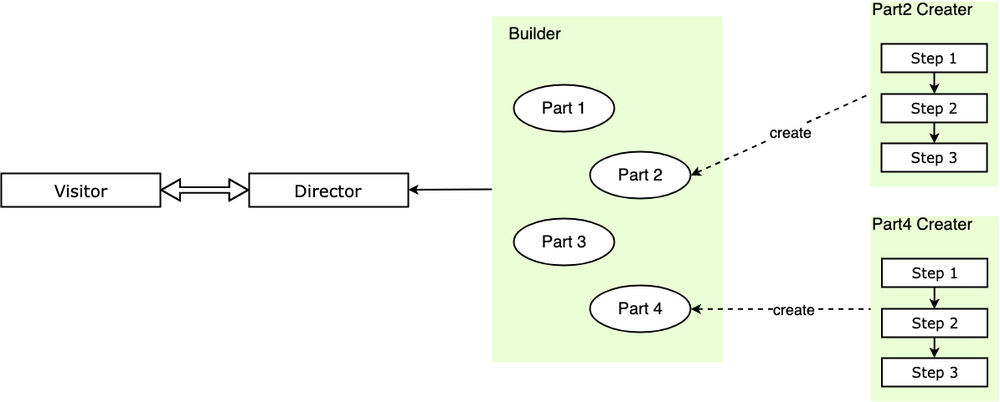

# 建造者模式

## 介绍

建造者模式（Builder Pattern）又称生成器模式，分步构建一个复杂对象，并允许按步骤构造。同样的构建过程可以采用不同的表示，将一个复杂对象的**构建层与其表示层分离**。

在工厂模式中，创建的结果都是一个完整的个体，我们对创建的过程并不关心，只需了解创建的结果。而在建造者模式中，我们关心的是对象的创建过程，因此我们通常将创建的复杂对象的模块化，使得被创建的对象的每一个子模块都可以得到高质量的复用，当然在灵活的 JavaScript 中我们可以有更灵活的实现。

## 通俗的示例

假定我们需要建造一个车，车这个产品是由多个部件组成，车身、引擎、轮胎。汽车制造厂一般不会自己完成每个部件的制造，而是把部件的制造交给对应的汽车零部件制造商，自己只进行装配，最后生产出整车。整车的每个部件都是一个相对独立的个体，都具有自己的生产过程，多个部件经过一系列的组装共同组成了一个完整的车。

类似的场景还有很多，比如生产一个笔记本电脑，由主板、显示器、壳子组成，每个部件都有自己独立的行为和功能，他们共同组成了一个笔记本电脑。笔记本电脑厂从部件制造商处获得制造完成的部件，再由自己完成组装，得到笔记本电脑这个完整的产品。

在这些场景中，有以下特点：

* 整车制造厂（指挥者）无需知道零部件的生产过程，零部件的生产过程一般由零部件厂商（建造者）来完成。
* 整车制造厂（指挥者）决定以怎样的装配方式来组装零部件，以得到最终的产品。

## 建造者模式的通用实现

我们提炼一下建造者模式，这里的生产汽车的奔驰厂家就相当于指挥者（Director），厂家负责将不同的部件组装成最后的产品（Product），而部件的生产者是部件厂家相当于建造者（Builder），我们通过指挥者就可以获得希望的复杂的产品对象，再通过访问不同指挥者获得装配方式不同的产品。主要有下面几个概念：

* **Director**：指挥者，调用建造者中的部件具体实现进行部件装配，相当于整车组装厂，最终返回装配完毕的产品。
* **Builder**：建造者，含有不同部件的生产方式给指挥者调用，是部件真正的生产者，但没有部件的装配流程。
* **Product**：产品，要返回给访问者的复杂对象。

建造者模式的主要功能是构建复杂的产品，并且是复杂的、需要分步骤构建的产品，其构建的算法是统一的，构建的过程由指挥者决定，只要配置不同的指挥者，就可以构建出不同的复杂产品来。也就是说，建造者模式**将产品装配的算法和具体部件的实现分离**，这样构建的算法可以扩展和复用，部件的具体实现也可以方便地扩展和复用，从而可以灵活地通过组合来构建出不同的产品对象。

结构如下：

<div style="text-align: center;">
  
  <p style="text-align: center; color: #888;">（建造者模式结构图）</p>
</div>

代码如下：

```javascript
// 建造者，部件生产
class ProductBuilder {
  constructor(param) {
    this.param = param
  }

  /* 生产部件，part1 */
  buildPart1() {
    // ... Part1 生产过程
    this.part1 = 'part1'

  }

  /* 生产部件，part2 */
  buildPart2() {
    // ... Part2 生产过程
    this.part2 = 'part2'
  }
}

/* 指挥者，负责最终产品的装配 */
class Director {
  constructor(param) {
    const _product = new ProductBuilder(param)
    _product.buildPart1()
    _product.buildPart2()
    return _product
  }
}

// 获得产品实例
const product = new Director('param')
```

结合链模式：

```javascript
// 建造者，汽车部件厂家
class CarBuilder {
  constructor(param) {
    this.param = param
  }

  /* 生产部件，part1 */
  buildPart1() {
    this.part1 = 'part1'
    return this
  }

  /* 生产部件，part2 */
  buildPart2() {
    this.part2 = 'part2'
    return this
  }
}

// 汽车装配，获得产品实例
const benchi1 = new CarBuilder('param')
  .buildPart1()
  .buildPart2()
```

如果希望扩展实例的功能，那么只需要在建造者类的原型上增加一个实例方法，再返回 `this` 即可。

值得一提的是，结合链模式的建造者模式中，装配复杂对象的链式装配过程就是指挥者 Director 角色，只不过在链式装配过程中不再封装在具体指挥者中，而是由使用者自己确定装配过程。

## 建造者模式的实际应用

### 重构一个具有很多参数的构造函数

有时候你会遇到一个参数很多的构造函数，比如：

```javascript
// 汽车建造者
class CarBuilder {
  constructor(engine, weight, height, color, tyre, name, type) {
    this.engine = engine
    this.weight = weight
    this.height = height
    this.color = color
    this.tyre = tyre
    this.name = name
    this.type = type
  }
}

const benchi = new CarBuilder('大马力发动机', '2ton', 'white', '大号轮胎', '奔驰', 'AMG')
```

如果构造函数的参数多于 3 个，在使用的时候就很容易弄不清哪个参数对应的是什么含义，你可以使用对象解构赋值的方式来提高可读性和使用便利性，也可以使用建造者模式的思想来进行属性赋值，这是另一个思路。代码如下：

```javascript
// 汽车建造者
class CarBuilder {
  constructor(engine, weight, height, color, tyre, name, type) {
    this.engine = engine
    this.weight = weight
    this.height = height
    this.color = color
    this.tyre = tyre
    this.name = name
    this.type = type
  }

  setCarProperty(key, value) {
    if (Object.getOwnPropertyNames(this).includes(key)) {
      this[key] = value
      return this
    }
    throw new Error(`Key error : ${ key } 不是本实例上的属性`)
  }
}

const benchi = new CarBuilder()
  .setCarProperty('engine', '大马力发动机')
  .setCarProperty('weight', '2ton')
  .setCarProperty('height', '2000mm')
  .setCarProperty('color', 'white')
  .setCarProperty('tyre', '大号轮胎')
  .setCarProperty('name', '奔驰')
  .setCarProperty('type', 'AMG')
```

每个键都是用一个同样的方法来设置，或许你觉得不太直观，我们可以将设置每个属性的操作都单独列为一个方法，这样可读性就更高了：

```javascript
// 汽车建造者
class CarBuilder {
  constructor(engine, weight, height, color, tyre, name, type) {
    this.engine = engine
    this.weight = weight
    this.height = height
    this.color = color
    this.tyre = tyre
    this.name = name
    this.type = type
  }

  setPropertyFuncChain() {
    Object.getOwnPropertyNames(this)
      .forEach(key => {
        const funcName = 'set' + key.replace(/^\w/g, str => str.toUpperCase())
        this[funcName] = value => {
          this[key] = value
          return this
        }
      })
    return this
  }
}

const benchi = new CarBuilder().setPropertyFuncChain()
  .setEngine('大马力发动机')
  .setWeight('2ton')
  .setHeight('2000mm')
  .setColor('white')
  .setTyre('大号轮胎')
  .setName('奔驰')
  .setType('AMG')
```

PS：这里用到了点正则的知识。

### 重构 React 的书写形式

::: warning
这个方式不一定推荐，只是用来开阔视野。
:::

当我们写一个 React 组件的时候，一般结构形式如下；

```javascript
class ContainerComponent extends Component {
  componentDidMount() {
    this.props.fetchThings()
  }
  render() {
    return <PresentationalComponent {...this.props}/>
  }
}

ContainerComponent.propTypes = {
  fetchThings: PropTypes.func.isRequired
}

const mapStateToProps = state => ({
  things: state.things
})
const mapDispatchToProps = dispatch => ({
  fetchThings: () => dispatch(fetchThings()),
  selectThing: id => dispatch(selectThing(id)),
  blowShitUp: () => dispatch(blowShitUp())
})

export default connect(
  mapStateToProps,
  mapDispatchToProps
)(ContainerComponent)
```

通过建造者模式重构，我们可以将组件形式写成如下方式：

```javascript
export default ComponentBuilder('ContainerComponent')
  .render(props => <PresentationalComponent {...props}/>)
  .componentDidMount(props => props.fetchThings())
  .propTypes({
    fetchThings: PropTypes.func.isRequired
  })
  .mapStateToProps(state => ({
    things: state.things
  }))
  .mapDispatchToProps(dispatch => ({
    fetchThings: () => dispatch(fetchThings()),
    selectThing: id => dispatch(selectThing(id)),
    blowShitUp: () => dispatch(blowShitUp())
  }))
  .build()
```

## 设计原则验证

* 将产品的创建算法和产品组成的实现隔离
* 符合开放封闭原则

## 建造者模式的优缺点

优点：

* 使用建造者模式可以**使产品的构建流程和产品的表现分离**，也就是将产品的创建算法和产品组成的实现隔离，访问者不必知道产品部件实现的细节。
* **扩展方便**，如果希望生产一个装配顺序或方式不同的新产品，那么直接新建一个指挥者即可，不用修改既有代码，符合开闭原则。
* **更好的复用性**，建造者模式将产品的创建算法和产品组成的实现分离，所以产品创建的算法可以复用，产品部件的实现也可以复用，带来很大的灵活性

缺点：

* 建造者模式一般适用于产品之间组成部件类似的情况，**如果产品之间差异性很大、复用性不高**，那么不要使用建造者模式。
* 实例的创建增加了许多额外的结构，无疑增加了许多复杂度，**如果对象粒度不大**，那么我们最好直接创建对象。

## 建造者模式的适用场景

* 相同的方法，不同的执行顺序，产生不一样的产品时，可以采用建造者模式。
* 产品的组成部件类似，通过组装不同的组件获得不同产品时，可以采用建造者模式。

## 其他相关模式

### 建造者模式与工厂模式

建造者模式和工厂模式最终都是创建一个完整的产品，但是在建造者模式中我们更关心对象创建的过程，将创建对象的方法模块化，从而更好地复用这些模块。

当然建造者模式与工厂模式也是可以组合使用的，比如建造者中一般会提供不同的部件实现，那么这里就可以使用工厂模式来提供具体的部件对象，再通过指挥者来进行装配。

### 建造者模式与模版方法模式

指挥者的实现可以和模版方法模式相结合。也就是说，指挥者中部件的装配过程，可以使用模版方法模式来固定装配算法，把部件实现方法分为模板方法和基本方法，进一步提取公共代码，扩展可变部分。

是否采用模版方法模式看具体场景，如果产品的部件装配顺序很明确，但是具体的实现是未知的、灵活的，那么你可以适当考虑是否应该将算法骨架提取出来。

（完）
