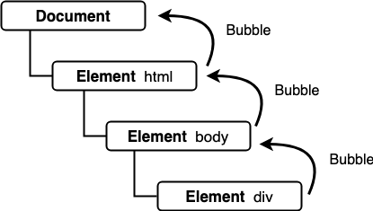

# 职责链模式

## 介绍

职责链模式（Chain of Responsibility Pattern）就是在一步操作可能分为多个职责角色来完成时，把这些角色都分开，然后用一个链串起来，将发起者和各个处理者进行隔离（各个处理者之间也相互隔离）。

## 通俗的示例

这里举个请假的例子：

你需要请两天假。首先跟你的小组领导提了一句，小领导说不行呐我只能批半天假，建议找部门经理。于是你来到了部门经理办公室，部门经理说不行呐我只能批一天假，建议找总经理。来到总经理办公室，总经理勉为其难的说，可以，不过要扣你两天工资。于是你请到了两天假。

当你作为请求者提出请假申请时，这个申请会由小组领导、部门经理、总经理之中的某一位领导来进行处理，但一开始提出申请的时候，并不知道这个申请之后由哪个领导来处理，也许是部门经理，或者是总经理，请求者事先不知道这个申请最后到底应该由哪个领导处理。

在类似的场景中，这些例子有以下特点：

* 请求在一系列对象中传递，形成一条链。
* 链中的请求接受者对请求进行分析，要么处理这个请求，要么把这个请求传递给链的下一个接受者。

## 职责链模式的通用实现

用 JS 代码实现上面的请假流程，我们很自然地会这么写：

```javascript
var askLeave = function(duration) {
  if (duration <= 0.5) {
    console.log('小组领导经过一番心理斗争：批准了');
  } else if (duration <= 1) {
    console.log('部门领导经过一番心理斗争：批准了');
  } else if (duration <= 2) {
    console.log('总经理经过一番心理斗争：批准了');
  } else {
    console.log('总经理：不准请这么长的假');
  }
}

askLeave(0.5); // 小组领导经过一番心理斗争：批准了
askLeave(1);   // 部门领导经过一番心理斗争：批准了
askLeave(2);   // 总经理经过一番心理斗争：批准了
askLeave(3);   // 总经理：不准请这么长的假
```

这么实现比较直白，但也会有一些问题：处理逻辑比较复杂时，这个 `askLeave` 方法会变得庞大而臃肿。而且如果中间增加一个新的领导层，那么你就要修改这个庞大的 `askLeave` 方法，维护工作变得复杂。

使用职责链模式重构，要求满足下面几个目标：

* 将不同领导的处理逻辑（也就是职责节点）提取出来，请假的时候直接找小组领导，如果小组领导处理不好，直接把请求传递给部门领导，部门领导处理不了则传递给总经理。
* 遵循开闭原则，增加新的职责节点或删除节点的时候，对原来的代码没有影响。

代码如下：

```javascript
/* 小组领导 */
var GroupLeader = {
  nextLeader: null,
  setNext: function(next) {
    this.nextLeader = next;
  },
  handle: function(duration) {
    if (duration <= 0.5) {
      console.log('小组领导经过一番心理斗争：批准了');
    } else {
      this.nextLeader.handle(duration);
    }
  }
}

/* 部门领导 */
var DepartmentLeader = {
  nextLeader: null,
  setNext: function(next) {
    this.nextLeader = next;
  },
  handle: function(duration) {
    if (duration <= 1) {
      console.log('部门领导经过一番心理斗争：批准了');
    } else {
      this.nextLeader.handle(duration);
    }
  }
}

/* 总经理 */
var GeneralLeader = {
  nextLeader: null,
  setNext: function(next) {
    this.nextLeader = next;
  },
  handle: function(duration) {
    if (duration <= 2) {
      console.log('总经理经过一番心理斗争：批准了');
    } else {
      console.log('总经理：不准请这么长的假');
    }
  }
}

GroupLeader.setNext(DepartmentLeader);   // 设置小组领导的下一个职责节点为部门领导
DepartmentLeader.setNext(GeneralLeader); // 设置部门领导的下一个职责节点为总经理

GroupLeader.handle(0.5); // 小组领导经过一番心理斗争：批准了
GroupLeader.handle(1);   // 部门领导经过一番心理斗争：批准了
GroupLeader.handle(2);   // 总经理经过一番心理斗争：批准了
GroupLeader.handle(3);   // 总经理：不准请这么长的假
```

这样，将职责的链在使用的时候再拼起来，灵活性好，比如如果要在部门领导和总经理中间增加一个新的职责节点，那么在使用时：

```javascript
/* 新领导 */
var MewLeader = {
  nextLeader: null,
  setNext: function(next) {
    this.nextLeader = next;
  },
  handle: function(duration) { ... }
}

GroupLeader.setNext(DepartmentLeader); // 设置小组领导的下一个职责节点为部门领导
DepartmentLeader.setNext(MewLeader);   // 设置部门领导的下一个职责节点为新领导
MewLeader.setNext(GeneralLeader);      // 设置新领导的下一个职责节点为总经理
```

删除节点也是类似操作，非常符合开闭原则了，给维护带来很大方便。

但是我们看到之前的内容有很多重复代码，比如 `Leader` 对象里的 `nextLeader`、`setNext` 里的逻辑就是一样的，可以用继承来避免这部分重复。

我们使用 ES6 的 `class` 语法改造一下：

```javascript
/* 领导基类 */
class Leader {
  constructor() {
    this.nextLeader = null;
  }

  setNext(next) {
    this.nextLeader = next;
  }
}

/* 小组领导 */
class GroupLeader extends Leader {
  handle(duration) {
    if (duration <= 0.5) {
      console.log('小组领导经过一番心理斗争：批准了');
    } else {
      this.nextLeader.handle(duration);
    }
  }
}

/* 部门领导 */
class DepartmentLeader extends Leader {
  handle(duration) {
    if (duration <= 1) {
      console.log('部门领导经过一番心理斗争：批准了');
    } else {
      this.nextLeader.handle(duration);
    }
  }
}

/* 总经理 */
class GeneralLeader extends Leader {
  handle(duration) {
    if (duration <= 2) {
      console.log('总经理经过一番心理斗争：批准了');
    } else {
      console.log('总经理：不准请这么长的假');
    }
  }
}

const zhangSan = new GroupLeader();
const liSi = new DepartmentLeader();
const wangWu = new GeneralLeader();

zhangSan.setNext(liSi); // 设置小组领导的下一个职责节点为部门领导
liSi.setNext(wangWu);   // 设置部门领导的下一个职责节点为总经理

zhangSan.handle(0.5); // 小组领导经过一番心理斗争：批准了
zhangSan.handle(1);   // 部门领导经过一番心理斗争：批准了
zhangSan.handle(2);   // 总经理经过一番心理斗争：批准了
zhangSan.handle(3);   // 总经理：不准请这么长的假
```

上面的代码实现，我们可以使用链模式稍加重构，在设置下一个职责节点的方法 `setNext` 中返回下一个节点实例，使得在职责链的组装过程是一个链的形式，代码结构更加简洁。

```javascript
/* 领导基类 */
class Leader {
  constructor() {
    this.nextLeader = null;
  }

  setNext(next) {
    this.nextLeader = next;
    return next;
  }
}

/* 小组领导 */
class GroupLeader extends Leader {
  handle(duration) { ... }
}

/* 部门领导 */
class DepartmentLeader extends Leader {
  handle(duration) { ... }
}

/* 总经理 */
class GeneralLeader extends Leader {
  handle(duration) { ... }
}

const zhangSan = new GroupLeader();
const liSi = new DepartmentLeader();
const wangWu = new GeneralLeader();

/* 组装职责链 */
zhangSan
  .setNext(liSi)   // 设置小组领导的下一个职责节点为部门领导
  .setNext(wangWu) // 设置部门领导的下一个职责节点为总经理
```

## 职责链模式的原理

职责链模式可能在真实的业务代码中见的不多，但是作用域链、原型链、DOM 事件流的事件冒泡，都有职责链模式的影子：

* **作用域链**：查找变量时，先从当前上下文的变量对象中查找，如果没有找到，就会从父级执行上下文的变量对象中查找，一直找到全局上下文的变量对象。
* **原型链**：当读取实例的属性时，如果找不到，就会查找当前对象关联的原型中的属性，如果还查不到，就去找原型的原型，一直找到最顶层为止。
* **事件冒泡**：事件在 DOM 元素上触发后，会从最内层的元素开始发生，一直向外层元素传播，直到全局 `document` 对象。

以事件冒泡为例，事件在某元素上触发后，会一级级往外层元素传递事件，如果当前元素没有处理这个事件并阻止冒泡，那么这个事件就会往外层节点传递，就像请求在职责链中的职责节点上传递一样，直到某个元素处理了事件并阻止冒泡。

事件冒泡示意图如下：：

<div style="text-align: center;">
  
  <p style="text-align: center; color: #888;">（事件冒泡示意图）</p>
</div>

可见虽然某些设计模式我们用的不多，但其实已经默默渗入到我们的日常开发中了。

## 设计原则验证

* 发起者与各个处理者进行隔离，各个处理者之间也相互隔离
* 符合开放封闭原则

## 职责链模式的优缺点

优点：

* 和命令模式类似，由于处理请求的职责节点可能是职责链上的任一节点，所以请求的发送者和接受者是解耦的。
* 通过改变链内的节点或调整节点次序，可以动态地修改责任链，符合开闭原则。

缺点：

* 并不能保证请求一定会被处理，有可能到最后一个节点还不能处理。
* 调试不便，调用层次会比较深，也有可能会导致循环引用。

## 职责链模式的适用场景

* 需要多个对象可以处理同一个请求，具体该请求由哪个对象处理在运行时才确定。
* 在不明确指定接收者的情况下，向多个对象中的其中一个提交请求的话，可以使用职责链模式。
* 如果想要动态指定处理一个请求的对象集合，可以使用职责链模式。

## 其他相关模式

### 职责链模式与组合模式

职责链模式可以和组合模式一起使用，比如把职责节点通过组合模式来组合，从而形成组合起来的树状职责链。

### 职责链模式与装饰器模式

这两个模式都是在运行期间动态组合，装饰器模式是动态组合装饰器，可以有任意多个对象来装饰功能，而职责链是动态组合职责节点，有一个职责节点处理的话就结束。

另外他们的目的也不同，装饰器模式为对象添加功能，而职责链模式是要实现发送者和接收者解耦。

（完）
