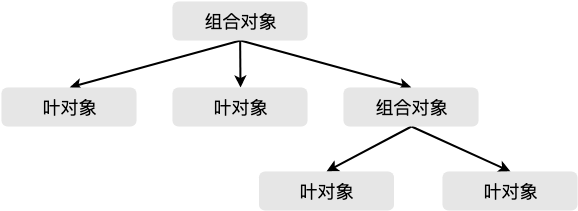

# 组合模式

## 介绍

组合模式（Composite Pattern）又叫整体-部分模式，它允许你将对象组合成树形结构来表现整体-部分层次结构，让使用者可以以一致的方式处理组合对象以及部分对象。

## 通俗的示例

电脑里的文件目录结构，文件夹下面可以有子文件夹，也可以有文件，子文件夹下面还可以有文件夹和文件，以此类推，共同组成了一个文件树，结构如下：

```
Folder 1
├── Folder 2
│   ├── File 1.txt
│   ├── File 2.txt
│   └── File 3.txt
└── Folder 3
    ├── File 4.txt
    ├── File 5.txt
    └── File 6.txt
```

文件夹是树形结构的容器节点，容器节点可以继续包含其他容器节点，像树枝上还可以有其他树枝一样；也可以包含文件，不再增加新的层级，就像树的叶子一样处于末端，因此被称为叶节点。本文中，叶节点又称为叶对象，容器节点因为可以包含容器节点和非容器节点，又称为组合对象。

当我们在某个文件夹下搜索某个文件的时候，通常我们希望搜索的结果包含组合对象的所有子孙对象。

在类似场景中，这些例子有以下特点：

* 结构呈整体-部分的树形关系，整体部分一般称为组合对象，组合对象下还可以有组合对象和叶对象。
* 组合对象和叶对象有一致的接口和数据结构，以保证操作一致。
* 请求从树的最顶端往下传递，如果当前处理请求的对象是叶对象，叶对象自身会对请求作出相应的处理；如果当前处理的是组合对象，则遍历其下的子节点（叶对象），将请求继续传递给这些子节点。

## 组合模式的通用实现

我们可以使用 JavaScript 来将之前的文件夹例子实现一下。

在本地一个「电影」文件夹下有两个子文件夹「漫威英雄电影」和「DC英雄电影」，分别各自有一些电影文件，我们要做的就是在这个电影文件夹里找大于 2G 的电影文件，无论是在这个文件夹下还是在子文件夹下，并输出它的文件名和文件大小。

```javascript
/* 文件夹类 */
class Folder {
  constructor(name, children) {
    this.name = name
    this.children = children
  }

  /* 在文件夹下增加文件或文件夹 */
  add(...fileOrFolder) {
    this.children.push(...fileOrFolder)
    return this
  }

  /* 扫描方法 */
  scan(cb) {
    this.children.forEach(child => child.scan(cb))
  }
}

/* 文件类 */
class File {
  constructor(name, size) {
    this.name = name
    this.size = size
  }

  /* 在文件下增加文件，应报错 */
  add(...fileOrFolder) {
    throw new Error('文件下面不能再添加文件')
  }

  /* 执行扫描方法 */
  scan(cb) {
    cb(this)
  }
}

const foldMovies = new Folder('电影', [
  new Folder('漫威英雄电影', [
    new File('钢铁侠.mp4', 1.9),
    new File('蜘蛛侠.mp4', 2.1),
    new File('金刚狼.mp4', 2.3),
    new File('黑寡妇.mp4', 1.9),
    new File('美国队长.mp4', 1.4)]),
  new Folder('DC英雄电影', [
    new File('蝙蝠侠.mp4', 2.4),
    new File('超人.mp4', 1.6)])
])

console.log('size 大于2G的文件有：')

foldMovies.scan(item => {
  if (item.size > 2) {
    console.log(`name:${ item.name } size:${ item.size }GB`)
  }
})

// size 大于2G的文件有：
// name:蜘蛛侠.mp4 size:2.1GB
// name:金刚狼.mp4 size:2.3GB
// name:蝙蝠侠.mp4 size:2.4GB
```

在传统的语言中，为了保证叶对象和组合对象的外观一致，还会让他们实现同一个抽象类或接口。

## 组合模式的概念

组合模式定义的包含组合对象和叶对象的层次结构，叶对象可以被组合成更复杂的组合对象，而这个组合对象又可以被组合，这样不断地组合下去。

在实际使用时，任何用到叶对象的地方都可以使用组合对象了。使用者可以不在意到底处理的节点是叶对象还是组合对象，也就不用写一些判断语句，让客户可以一致地使用组合结构的各节点，这就是所谓**面向接口编程**，从而减少耦合，便于扩展和维护。

组合模式的示意图如下：

<div style="text-align: center;">
  
  <p style="text-align: center; color: #888;">（组合模式示意图）</p>
</div>

## 组合模式的实际应用

类似于组合模式的结构其实我们经常碰到，比如浏览器的 DOM 树，从 `<html/>` 根节点到 `<head/>`、`<body/>`、`<style/>` 等节点，而 `<body/>` 节点又可以有 `<div/>`、`<span/>`、`<p/>`、`<a/>` 等等节点，这些节点下面还可以有节点，而且这些节点的操作方式有的也比较类似。

我们可以借用上面示例代码的例子，方便地创建一个 DOM 树，由于浏览器 API 的返回值不太友好，因此我们稍微改造一下；

```javascript
const createElement = ({ tag, attr, children }) => {
  const node = tag
    ? document.createElement(tag)
    : document.createTextNode(attr.text)
  tag && Object.keys(attr)
    .forEach(key => node.setAttribute(key, attr[key]))
  children && children
    .forEach(child =>
      node.appendChild(createElement.call(null, child)))
  return node
}

const ulElement = createElement({
  tag: 'ul',
  attr: { id: 'data-list' },
  children: [
    {
      tag: 'li',
      attr: { class: 'data-item' },
      children: [{ attr: { text: 'li-item 1' } }]
    },
    {
      tag: 'li',
      attr: { class: 'data-item' },
      children: [{ attr: { text: 'li-item 2' } }]
    },
    {
      tag: 'li',
      attr: { class: 'data-item' },
      children: [{ attr: { text: 'li-item 3' } }]
    }
  ]
})

// 输出：
// <ul id='data-list'>
//     <li class='data-item'>li-item 1</li>
//     <li class='data-item'>li-item 2</li>
//     <li class='data-item'>li-item 3</li>
// </ul>
```

另外，之前的代码中添加文件的方式是不是很眼熟？Vue/React 里创建元素节点的方法 `createElement` 也是类似这样使用，来组装元素节点：

```javascript
// Vue
createElement('h3', { class: 'main-title' }, [
  createElement('img', { class: 'avatar', attrs: { src: '../avatar.jpg' } }),
  createElement('p', { class: 'user-desc' }, '长得帅老的快，长得丑活得久')
])

// React
React.createElement('h3', { className: 'user-info' },
  React.createElement('img', { src: '../avatar.jpg', className: 'avatar' }),
  React.createElement('p', { className: 'user-desc' }, '长得帅老的快，长得丑活得久')
)
```

类似的，Vue 中的虚拟 DOM 树，也是这样的结构：

```javascript
{
  tagName: 'ul',   // 节点标签名
  props: {         // 属性
    id: 'data-list'
  },
  children: [      // 节点的子节点
    {
      tagName: 'li',
      props: { class: 'data-item' },
      children: ['li-item 1']
    },
    {
      tagName: 'li',
      props: { class: 'data-item' },
      children: ['li-item 2']
    }, {
      tagName: 'li',
      props: { class: 'data-item' },
      children: ['li-item 3']
    }]
}
```

这样的虚拟 DOM 树，会被渲染成：

```html
<ul id='data-list'>
  <li class='data-item'>li-item 1</li>
  <li class='data-item'>li-item 2</li>
  <li class='data-item'>li-item 3</li>
</ul>
```

虚拟 DOM 树中的每个虚拟 DOM 都是 `VNode` 类的实例，因此具有基本统一的外观，在操作时对父节点和子节点的操作是一致的，这也是组合模式的思想。

浏览器的 DOM 树、Vue 的虚拟 DOM 树等可以说和组织模式形似，也就是具有整体-部分的层次结构，但是在操作传递方面，没有组合模式所定义的特性。

这个特性就是**职责链模式**的特性，组合模式天生具有职责链，当请求组合模式中的组合对象时，请求会顺着父节点往子节点传递，直到遇到可以处理这个请求的节点，也就是叶节点。

## 设计原则验证

* 将整体和单个节点的操作抽象出来
* 符合开放封闭原则

## 组合模式的优缺点

优点：

* 由于组合对象和叶对象具有同样的接口，因此调用的是组合对象还是叶对象对使用者来说没有区别，使得使用者**面向接口编程**。
* 如果想在组合模式的树中增加一个节点比较容易，在目标组合对象中添加即可，不会影响到其他对象，**对扩展友好，符合开闭原则，利于维护**。

缺点：

* 增加了系统复杂度，如果树中对象不多，则不一定需要使用。
* 如果通过组合模式创建了太多的对象，那么这些对象可能会让系统负担不起。

## 组合模式的适用场景

* 如果对象组织呈树形结构就可以考虑使用组合模式，特别是如果操作树中对象的方法比较类似时。
* 使用者希望统一对待树形结构中的对象，比如用户不想写一堆 if-else 来处理树中的节点时，可以使用组合模式。

## 其他相关模式

### 组合模式和职责链模式

正如前文所说，组合模式是天生实现了职责链模式的。

* **组合模式**：请求在组合对象上传递，被深度遍历到组合对象的所有子孙叶节点具体执行。
* **职责链模式**：实现请求的发送者和接受者之间的解耦，把多个接受者组合起来形成职责链，请求在链上传递，直到有接受者处理请求为止。

### 组合模式和迭代器模式

组合模式可以结合迭代器模式一起使用，在遍历组合对象的叶节点的时候，可以使用迭代器模式来遍历。

### 组合模式和命令模式

命令模式里有一个用法「宏命令」，宏命令就是组合模式和命令模式一起使用的结果，是组合模式组装而成。

（完）
