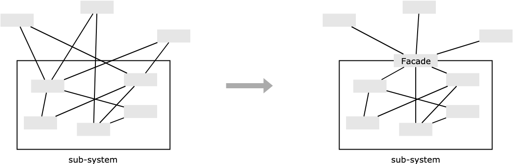

# 外观模式

## 介绍

外观模式（Facade Pattern）又叫门面模式，它用于为子系统中的一组接口提供一个高层接口，使用者使用这个高层接口。外观模式让外界减少与子系统内多个模块的直接交互，从而减少耦合，让外界可以更轻松地使用子系统。本质是**封装交互，简化调用**。

外观模式在源码中使用很多，具体可以参考后文中源码阅读部分。

## 通俗的示例

比如常见的空调、冰箱、洗衣机，内部结构都并不简单，对于我们使用者而言，理解他们内部的运行机制的门槛比较高，但是理解遥控器/控制面板上面寥寥几个按钮就相对容易的多，这就是外观模式的意义。

在类似场景中，这些例子有以下特点：

* 一个统一的外观为复杂的子系统提供一个简单的高层功能接口。
* 原本访问者直接调用子系统内部模块导致的复杂引用关系，现在可以通过只访问这个统一的外观来避免。

## 外观模式的通用实现

在外观模式中，客户端直接对接外观（Facade），通过接口去对接子接口，而子接口里封装的一系列复杂操作，则不是我们要关注的重点。

结构如下：

<div style="text-align: center;">
  
  <p style="text-align: center; color: #888;">（外观模式结构图）</p>
</div>

::: warning
外观模式一般是作为子系统的功能出口出现，使用的时候可以在其中增加新的功能，但是不推荐这样做，因为外观应该是对已有功能的包装，不应在其中掺杂新的功能。
:::

## 外观模式的实际应用

### 函数参数重载

有一种情况，比如某个函数有多个参数，其中一个参数可以传递也可以不传递，你当然可以直接弄两个接口，但是使用函数参数重载的方式，可以让使用者获得更大的自由度，让两个使用上基本类似的方法获得统一的外观。

```javascript
function bindEvent(elem, type, selector, fn) {
  if (fn === undefined) {
    fn = selector;
    selector = null;
  }
  // ... 剩下相关逻辑
}

bindEvent(elem, 'click', '#div1', fn)
bindEvent(elem, 'click', fn)
```

上面这个绑定事件的函数中，参数 `selector` 就是可选的。

这种方式在一些工具库或者框架提供的多功能方法上经常得到使用，特别是在通用 API 的**某些参数可传可不传的时候**。

参数重载之后的函数在使用上会获得更大的自由度，而不必重新创建一个新的 API，这在 Vue、React、jQuery、Lodash 等库中使用非常频繁。

### 抹平浏览器兼容性问题

外观模式经常被用于 JavaScript 的库中，封装一些接口用于兼容多浏览器，让我们可以间接调用我们封装的外观，从而屏蔽了浏览器差异，便于使用。

比如经常用的兼容不同浏览器的事件绑定方法：

```javascript
function addEvent(element, type, fn) {
  if (element.addEventListener) {      // 支持 DOM2 级事件处理方法的浏览器
    element.addEventListener(type, fn, false);
  } else if (element.attachEvent) {    // 不支持 DOM2 级但支持 attachEvent
    element.attachEvent('on' + type, fn);
  } else {
    element['on' + type] = fn;         // 都不支持的浏览器
  }
}

var myInput = document.getElementById('myinput');

addEvent(myInput, 'click', function() {
    console.log('绑定 click 事件');
})
```

除了事件绑定之外，在抹平浏览器兼容性的其他问题上我们也经常使用外观模式：

```javascript
// 移除 DOM 上的事件
function removeEvent(element, type, fn) {
  if (element.removeEventListener) {
    element.removeEventListener(type, fn, false);
  } else if (element.detachEvent) {
    element.detachEvent('on' + type, fn);
  } else {
    element['on' + type] = null;
  }
}

// 获取样式
function getStyle(obj, styleName) {
  if (window.getComputedStyle) {
    var styles = getComputedStyle(obj, null)[styleName];
  } else {
    var styles = obj.currentStyle[styleName];
  }
  return styles;
}

// 阻止默认事件
var preventDefault = function(event) {
  if (event.preventDefault) {
    event.preventDefault();
  } else {                    // IE 下
    event.returnValue = false;
  }
}

// 阻止事件冒泡
var cancelBubble = function(event) {
  if (event.stopPropagation) {
    event.stopPropagation();
  } else {                    // IE 下
    event.cancelBubble = true;
  }
}
```

通过将处理不同浏览器兼容性问题的过程封装成一个外观，我们在使用的时候可以直接使用外观方法即可，在遇到兼容性问题的时候，这个外观方法自然帮我们解决，方便又不容易出错。

### Vue 源码中的函数参数重载

Vue 提供的一个创建元素的方法 [createElement](https://cn.vuejs.org/v2/guide/render-function.html) 就使用了函数参数重载，使得使用者在使用这个参数的时候很灵活：

```javascript
export function createElement(
  context,
  tag,
  data,
  children,
  normalizationType,
  alwaysNormalize
) {
  if (Array.isArray(data) || isPrimitive(data)) {  // 参数的重载
    normalizationType = children
    children = data
    data = undefined
  }
    
  // ...
}
```

`createElement` 方法里面对第三个参数 `data` 进行了判断，如果第三个参数的类型是 `array`、`string`、`number`、`boolean` 中的一种，那么说明是 `createElement(tag [, data], children, ...)` 这样的使用方式，用户传的第二个参数不是 `data`，而是 `children`。

`data` 这个参数是包含模板相关属性的数据对象，如果用户没有什么要设置，那这个参数自然不传，不使用函数参数重载的情况下，需要用户手动传递 `null` 或者 `undefined` 之类，参数重载之后，用户对 `data` 这个参数可传可不传，使用自由度比较大，也很方便。

`createElement` 方法的源码参见 Github 链接 [vue/src/core/vdom/create-element.js](https://github.com/vuejs/vue/blob/v2.6.10/src/core/vdom/create-element.js#L28-L45)

### Lodash 源码中的函数参数重载

Lodash 的 range 方法的 API 为 `_.range([start=0], end, [step=1])`，这就很明显使用了参数重载，这个方法调用了一个内部函数 `createRange`：

```javascript
function createRange(fromRight) {
  return (start, end, step) => {
    // ...
    
    if (end === undefined) {
      end = start
      start = 0
    }
    
    // ...
  }
}
```

意思就是，如果没有传第二个参数，那么就把传入的第一个参数作为 `end`，并把 `start` 置为默认值。

`createRange` 方法的源码参见 Github 链接 [lodash/.internal/createRange.js](https://github.com/lodash/lodash/blob/4.17.14-es/_createRange.js#L19)

### jQuery 源码中的函数参数重载

函数参数重载在源码中使用比较多，jQuery 中也有大量使用，比如 `on`、`off`、`bind`、`one`、`load`、`ajaxPrefilter` 等方法，这里以 `off` 方法为例，该方法在选择元素上移除一个或多个事件的事件处理函数。源码如下：

```javascript
off: function (types, selector, fn) {
  // ...
  
  if (selector === false || typeof selector === 'function') {
    // ( types [, fn] ) 的使用方式
    fn = selector
    selector = undefined
  }
  
  // ...
}
```

可以看到如果传入第二个参数为 `false` 或者是函数的时候，就是 `off(types [, fn])` 的使用方式。

`off` 方法的源码参见 Github 链接 [jquery/src/event.js](https://github.com/jquery/jquery/blob/3.4.1/src/event.js#L872-L877)

再比如 `load` 方法的源码：

```javascript
jQuery.fn.load = function(url, params, callback) {
  // ...
  
  if (isFunction(params)) {
    callback = params
    params = undefined
  }
  
  // ...
}
```

可以看到 jQuery 对第二个参数进行了判断，如果是函数，就是 `load(url [, callback])` 的使用方式。

`load` 方法的源码参见 Github 链接 [jquery/src/ajax/load.js](https://github.com/jquery/jquery/blob/3.4.1/src/ajax/load.js#L28-L35)

### jQuery 源码中的外观模式

当我们使用 jQuery 的 `$(document).ready(...)` 来给浏览器加载事件添加回调时，jQuery 会使用源码中的 `bindReady` 方法：

```javascript
bindReady: function() {
  // ...
    
  // Mozilla, Opera and webkit 支持
  if (document.addEventListener) {
    document.addEventListener('DOMContentLoaded', DOMContentLoaded, false)
        
    // A fallback to window.onload, that will always work
    window.addEventListener('load', jQuery.ready, false)
        
    // 如果使用了 IE 的事件绑定形式
  } else if (document.attachEvent) {
    document.attachEvent('onreadystatechange', DOMContentLoaded)
        
    // A fallback to window.onload, that will always work
    window.attachEvent('onload', jQuery.ready)
  }
    
  // ...
}
```

通过这个方法，jQuery 帮我们将不同浏览器下的不同绑定形式隐藏起来，从而简化了使用。

`bindReady` 方法的源码参见 Github 链接 [jquery/src/core.js](https://github.com/jquery/jquery/blob/1.6.2/src/core.js#L424-L467)

除了屏蔽浏览器兼容性问题之外，jQuery 还有其他的一些其他外观模式的应用：

比如修改 css 的时候可以 `$('p').css('color', 'red')`，也可以 `$('p').css('width', 100)`，对不同样式的操作被封装到同一个外观方法中，极大地方便了使用，对不同样式的特殊处理（比如设置 `width` 的时候不用加 `px`）也一同被封装了起来。

源码参见 Github 链接 [jquery/src/css.js](https://github.com/jquery/jquery/blob/3.4.1/src/css.js#L230)

再比如 jQuery 的 ajax 的 API `$.ajax(url [, settings])`，当我们在设置以 JSONP 的形式发送请求的时候，只要传入 `dataType: 'jsonp'` 设置，jQuery 会进行一些额外操作帮我们启动 JSONP 流程，并不需要使用者手动添加代码，这些都被封装在 `$.ajax()` 这个外观方法中了。

源码参见 Github 链接 [jquery/src/ajax/jsonp.js](https://github.com/jquery/jquery/blob/3.4.1/src/ajax/jsonp.js)

### Axios 源码中的外观模式

Axios 可以使用在不同环境中，那么在不同环境中发送 HTTP 请求的时候会使用不同环境中的特有模块，Axios 这里是使用外观模式来解决这个问题的：

```javascript
function getDefaultAdapter() {
  // ...

  if (typeof process !== 'undefined' && Object.prototype.toString.call(process) === '[object process]') {
    // Nodejs 中使用 HTTP adapter
    adapter = require('./adapters/http');
  } else if (typeof XMLHttpRequest !== 'undefined') {
    // 浏览器使用 XHR adapter
    adapter = require('./adapters/xhr');
  }
  
  // ...
}
```

这个方法进行了一个判断，如果在 Nodejs 的环境中则使用 Nodejs 的 `HTTP` 模块来发送请求，在浏览器环境中则使用 `XMLHTTPRequest` 这个浏览器 API。

`getDefaultAdapter` 方法源码参见 Github 链接 [axios/lib/defaults.js](https://github.com/axios/axios/blob/v0.19.0/lib/defaults.js#L16-L27)

## 设计原则验证

* 不符合单一职责原则和开放封闭原则，因此谨慎使用，不可滥用

## 外观模式的优缺点

优点：

* 访问者不需要再了解子系统内部模块的功能，而只需和外观交互即可，使得访问者对子系统的**使用变得简单**，符合最少知识原则，增强了可移植性和可读性。
* 减少了与子系统模块的直接引用，实现了**访问者与子系统中模块之间的松耦合**，增加了可维护性和可扩展性。
* 通过合理使用外观模式，可以帮助我们**更好地划分系统访问层次**，比如把需要暴露给外部的功能集中到外观中，这样既方便访问者使用，也很好地隐藏了内部的细节，提升了安全性。

缺点：

* 不符合开闭原则，对修改关闭，对扩展开放，如果外观模块出错，那么只能通过修改的方式来解决问题，因为外观模块是子系统的唯一出口。
* 不需要或不合理的使用外观会让人迷惑，过犹不及。

## 外观模式的适用场景

* 维护设计粗糙和难以理解的遗留系统，或者系统非常复杂的时候，可以为这些系统设置外观模块，给外界提供清晰的接口，以后新系统只需与外观交互即可。
* 你写了若干小模块，可以完成某个大功能，但日后常用的是大功能，可以使用外观来提供大功能，因为外界也不需要了解小模块的功能。
* 团队协作时，可以给各自负责的模块建立合适的外观，以简化使用，节约沟通时间。
* 如果构建多层系统，可以使用外观模式来将系统分层，让外观模块成为每层的入口，简化层间调用，松散层间耦合。

## 其他相关模式

### 外观模式与中介者模式

* **外观模式**：封装子使用者对子系统内模块的直接交互，方便使用者对子系统的调用。
* **中介者模式**：封装子系统间各模块之间的直接交互，松散模块间的耦合。

### 外观模式与单例模式

有时候一个系统只需要一个外观，比如之前举的 Axios 的 HTTP 模块例子。这时我们可以将外观模式和单例模式一起使用，把外观实现为单例。

（完）
