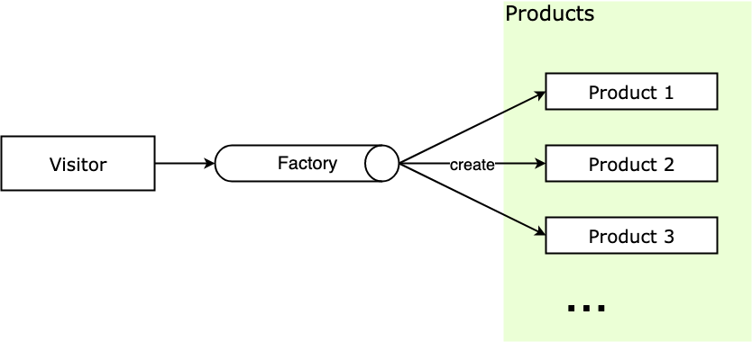

# 工厂模式

> 此处介绍的工厂模式是基于前端场景下的设计模式应用，因此会与传统的设计模式有所区别，主要体现在过程会更简化。

## 介绍

工厂模式（Factory Pattern），根据不同的输入返回不同类的实例，一般用来创建同一类对象。工厂方式的主要思想是**将对象的创建与对象的实现分离**。

在 JS 中的应用：

* 将 `new` 操作单独封装
* 遇到 `new` 时，就要考虑是否该使用工厂模式

## 通俗的示例

* 我们去 KFC 购买汉堡，只需直接点餐、取餐，不用自己亲手做
* KFC 要「封装」做汉堡的工作，做好直接给购买者

在类似场景中，这些例子有以下特点：

* 访问者只需要知道产品名，就可以从工厂获得对应实例。
* 访问者不关心实例创建过程。

## 工厂模式的通用实现

传统的工厂模式比较复杂，因为像 Java 等语言中有「接口」的概念。但 JS 中没有接口，即使可以用再加一层父类的形式来代替接口，但「用不同的子类继承父类，从而实现不同子类」的场景比较少，所以我们可以提炼一下工厂模式：

如果我们希望获得产品，通过工厂类就可以拿到产品实例，不用关注产品实例创建流程。主要有下面几个概念：

* **Factory**：工厂，负责返回产品实例。
* **Product**：产品，访问者从工厂拿到产品实例。

结构如下：

<div style="text-align: center;">
  
  <p style="text-align: center; color: #888;">（简易工厂模式结构图）</p>
</div>

代码如下：

> 以下代码中的 `init`、`func1`、`func2` 都是用来处理业务逻辑的代码，不是工厂模式相关的逻辑，实际使用中看情况进行修改。

```javascript
/* 工厂类 */
class Factory {
  static create(type) {
    switch (type) {
      case 'Product1':
        return new Product1();
      case 'Product2':
        return new Product2();
      default:
        throw new Error('当前没有这个产品');
    }
  }
}

/* 产品类 1 */
class Product1 {
  constructor() {
    this.type = 'Product1';
  }
  init() {
    console.log('init');
  }
  func1() {
    console.log('func1');
  }
  func2() {
    console.log('func2');
  }
}

/* 产品类 2 */
class Product2 {
  constructor() {
    this.type = 'Product2';
  }
  init() {
    console.log('init');
  }
  func1() {
    console.log('func1');
  }
  func2() {
    console.log('func2');
  }
}

// 测试
let p1 = Factory.create('Product1');
p1.init();
let p3 = Factory.create('Product3');
```

这样就完成了一个工厂模式，但是这个实现有一个问题：工厂中会包含很多与创建产品相关的过程，如果产品种类很多的话，这个工厂中就会罗列很多产品的创建逻辑，每次新增或删除产品种类，不仅要增加产品类，还需要对应地去修改工厂中的方法，违反了开闭原则，也导致这个工厂类变得臃肿、高耦合。

严格上这种实现在面向对象语言中叫做**简单工厂模式**。适用于产品种类比较少，创建逻辑不复杂的时候使用。

工厂模式的本意是将实际创建对象的过程推迟到子类中，一般用抽象类来作为父类，创建过程由抽象类的子类来具体实现。JavaScript 中没有抽象类（或者 Java 中的接口），所以我们可以简单地将工厂模式看做是一个实例化对象的工厂类即可。

## 工厂模式的实际应用

### Vue/React 源码中的工厂模式

和原生的 `document.createElement` 类似，Vue 和 React 这种具有虚拟 DOM 树（Virtual Dom Tree）机制的框架在生成虚拟 DOM 的时候，都提供了 `createElement` 方法用来生成 VNode，用来作为真实 DOM 节点的映射：

```javascript
// Vue
createElement('h3', { class: 'main-title' }, [
  createElement('img', { class: 'avatar', attrs: { src: '../avatar.jpg' } }),
  createElement('p', { class: 'user-desc' }, '放弃不难，但坚持一定很酷')
])

// React
React.createElement('h3', { className: 'user-info' },
  React.createElement('img', { src: '../avatar.jpg', className: 'avatar' }),
  React.createElement('p', { className: 'user-desc' }, '放弃不难，但坚持一定很酷')
)
```

`createElement` 函数结构大概如下：

```javascript
class Vnode (tag, data, children) { ... }

function createElement(tag, data, children) {
  return new Vnode(tag, data, children)
}
```

可以看到 `createElement` 函数内会进行 VNode 的具体创建，创建的过程是很复杂的，而框架提供的 `createElement` 工厂方法封装了复杂的创建与验证过程，对于使用者来说就很方便了。

### vue-router 源码中的工厂模式

工厂模式在源码中应用频繁，以 vue-router 中的源码为例，代码位置：[vue-router/src/index.js](https://github.com/vuejs/vue-router/blob/v3.0.6/src/index.js)

```javascript
// src/index.js
export default class VueRouter {
  constructor(options) {
    this.mode = mode	// 路由模式
        
    switch (mode) {     // 简单工厂
      case 'history':   // history 方式
        this.history = new HTML5History(this, options.base)
        break
      case 'hash':      // hash 方式
        this.history = new HashHistory(this, options.base, this.fallback)
        break
      case 'abstract':  // abstract 方式
        this.history = new AbstractHistory(this, options.base)
        break
      default:
        // ... 初始化失败报错
    }
  }
}
```

稍微解释一下这里的源码。`mode` 是路由创建的模式，这里有三种 History、Hash、Abstract，前两种我们已经很熟悉了，History 是 H5 的路由方式，Hash 是路由中带 `#` 的路由方式，Abstract 代表非浏览器环境中路由方式，比如 Node、weex 等；`this.history` 用来保存路由实例，vue-router 中使用了工厂模式的思想来获得响应路由控制类的实例。

源码里没有把工厂方法的产品创建流程封装出来，而是直接将产品实例的创建流程暴露在 `VueRouter` 的构造函数中，在被 `new` 的时候创建对应产品实例，相当于 `VueRouter` 的构造函数就是一个工厂方法。

如果一个系统不是 SPA （Single Page Application，单页应用），而是是 MPA（Multi Page Application，多页应用），那么就需要创建多个 `VueRouter` 的实例，此时 `VueRouter` 的构造函数也就是工厂方法将会被多次执行，以分别获得不同实例。

## 设计原则验证

* 构造函数和创建者分离
* 符合开放封闭原则

## 工厂模式的优缺点

优点：

* 良好的封装，代码结构清晰，**访问者无需知道对象的创建流程**，特别是创建比较复杂的情况下。
* 扩展性优良，通过工厂方法隔离了用户和创建流程隔离，**符合开放封闭原则**。
* 解耦了高层逻辑和底层产品类，**符合最少知识原则**，不需要的就不要去交流。

缺点：

* 带来了**额外的系统复杂度**，增加了抽象性。

## 工厂模式的使用场景

那么什么时候使用工厂模式呢：

* 对象的创建比较复杂，而访问者无需知道创建的具体流程。
* 处理大量具有相同属性的小对象。

什么时候不该用工厂模式：滥用只是增加了不必要的系统复杂度，过犹不及。

（完）
