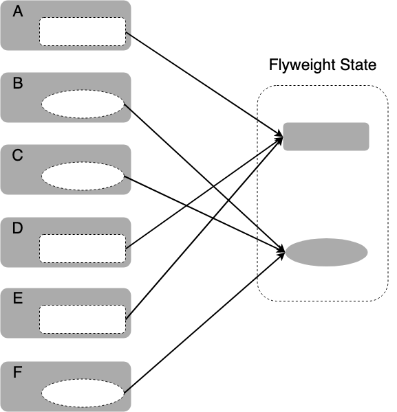
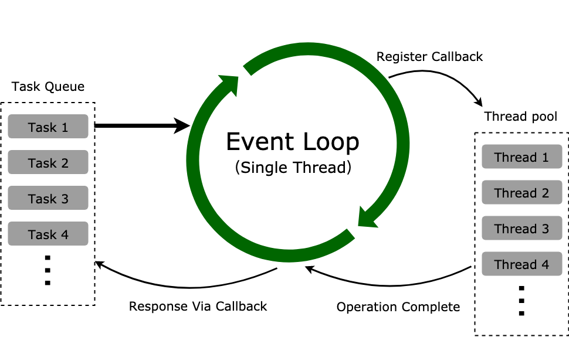

# 享元模式

## 介绍

享元模式（Flyweight Pattern）运用共享技术来有效地支持大量细粒度对象的复用，以减少创建的对象的数量。

享元模式的主要思想是**共享细粒度对象**，也就是说如果系统中存在多个相同的对象，那么只需共享一份就可以了，不必每个都去实例化每一个对象，这样来精简内存资源，提升性能和效率。

简单来说，

* 共享内存（主要考虑内存，而非效率）
* 相同的数据，共享使用
* 但是前端主要运行在客户端，所以使用场景不多。

> Fly 意为苍蝇，Flyweight 指轻蝇量级，指代对象粒度很小。

## 通俗的示例

我们去驾考的时候，如果给每个考试的人都准备一辆车，那考场就挤爆了，考点都堆不下考试车，因此驾考现场一般会有几辆车给要考试的人依次使用。如果考生人数少，就分别少准备几个自动档和手动档的驾考车，考生多的话就多准备几辆。如果考手动档的考生比较多，就多准备几辆手动档的驾考车。

生活中类似的场景还有很多，比如咖啡厅的咖啡口味，餐厅的菜品种类，拳击比赛的重量级等等。

在类似场景中，这些例子有以下特点：

* 目标对象具有一些共同的状态，比如驾考考生考的是自动档还是手动档。
* 这些共同的状态所对应的对象，可以被共享出来。

## 享元模式的通用实现

首先假设考生的 ID 为奇数则考的是手动档，为偶数则考的是自动档。如果给所有考生都 `new` 一个驾考车，那么这个系统中就会创建了和考生数量一致的驾考车对象：

```javascript
var candidateNum = 10   // 考生数量
var examCarNum = 0      // 驾考车的数量

/* 驾考车构造函数 */
function ExamCar(carType) {
  examCarNum++
  this.carId = examCarNum
  this.carType = carType ? '手动档' : '自动档'
}

ExamCar.prototype.examine = function(candidateId) {
  console.log('考生- ' + candidateId + ' 在' + this.carType + '驾考车- ' + this.carId + ' 上考试')
}

for (var candidateId = 1; candidateId <= candidateNum; candidateId++) {
  var examCar = new ExamCar(candidateId % 2)
  examCar.examine(candidateId)
}

console.log('驾考车总数 - ' + examCarNum)
// 输出: 驾考车总数 - 10
```

如果考生很多，那么系统中就会存在更多个驾考车对象实例，假如驾考车对象比较复杂，那么这些新建的驾考车实例就会占用大量内存。这时我们将同种类型的驾考车实例进行合并，手动档和自动档档驾考车分别引用同一个实例，就可以节约大量内存：

```javascript
var candidateNum = 10   // 考生数量
var examCarNum = 0      // 驾考车的数量

/* 驾考车构造函数 */
function ExamCar(carType) {
  examCarNum++
  this.carId = examCarNum
  this.carType = carType ? '手动档' : '自动档'
}

ExamCar.prototype.examine = function(candidateId) {
  console.log('考生- ' + candidateId + ' 在' + this.carType + '驾考车- ' + this.carId + ' 上考试')
}

var manualExamCar = new ExamCar(true)
var autoExamCar = new ExamCar(false)

for (var candidateId = 1; candidateId <= candidateNum; candidateId++) {
  var examCar = candidateId % 2 ? manualExamCar : autoExamCar
  examCar.examine(candidateId)
}

console.log('驾考车总数 - ' + examCarNum)
// 输出: 驾考车总数 - 2
```

可以看到我们使用 2 个驾考车实例就实现了刚刚 10 个驾考车实例实现的功能。这是仅有 10 个考生的情况，如果有几百上千考生，这时我们节约的内存就比较可观了，这就是享元模式要达到的目的。

## 享元模式改进

在原型链继承和组合继承中，子类通过原型 `prototype` 来复用父类的方法和属性，如果子类实例每次都创建新的方法与属性，那么在子类实例很多的情况下，内存中就存在有很多重复的方法和属性，即使这些方法和属性完全一样，因此这部分内存完全可以通过复用来优化，这也是享元模式的思想。

传统的享元模式是将目标对象的状态区分为**内部状态**和**外部状态**，内部状态相同的对象可以被共享出来指向同一个内部状态。正如之前举的驾考例子中，自动档还是手动档，就属于驾考考生中的内部状态，对应的驾考车就是可以被共享的对象。而考生的年龄、姓名、籍贯等就属于外部状态，一般没有被共享出来的价值。

主要的原理可以参看下面的示意图：

<div style="text-align: center;">
  
  <p style="text-align: center; color: #888;">（享元模式示意图）</p>
</div>

享元模式的主要思想是细粒度对象的共享和复用，因此对之前的驾考例子，我们可以继续改进一下：

* 如果某考生正在使用一辆驾考车，那么这辆驾考车的状态就是被占用，其他考生只能选择剩下未被占用状态的驾考车。
* 如果某考生对驾考车的使用完毕，那么将驾考车开回考点，驾考车的状态改为未被占用，供给其他考生使用。
* 如果所有驾考车都被占用，那么其他考生只能等待正在使用驾考车的考生使用完毕，直到有驾考车的状态变为未被占用。
* 组织单位可以根据考生数量多准备几辆驾考车，比如手动档考生比较多，那么手动档驾考车就应该比自动档驾考车多准备几辆。

接下来简单实现一下，首先创建 3 个手动档驾考车，然后注册 10 个考生参与考试，一开始肯定有 3 个考生同时上车，然后在某个考生考完之后其他考生接着后面考。为了实现这个过程，这里使用了 `Promise`，考试的考生在 0 到 2 秒后的随机时间考试完毕归还驾考车，其他考生在前面考生考完之后接着进行考试：

```javascript
let examCarNum = 0                  // 驾考车总数

/* 驾考车对象 */
class ExamCar {
  constructor(carType) {
    examCarNum++
    this.carId = examCarNum
    this.carType = carType ? '手动档' : '自动档'
    this.usingState = false    // 是否正在使用
  }

  /* 在本车上考试 */
  examine(candidateId) {
    return new Promise((resolve => {
      this.usingState = true
      console.log(`考生- ${ candidateId } 开始在${ this.carType }驾考车- ${ this.carId } 上考试`)
      setTimeout(() => {
        this.usingState = false
        console.log(`%c考生- ${ candidateId } 在${ this.carType }驾考车- ${ this.carId } 上考试完毕`, 'color:#f40')
        resolve()                       // 0~2秒后考试完毕
      }, Math.random() * 2000)
    }))
  }
}

/* 手动档汽车对象池 */
ManualExamCarPool = {
  _pool: [],                  // 驾考车对象池
  _candidateQueue: [],        // 考生队列

  /* 注册考生 ID 列表 */
  registCandidates(candidateList) {
    candidateList.forEach(candidateId => this.registCandidate(candidateId))
  },

  /* 注册手动档考生 */
  registCandidate(candidateId) {
    const examCar = this.getManualExamCar()    // 找一个未被占用的手动档驾考车
    if (examCar) {
      examCar.examine(candidateId)           // 开始考试，考完了让队列中的下一个考生开始考试
        .then(() => {
          const nextCandidateId = this._candidateQueue.length && this._candidateQueue.shift()
          nextCandidateId && this.registCandidate(nextCandidateId)
        })
    } else this._candidateQueue.push(candidateId)
  },

  /* 注册手动档车 */
  initManualExamCar(manualExamCarNum) {
    for (let i = 1; i <= manualExamCarNum; i++) {
      this._pool.push(new ExamCar(true))
    }
  },

  /* 获取状态为未被占用的手动档车 */
  getManualExamCar() {
    return this._pool.find(car => !car.usingState)
  }
}

ManualExamCarPool.initManualExamCar(3)          // 一共有3个驾考车
ManualExamCarPool.registCandidates([1, 2, 3, 4, 5, 6, 7, 8, 9, 10])  // 10个考生来考试
```

在浏览器中运行下试试，可以看到一个驾考的过程被模拟出来了，这里只简单实现了手动档，自动档驾考场景同理，就不进行实现了。上面的实现还可以进一步优化，比如考生多的时候自动新建驾考车，考生少的时候逐渐减少驾考车，但又不能无限新建驾考车对象，这些情况可以自行发挥。

如果可以将目标对象的内部状态和外部状态区分的比较明显，就可以将内部状态一致的对象很方便地共享出来，但是对 JavaScript 来说，我们并不一定要严格区分内部状态和外部状态才能进行资源共享，比如资源池模式。

## 资源池

上面这种改进的模式一般叫做**资源池**（Resource Pool），或者叫对象池（Object Pool），可以当作是享元模式的升级版，实现不一样，但是目的相同。资源池一般维护一个装载对象的池子，封装有获取、释放资源的方法，当需要对象的时候直接从资源池中获取，使用完毕之后释放资源等待下次被获取。

在上面的例子中，驾考车相当于有限资源，考生作为访问者根据资源的使用情况从资源池中获取资源，如果资源池中的资源都正在被占用，要么资源池创建新的资源，要么访问者等待占用的资源被释放。

资源池在后端应用相当广泛，比如缓冲池、连接池、线程池、字符常量池等场景，前端使用场景不多，但是也有使用，比如有些频繁的 DOM 创建销毁操作，就可以引入对象池来节约一些 DOM 创建损耗。

下面介绍资源池的几种主要应用。

### 线程池

以 Node.js 中的线程池为例，Node.js 的 JavaScript 引擎是执行在单线程中的，启动的时候会新建 4 个线程放到线程池中，当遇到一些异步 I/O 操作（比如文件异步读写、DNS 查询等）或者一些 CPU 密集的操作（Crypto、Zlib 模块等）的时候，会在线程池中拿出一个线程去执行。如果有需要，线程池会按需创建新的线程。

线程池在整个 Node.js 事件循环中的位置可以参照下图：

<div style="text-align: center;">
  
  <p style="text-align: center; color: #888;">（Node.js 线程池）</p>
</div>

上面这个图就是 Node.js 的事件循环（Event Loop）机制，简单解读一下（扩展视野，不一定需要懂）：

* 所有任务都在主线程上执行，形成执行栈（Execution Context Stack）。
* 主线程之外维护一个任务队列（Task Queue），接到请求时将请求作为一个任务放入这个队列中，然后继续接收其他请求。
* 一旦执行栈中的任务执行完毕，主线程空闲时，主线程读取任务队列中的任务，检查队列中是否有要处理的事件，这时要分两种情况：如果是非 I/O 任务，就亲自处理，并通过回调函数返回到上层调用；如果是 I/O 任务，将传入的参数和回调函数封装成请求对象，并将这个请求对象推入线程池等待执行，主线程则读取下一个任务队列的任务，以此类推处理完任务队列中的任务。
* 线程池当线程可用时，取出请求对象执行 I/O 操作，任务完成以后归还线程，并把这个完成的事件放到任务队列的尾部，等待事件循环，当主线程再次循环到该事件时，就直接处理并返回给上层调用。

### 缓存

根据二八原则，80% 的请求其实访问的是 20% 的资源，我们可以将频繁访问的资源缓存起来，如果用户访问被缓存起来的资源就直接返回缓存的版本，这就是 Web 开发中经常遇到的**缓存**。

缓存服务器就是缓存的最常见应用之一，也是复用资源的一种常用手段。缓存服务器的示意图如下：

<div style="text-align: center;">
  
  <p style="text-align: center; color: #888;">（缓存服务器示意图）</p>
</div>

缓存服务器位于访问者与业务服务器之间，对业务服务器来说，减轻了压力，减小了负载，提高了数据查询的性能。对用户来说，提升了网页打开速度，优化了体验。

缓存技术用的非常多，不仅仅用在缓存服务器上，浏览器本地也有缓存，查询的 DNS 也有缓存，包括我们的电脑 CPU 上，也有缓存硬件。

### 连接池

我们知道对数据库进行操作需要先创建一个数据库连接对象，然后通过创建好的数据库连接来对数据库进行 CRUD（增删改查）操作。如果访问量不大，对数据库的 CRUD 操作就不多，每次访问都创建连接并在使用完销毁连接就没什么，但是如果访问量比较多，并发的要求比较高时，频繁创建和销毁连接就比较消耗资源了。

这时，可以不销毁连接，一直使用已创建的连接，就可以避免频繁创建销毁连接的损耗了。但是有个问题，一个连接同一时间只能做一件事，某使用者（一般是线程）正在使用时，其他使用者就不可以使用了，所以如果只创建一个不关闭的连接显然不符合要求，我们需要创建多个不关闭的连接。

这就是**连接池**的来源，创建多个数据库连接，当有调用的时候直接在创建好的连接中拿出来使用，使用完毕之后将连接放回去供其他调用者使用。

我们以 Node.js 中 `mysql` 模块的连接池应用为例，看看后端一般是如何使用数据库连接池的。在 Node.js 中使用 `mysql` 创建单个连接，一般这样使用：

```javascript
var mysql = require('mysql')

var connection = mysql.createConnection({     // 创建数据库连接
  host: 'localhost',
  user: 'root',         // 用户名
  password: '123456',   // 密码
  database: 'db',       // 指定数据库
  port: '3306'          // 端口号
})

// 连接回调，在回调中增删改查
connection.connect(...)

// 关闭连接
connection.end(...)
```

在 Node.js 中使用 `mysql` 模块的连接池创建连接：

```javascript
var mysql = require('mysql')

var pool = mysql.createPool({     // 创建数据库连接池
  host: 'localhost',
  user: 'root',         // 用户名
  password: '123456',   // 密码
  database: 'db',       // 制定数据库
  port: '3306'          // 端口号
})

// 从连接池中获取一个连接，进行增删改查
pool.getConnection(function(err, connection) {
  // ... 数据库操作
  connection.release()  // 将连接释放回连接池中
})

// 关闭连接池
pool.end()
```

一般连接池在初始化的时候，都会自动打开 n 个连接，称为**连接预热**。如果这 n 个连接都被使用了，再从连接池中请求新的连接时，会动态地隐式创建额外连接，即**自动扩容**。如果扩容后的连接池一段时间后有不少连接没有被调用，则**自动缩容**，适当释放空闲连接，增加连接池中连接的使用效率。在连接失效的时候，自动**抛弃无效连接**。在系统关闭的时候，自动**释放所有连接**。为了维持连接池的有效运转和避免连接池无限扩容，还会给连接池设置最大最小连接数。

这些都是连接池的功能，可以看到连接池一般可以根据当前使用情况自动地进行缩容和扩容，来进行连接池资源的最优化，和连接池连接的复用效率最大化。这些连接池的功能点，看着是不是和之前驾考例子的优化过程有点似曾相识呢！

在实际项目中，除了数据库连接池外，还有 **HTTP 连接池**。使用 HTTP 连接池管理长连接可以复用 HTTP 连接，省去创建 TCP 连接的 3 次握手和关闭 TCP 连接的 4 次挥手的步骤，降低请求响应的时间。

连接池某种程度也算是一种缓冲池，只不过这种缓冲池是专门用来管理连接的。

### 字符常量池

很多语言的引擎为了减少字符串对象的重复创建，会在内存中维护有一个特殊的内存，这个内存就叫**字符常量池**。当创建新的字符串时，引擎会对这个字符串进行检查，与字符常量池中已有的字符串进行比对，如果存在有相同内容的字符串，就直接将引用返回，否则在字符常量池中创建新的字符常量，并返回引用。

类似于 Java、C# 这些语言，都有字符常量池的机制。JavaScript 有多个引擎，以 Chrome 的 V8 引擎为例，V8 在把 JavaScript 编译成字节码过程中就引入了字符常量池这个优化手段，这就是为什么很多 JavaScript 的书籍都提到了 JavaScript 中的字符串具有不可变性，因为如果内存中的字符串可变，一个引用操作改变了字符串的值，那么其他同样的字符串也会受到影响。

V8 引擎中的字符常量池存在一个变量 `string_table_` 中，这个变量保存有所有的字符串 `All strings are copied here, one after another`，地址位于 [v8/src/ast/ast-value-factory.h](https://github.com/v8/v8/blob/7.7.205/src/ast/ast-value-factory.h#L349-L350)，核心方法是 [LookupOrInsert](https://github.com/v8/v8/blob/7.7.205/src/ast/ast-value-factory.cc#L275)，这个方法给每一个字符串计算出 hash 值，并从 table 中搜索，没有则插入，感兴趣的话可以自行阅读。

引用《JavaScript 高级程序设计》中的话解释一下：

> ECMAScript 中的字符串是不可变的，也就是说，字符串一旦创建，它们的值就不能改变。要改变某个变量保存的字符串，首先要销毁原来的字符串，然后再用另一个包含新值的字符串填充该变量。

字符常量池也是复用资源的一种手段，只不过这种手段通常用在编译器的运行过程中，通常开发（搬砖）过程用不到，了解即可。

## 设计原则验证

* 将相同的部分抽象出来
* 符合开放封闭原则

## 享元模式的优缺点

优点：

* 由于**减少了系统中的对象数量**，提高了程序运行效率和性能，精简了内存占用，加快运行速度。
* **外部状态相对独立**，不会影响到内部状态，所以享元对象能够在不同的环境被共享。

缺点：

* 引入了共享对象，使对象结构变得复杂。
* 共享对象的创建、销毁等需要维护，带来额外的复杂度（如果需要把共享对象维护起来的话）。

## 享元模式的适用场景

* 如果一个程序中大量使用了相同或相似对象，那么可以考虑引入享元模式。
* 如果使用了大量相同或相似对象，并造成了比较大的内存开销。
* 对象的大多数状态可以被转变为外部状态。
* 剥离出对象的外部状态后，可以使用相对较少的共享对象取代大量对象。

在一些程序中，如果引入享元模式对系统的性能和内存的占用影响不大时，比如目标对象不多，或者场景比较简单，则不需要引入，以免适得其反。

## 其他相关模式

享元模式和单例模式、工厂模式、组合模式、策略模式、状态模式等等可以一起使用。

### 享元模式和工厂模式、单例模式

在区分出不同种类的外部状态后，创建新对象时需要选择不同种类的共享对象，这时就可以使用工厂模式来提供共享对象，在共享对象的维护上，经常会采用单例模式来提供单实例的共享对象。

### 享元模式和组合模式

在使用工厂模式来提供共享对象时，比如某些时候共享对象中的某些状态就是对象不需要的，可以引入组合模式来提升自定义共享对象的自由度，对共享对象的组成部分进一步归类、分层，来实现更复杂的多层次对象结构，当然系统也会更难维护。

### 享元模式和策略模式

策略模式中的策略属于一系列功能单一、细粒度的细粒度对象，可以作为目标对象来考虑引入享元模式进行优化，但是前提是这些策略是会被频繁使用的，如果不经常使用，就没有必要了。

（完）
