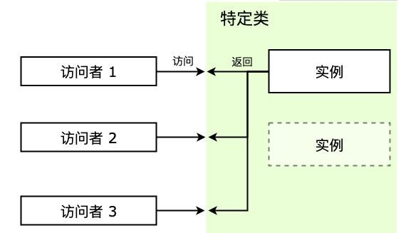

# 单例模式

> 单例模式可能是设计模式里面最简单的模式了，虽然简单，但在我们日常生活和编程中却经常接触到。

## 介绍

单例模式（Singleton Pattern）又称为单体模式，保证一个类只有一个实例，并提供一个访问它的全局访问点。也就是说，第二次使用同一个类创建新对象的时候，应该得到与第一次创建的对象完全相同的对象。

## 通俗的示例

* 登录框：一个系统有好多页面，但登录框只有一个。
* 购物车：一个商城有很多的模块，但购物车只有一个，添加商品时都是添加到同一个购物车中。

编程中也有很多对象我们只需要唯一一个，比如数据库连接、线程池、配置文件缓存、浏览器中的 window/document 等，如果创建多个实例，会带来资源耗费严重，或访问行为不一致等情况。

类似于数据库连接实例，我们可能频繁使用，但是创建它所需要的开销又比较大，这时只使用一个数据库连接就可以节约很多开销。一些文件的读取场景也类似，如果文件比较大，那么文件读取就是一个比较重的操作。比如这个文件是一个配置文件，那么完全可以将读取到的文件内容缓存一份，每次来读取的时候访问缓存即可，这样也可以达到节约开销的目的。

在类似场景中，这些例子有以下特点：

* 每次访问者来访问，返回的都是同一个实例。
* 如果一开始实例没有创建，那么这个特定类需要自行创建这个实例。

## 单例模式的通用实现

单例模式需要用到 private 的特性，JavaScript 中没有（TypeScript 除外），所以先用 Java 代码对应的单例模式来演示，然后用 JavaScript 来模仿实现。

### Java 代码实现

```java
public class SingleObject {
    // 注意，私有化构造函数，外部不能 new，只能内部 new
    private SingleObject() {
    }
    // 唯一被 new 出来的对象
    private SingleObject instance = null;
    // 获取对象的唯一接口
    public SingleObject getInstance() {
        if (instance == null) {
            // 只 new 一次
            instance = new SingleObject();
        }
        return instance;
    }

    // 对象方法
    public void login(username, password) {
        System.out.println("login...");
    }
}

// 测试代码
public class SingletonPatternDemo {
    public static void main(String[] args) {
        // 如果这样实例化对象，会报编译时错误：构造函数 SingleObject() 时不可见的！
        // 原因是构造函数已经私有化了，这样可以保证没法在外面初始化很多个实例
        // SingleObject object = new SingleObject();

        // 获取唯一可用的对象
        SingleObject object = SingleObject.getInstance();
        object.login();
    }
}
```

### JavaScript 代码实现

根据上面的 Java 代码实现，我们用 JavaScript 代码来模仿一下。主要有下面几个概念：

* **Singleton**：特定类，这是我们需要访问的类，访问者要拿到的是它的实例。
* **instance**：单例，是特定类的实例，特定类一般会提供 `getInstance` 方法来获取该单例。
* **getInstance**：获取单例的方法，或者直接由 `new` 操作符获取。

这里有几个实现点要关注一下：

* 访问时始终返回的是同一个实例。
* 自行实例化，无论是一开始加载的时候就创建好，还是在第一次被访问时。
* 一般还会提供一个 `getInstance` 方法用来获取它的实例。

结构如下：

<div style="text-align: center;">
  
  <p style="text-align: center; color: #888;">（单例模式结构图）</p>
</div>

代码如下：

#### 1）一个最简单的单例模式

> 复习一个 JS 的小知识点：构造函数中的 `this` 指向 new 创建的新对象

```javascript
class Singleton {
  static _instance = null;  // 存储单例

  constructor() {
    if (Singleton._instance) {  // 判断是否已经有单例了
      return Singleton._instance;
    }
    Singleton._instance = this; // this 指向新创建的对象，此处再把它赋值给 _instance 变量
  }

  // 定义静态方法：无论 new 多少次，只会共享这一个方法
  static getInstance() {
    if (Singleton._instance) {  // 判断是否已经有单例了
      return Singleton._instance;
    }
    return Singleton._instance = new Singleton();
  }
}

// 测试
const obj1 = new Singleton();
const obj2 = Singleton.getInstance();
console.log('obj1 === obj2', obj1 === obj2);  // 两者必须完全相等
```

这个类在内部维护一个实例，第一次执行 `new` 的时候判断这个实例有没有创建过，创建过就直接返回，否则走创建流程。

但这种简单实现有一个缺点，就是维护的实例 `_instance` 作为静态属性直接暴露，外部可以直接修改。

#### 2）IIFE 方式创建单例模式

我们使用立即调用函数 IIFE 将不希望公开的单例实例 `_instance` 隐藏。这样一来，由于变量 `_instance` 在闭包的内部，所以外部代码无法直接修改。

> 以下代码中的 `init` 是用来处理业务逻辑的代码，不是单例相关逻辑，实际使用中看情况进行修改。

```javascript
const Singleton = (function() {
  let _instance = null;  // 存储单例
    
  const Singleton = function() {
    if (_instance) return _instance;  // 判断是否已有单例
    _instance = this;                 // this 指向新创建的对象，此处再把它赋值给 _instance 变量
    this.init();                      // 初始化操作
    return _instance;
  }
    
  Singleton.prototype.init = function() {
    this.foo = 'Singleton Pattern';
  }

  // 定义静态方法
  Singleton.getInstance = function() {
    if (_instance) return _instance;
    _instance = new Singleton();
    return _instance;
  }
    
  return Singleton;
})()

// 测试
const visitor1 = new Singleton();
const visitor2 = new Singleton();         // 既可以 new 获取单例
const visitor3 = Singleton.getInstance(); // 也可以 getInstance 获取单例

console.log(visitor1 === visitor2);	// true
console.log(visitor1 === visitor3);	// true
```

注意，上述代码中 IIFE 内部返回的 `Singleton` 才是我们真正需要的单例的构造函数，外部的 `Singleton` 把它和一些单例模式的创建逻辑进行了一些封装。

这种方法有一个代价就是闭包开销，并且因为 IIFE 操作带来了额外的复杂度，让可读性变差。

#### 3）块级作用域方式创建单例

IIFE 方式本质还是通过函数作用域的方式来隐藏内部作用域的变量，有了 ES6 的 let/const 之后，可以通过 `{ }` 块级作用域的方式来隐藏内部变量：

> 以下代码中的 `init` 是用来处理业务逻辑的代码，不是单例相关逻辑，实际使用中看情况进行修改。

```javascript
let getInstance;

{
  let _instance = null;  // 存储单例
    
  const Singleton = function() {
    if (_instance) return _instance;  // 判断是否已有单例
    _instance = this;
    this.init();                      // 初始化操作
    return _instance;
  }
    
  Singleton.prototype.init = function() {
    this.foo = 'Singleton Pattern';
  }
    
  getInstance = function() {
    if (_instance) return _instance;
    _instance = new Singleton();
    return _instance;
  }
}

// 测试
const visitor1 = getInstance();
const visitor2 = getInstance();

console.log(visitor1 === visitor2);  // 两者必须完全相等
```

这种对块级作用域的用法是不是很巧妙！

#### 4）单例模式赋能

之前的例子中，单例模式的创建逻辑和原先这个类的一些功能逻辑（比如 `init` 等操作）混杂在一起，根据**单一职责原则**，这个例子我们还可以继续改进一下，将单例模式的创建逻辑和特定类的功能逻辑拆开，这样功能逻辑就可以和正常的类一样。

> 以下代码中的 `FuncClass` 是业务逻辑类，不是单例相关逻辑，实际使用中看情况进行修改。

```javascript
/* 功能类 */
class FuncClass {
  constructor(bar) { 
    this.bar = bar;
    this.init();
  }
    
  init() {
    this.foo = 'Singleton Pattern';
  }
}

/* 单例模式的赋能类 */
const Singleton = (function() {
  let _instance = null;  // 存储单例
    
  const ProxySingleton = function(bar) {
    if (_instance) return _instance;  // 判断是否已有单例
    _instance = new FuncClass(bar);
    return _instance;
  }

  ProxySingleton.getInstance = function(bar) {
    if (_instance) return _instance;
    _instance = new Singleton(bar);
    return _instance;
  }
    
  return ProxySingleton;
})()


// 测试
const visitor1 = new Singleton('单例1');
const visitor2 = new Singleton('单例2');
const visitor3 = Singleton.getInstance();

console.log(visitor1 === visitor2);	// true
console.log(visitor1 === visitor3);	// true
```

这样的单例模式赋能类也可被称为**代理类**，将业务类和单例模式的逻辑解耦，把单例的创建逻辑抽象封装出来，有利于业务类的扩展和维护。代理的概念我们将在后面**代理模式**的章节中更加详细地探讨。

使用类似的概念，配合 ES6 引入的 `Proxy` 来拦截默认的 `new` 方式，我们可以写出更简化的单例模式赋能方法：

```javascript
/* Person 类 */
class Person {
  constructor(name, age) {
    this.name = name;
    this.age = age;
  }
}

/* 单例模式的赋能方法 */
function Singleton(FuncClass) {
  let _instance;
  return new Proxy(FuncClass, {
    construct(target, args) {
      return _instance || (_instance = Reflect.construct(FuncClass, args)); // 使用 new FuncClass(...args) 也可以
    }
  });
}

// 测试
const PersonInstance = Singleton(Person);

const person1 = new PersonInstance('张三', 13);
const person2 = new PersonInstance('李四', 14);

console.log(person1 === person2); // true
```

### 惰性单例、懒汉式-饿汉式

有时候一个实例化过程比较耗费性能的类，但是却一直用不到，如果一开始就对这个类进行实例化就显得有些浪费，那么这时我们就可以使用**惰性创建**，即延迟创建该类的单例。之前的例子都属于惰性单例，实例的创建都是 `new` 的时候才进行。

惰性单例又被成为**懒汉式**，相对应的概念是**饿汉式**：

* 懒汉式单例是在使用时才实例化
* 饿汉式是当程序启动时或单例模式类一加载的时候就被创建

举一个简单的例子比较一下：

```javascript
class FuncClass {
  constructor() { this.bar = 'bar' };
}

// 饿汉式
const HungrySingleton = (function() {
  const _instance = new FuncClass();
    
  return function() {
    return _instance;
  }
})()

// 懒汉式
const LazySingleton = (function() {
  let _instance = null;
    
  return function() {
    return _instance || (_instance = new FuncClass());
  }
})()

// 测试
const visitor1 = new HungrySingleton();
const visitor2 = new HungrySingleton();
const visitor3 = new LazySingleton();
const visitor4 = new LazySingleton();

console.log(visitor1 === visitor2)	// true
console.log(visitor3 === visitor4)	// true
```

通过打上 `debugger` 可以在控制台中观察到：

* 饿汉式在 `HungrySingleton` 这个 IIFE 执行的时候就进入到 `FuncClass` 的实例化流程了。
* 懒汉式的 `LazySingleton` 中 `FuncClass` 的实例化过程是在第一次 `new` 的时候才进行的。

惰性创建在实际开发中使用很普遍，了解一下对以后的开发工作很有帮助。

## 单例模式的实际应用

### 模拟登录框

```javascript
class LoginForm {
  constructor() {
    this.state = 'hide';
  }
  show() {
    if (this.state === 'show') {
      console.log('登录框已经显示');
      return;
    }
    this.state = 'show';
    console.log('登录框显示成功');
  }
  hide() {
    if (this.state === 'hide') {
      console.log('登录框已经隐藏');
      return;
    }
    this.state = 'hide';
    console.log('登录框隐藏成功');
  }
}

// 定义获取单例的静态方法
// 自执行函数的目的是方便里面添加闭包变量，防止把变量添加在外面造成变量污染
LoginForm.getInstance = (function() {
  let _instance; // 闭包
  return function() {
    if (!_instance) {
      _instance = new LoginForm();
    }
    return _instance;
  }
})()

// 测试
let login1 = LoginForm.getInstance();
login1.show();
let login2 = LoginForm.getInstance();
login2.show();
console.log('login1 === login2', login1 === login2)
```

### ElementUI 中的 Loading

以 ElementUI 为例，ElementUI 中的全屏 Loading 蒙层调用有两种形式：

```javascript
// 1. 指令形式
Vue.use(Loading.directive)
// 2. 服务形式
Vue.prototype.$loading = service
```

* 上面的是指令形式注册，使用的方式 `<div :v-loading.fullscreen="true">...</div>`
* 下面的是服务形式注册，使用的方式 `this.$loading({ fullscreen: true })`

用服务方式使用全屏 Loading 是单例的，即在前一个全屏 Loading 关闭前再次调用全屏 Loading，并不会创建一个新的 Loading 实例，而是返回现有全屏 Loading 的实例。

下面我们可以看看 ElementUI 2.9.2 的[源码](https://github.com/ElemeFE/element/blob/v2.9.2/packages/loading/src/index.js)是如何实现的，为了观看方便，省略了部分代码：

```javascript
import Vue from 'vue'
import loadingVue from './loading.vue'

const LoadingConstructor = Vue.extend(loadingVue)

let fullscreenLoading

const Loading = (options = {}) => {
  if (options.fullscreen && fullscreenLoading) {
    return fullscreenLoading
  }

  let instance = new LoadingConstructor({
    el: document.createElement('div'),
    data: options
  })

  if (options.fullscreen) {
    fullscreenLoading = instance
  }
  return instance
}

export default Loading
```

这里的单例是 `fullscreenLoading`，是存放在闭包中的，如果用户传的 `options` 的 `fullscreen` 为 `true` 且已经创建了单例的情况下则回直接返回之前创建的单例，如果之前没有创建过，则创建单例并赋值给闭包中的 `fullscreenLoading` 后返回新创建的单例实例。

这是一个典型的单例模式的应用，通过复用之前创建的全屏蒙层单例，不仅减少了实例化过程，而且避免了蒙层叠加蒙层出现的底色变深的情况。

### 其他

* 购物车（和登录框类似）
* vuex 和 redux 中的 store

## 设计原则验证

* 符合单一职责原则，只实例化唯一的对象（意思是初始化的动作都放到 `getInstance` 函数里去了，没有交给外面的人来做）
* 没法具体体现开放封闭原则，但是绝对不违反开放封闭原则

## 单例模式的优缺点

单例模式主要解决的问题就是**节约资源，保持访问一致性**。

优点：

* 单例模式在创建后在内存中只存在一个实例，节约了内存开支和实例化时的性能开支，特别是需要重复使用一个创建开销比较大的类时，比起实例不断地销毁和重新实例化，单例能节约更多资源，比如数据库连接。
* 单例模式可以解决对资源的多重占用，比如写文件操作时，因为只有一个实例，可以避免对一个文件进行同时操作。
* 只使用一个实例，也可以减小垃圾回收机制 GC（Garbage Collection）的压力，表现在浏览器中就是系统卡顿减少，操作更流畅，CPU 资源占用更少。

缺点：

* 单例模式对扩展不友好，一般**不容易扩展**，因为单例模式一般自行实例化，没有接口。
* **与单一职责原则冲突**，一个类应该只关心内部逻辑，而不关心外面怎么样来实例化（从这个方面来讲确实）。

## 单例模式的使用场景

那在什么时候使用单例模式呢：

* 当一个类的**实例化过程消耗的资源过多**，可以使用单例模式来避免性能浪费。
* 当项目中需要一个公共的状态，那么需要使用单例模式来**保证访问一致性**。

（完）
