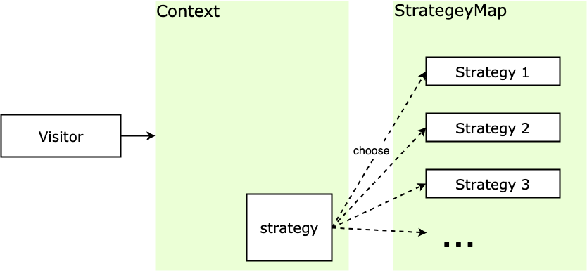

# 策略模式

## 介绍

策略模式（Strategy Pattern）又称政策模式，其定义一系列的算法，把它们一个个封装起来，并且使它们可以互相替换。封装的策略算法一般是独立的，策略模式根据输入来调整采用哪个算法。关键是策略的**实现和使用分离**。

## 通俗的示例

简单来说就是不同策略分开处理，避免出现大量 `if...else` 或者 `switch... case`。

例如电商网站在双十一举办活动，有的商品满 100 减 30，有的商品满 200 减 80，有的商品直接 8 折出售，不同商品的优惠策略不一样。

在这些场景中，有以下特点：

* 折扣计算方式（策略）之间相互独立，但又可以相互替换。
* 具体折扣的计算过程（封装上下文）可以根据需要的不同选用不同的策略。

## 策略模式的通用实现

假设要实现上面说的双十一促销折扣功能，不使用策略模式的写法：

```javascript
function priceCalculate(discountType, price) {
  if (discountType === 'minus100_30') {   		// 满100减30
    return price - Math.floor(price / 100) * 30;
  }
  else if (discountType === 'minus200_80') {    // 满200减80
    return price - Math.floor(price / 200) * 80;
  }
  else if (discountType === 'percent80') {      // 8折
    return price * 0.8;
  }
}

priceCalculate('minus100_30', 270); // 输出: 210
priceCalculate('percent80', 250);   // 输出: 200
```

通过判断输入的折扣类型来计算商品总价的方式，几个 `if-else` 就满足了需求，但是这样的做法的缺点也很明显：

* `priceCalculate` 函数随着折扣类型的增多，`if-else` 判断语句会变得越来越臃肿。
* 如果增加了新的折扣类型或者折扣类型的算法有所改变，那么需要更改 `priceCalculate` 函数的实现，这是违反开放-封闭原则的。
* 可复用性差，如果在其他的地方也有类似这样的算法，但规则不一样，上述代码不能复用。

使用策略模式来写的话，折扣计算方式作为策略，具体折扣的计算过程作为封装上下文，主要有下面几个概念：

* **Context**：封装上下文，根据需要调用需要的策略，屏蔽外界对策略的直接调用，只对外提供一个接口，根据需要调用对应的策略。
* **Strategy**：策略，含有具体的算法，其方法的外观相同，因此可以互相代替。
* **StrategyMap**：所有策略的合集，供封装上下文调用。

结构如下：

<div style="text-align: center;">
  
  <p style="text-align: center; color: #888;">（策略模式结构图）</p>
</div>

代码如下：

```javascript
// 存储所有策略
const StrategyMap = {}

// 封装上下文
function context(type, ...rest) {
  return StrategyMap[type] && StrategyMap[type](...rest)
}

// 增加策略
StrategyMap.minus100_30 = function(price) {
  return price - Math.floor(price / 100) * 30
}
// 调用策略
context('minus100_30', 270)	// 输出: 210
```

这样就能很方便地增加策略，便于扩展。

## 策略模式的实际应用

### 表格 formatter

这里举一个 Vue + ElementUI 项目中用到的例子。

Element 的表格控件的 Column 接受一个 `formatter` 参数，用来格式化内容，其类型为函数，并且还可以接受几个特定参数，像这样：`Function(row, column, cellValue, index)`。

以文件的大小转化为例，后端经常会直接传 bit 单位的文件大小，那么前端需要根据后端的数据，根据需求转化为自己需要的单位的文件大小，比如 KB/MB。

首先实现文件大小的计算算法：

```javascript
export const StrategyMap = {
  /* Strategy 1: 将文件大小（bit）转化为 KB */
  bitToKB: val => {
    const num = Number(val)
    return isNaN(num) ? val : (num / 1024).toFixed(0) + 'KB'
  },
  /* Strategy 2: 将文件大小（bit）转化为 MB */
  bitToMB: val => {
    const num = Number(val)
    return isNaN(num) ? val : (num / 1024 / 1024).toFixed(1) + 'MB'
  }
}

/* Context: 生成el表单 formatter */
const strategyContext = function(type, rowKey){
  return function(row, column, cellValue, index){
    return StrategyMap[type](row[rowKey])
  }
}

export default strategyContext
```

那么在组件中我们可以直接：

```vue
<template>
  <el-table :data="tableData">
    <el-table-column prop="date" label="日期"></el-table-column>
    <el-table-column prop="name" label="文件名"></el-table-column>
    <!-- 直接调用 strategyContext -->
    <el-table-column prop="sizeKb" label="文件大小(KB)"
                     :formatter='strategyContext("bitToKB", "sizeKb")'>
    </el-table-column>
    <el-table-column prop="sizeMb" label="附件大小(MB)"
                     :formatter='strategyContext("bitToMB", "sizeMb")'>
    </el-table-column>
  </el-table>
</template>

<script type='text/javascript'>
import strategyContext from './strategyContext.js'
    
export default {
  name: 'ElTableDemo',
  data() {
    return {
      strategyContext,
      tableData: [
        { date: '2022-03-27', name: '文件1', sizeKb: 1234, sizeMb: 1234426 },
        { date: '2022-03-29', name: '文件2', sizeKb: 4213, sizeMb: 8636152 }
      ]
    }
  }
}
</script>

<style scoped></style>
```

### 表单验证

除了表格中的 formatter 之外，策略模式也经常用在表单验证的场景，还是举一个 Vue + ElementUI 项目的例子。

ElementUI 的 Form 表单 具有表单验证功能，用来校验用户输入的表单内容。实际需求中表单验证项一般会比较复杂，所以需要给每个表单项增加 validator 自定义校验方法。

我们可以像官网示例一样把表单验证都写在组件的状态 `data` 函数中，但是这样就不好复用使用频率比较高的表单验证方法了，这时我们可以结合策略模式和函数柯里化的知识来重构一下。首先我们在项目的工具模块（一般是 `utils` 文件夹）实现通用的表单验证方法：

```javascript
// src/utils/validates.js

/* 姓名校验 由2-10位汉字组成 */
export function validateUsername(str) {
  const reg = /^[\u4e00-\u9fa5]{2,10}$/
  return reg.test(str)
}

/* 手机号校验 由以1开头的11位数字组成  */
export function validateMobile(str) {
  const reg = /^1\d{10}$/
  return reg.test(str)
}

/* 邮箱校验 */
export function validateEmail(str) {
  const reg = /^[a-zA-Z0-9_-]+@[a-zA-Z0-9_-]+(\.[a-zA-Z0-9_-]+)+$/
  return reg.test(str)
}
```

然后在 `utils/index.js` 中增加一个柯里化方法，用来生成表单验证函数：

```javascript
// src/utils/index.js

import * as Validates from './validates.js'

/* 生成表格自定义校验函数 */
export const formValidateGene = (key, msg) => (rule, value, cb) => {
  if (Validates[key](value)) {
    cb()
  } else {
    cb(new Error(msg))
  }
}
```

上面的 `formValidateGene` 函数接受两个参数，第一个是验证规则，也就是 `src/utils/validates.js` 文件中提取出来的通用验证规则的方法名，第二个参数是报错的话表单验证的提示信息。

```vue
<template>
  <el-form ref="ruleForm"
           label-width="100px"
           class="demo-ruleForm"
           :rules="rules"
           :model="ruleForm">
        
    <el-form-item label="用户名" prop="username">
      <el-input v-model="ruleForm.username"></el-input>
    </el-form-item>
        
    <el-form-item label="手机号" prop="mobile">
      <el-input v-model="ruleForm.mobile"></el-input>
    </el-form-item>
        
    <el-form-item label="邮箱" prop="email">
      <el-input v-model="ruleForm.email"></el-input>
    </el-form-item>
  </el-form>
</template>

<script type='text/javascript'>
import * as Utils from '../utils'
    
export default {
  name: 'ElTableDemo',
  data() {
    return {
      ruleForm: { pass: '', checkPass: '', age: '' },
      rules: {
        username: [{
          validator: Utils.formValidateGene('validateUsername', '姓名由2-10位汉字组成'),
          trigger: 'blur'
        }],
        mobile: [{
          validator: Utils.formValidateGene('validateMobile', '手机号由以1开头的11位数字组成'),
          trigger: 'blur'
        }],
        email: [{
          validator: Utils.formValidateGene('validateEmail', '不是正确的邮箱格式'),
          trigger: 'blur'
        }]
      }
    }
  }
}
</script>
```

可以看见在使用的时候非常方便，把表单验证方法提取出来作为策略，使用柯里化方法动态选择表单验证方法，从而对策略灵活运用，大大加快开发效率。

## 设计原则验证

* 不同策略，分开处理，而不是混合在一起
* 符合开放封闭原则

## 策略模式的优缺点

策略模式将算法的**实现和使用拆分**，这个特点带来了很多优点：

* 策略之间相互独立，但**策略可以自由切换**，这个策略模式的特点给策略模式带来很多灵活性，也提高了策略的复用率。
* 如果不采用策略模式，那么在选策略时一般会采用多重的条件判断，采用策略模式可以**避免多重条件判断**，增加可维护性。
* **可扩展性好**，策略可以很方便的进行扩展。

缺点：

* 策略相互独立，因此一些复杂的算法逻辑**无法共享**，造成一些资源浪费。
* 如果用户想采用什么策略，必须了解策略的实现，因此**所有策略都需向外暴露**，这是违背迪米特法则/最少知识原则的，也增加了用户对策略对象的使用成本。

## 策略模式的适用场景

那么应该在什么场景下使用策略模式呢：

* 多个算法**只在行为上稍有不同**的场景，这时可以使用策略模式来动态选择算法。
* 算法**需要自由切换**的场景。
* 有时**需要多重条件判断**，那么可以使用策略模式来规避多重条件判断的情况。

## 其他相关模式

### 策略模式和模板方法模式

策略模式和模板方法模式的作用比较类似，但是结构和实现方式有点不一样。

* **策略模式** 让我们在程序运行的时候动态地指定要使用的算法。
* **模板方法模式** 是在子类定义的时候就已经确定了使用的算法。

### 策略模式和享元模式

见享元模式中的介绍。

（完）
