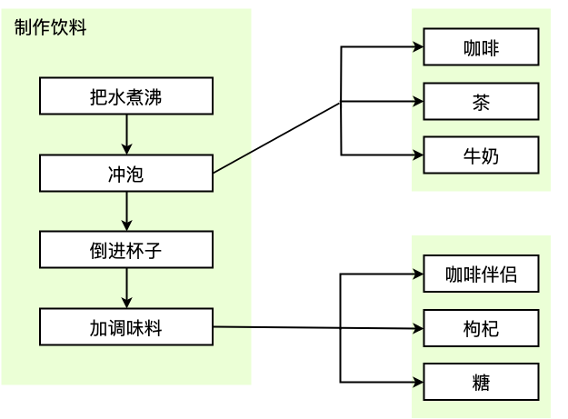
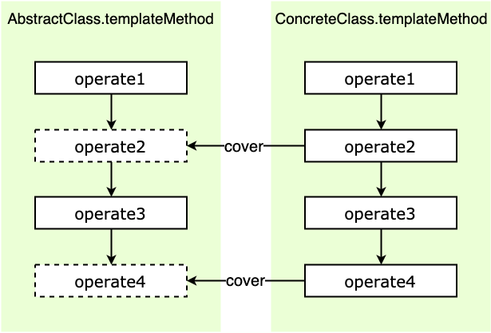

# 模板方法模式

## 介绍

模板方法模式（Template Method Pattern）父类中定义一组操作算法骨架，而将一些实现步骤延迟到子类中，使得子类可以不改变父类的算法结构的同时，重新定义算法中的某些实现步骤。模板方法模式的关键是**算法步骤的骨架和具体实现分离**。

## 通俗的示例

这里举个经典的咖啡厅例子，咖啡厅制作饮料的过程有一些类似的步骤：

1. 先把水煮沸
2. 冲泡饮料（咖啡、茶、牛奶）
3. 倒进杯子中
4. 最后加一些调味料（咖啡伴侣、枸杞、糖）

无论冲饮的是咖啡、茶、牛奶，他们的制作过程都类似，可以被总结为这几个流程。也就是说这个流程是存在着类似的流程结构的，这就给我们留下了将操作流程抽象封装出来的余地。

<div style="text-align: center;">
  
  <p style="text-align: center; color: #888;">（制作饮料步骤图）</p>
</div>

再举个例子，做菜的过程也可以被总结为固定的几个步骤：

1. 准备食材（肉、蔬菜、菌菇）
2. 食材放到锅里
3. 放调味料（糖、盐、油）
4. 炒菜
5. 倒到容器里（盘子、碗）

在类似的场景中，这些例子都有这些特点：

* 有一个基本的操作流程，这个流程我们可以抽象出来，由具体实例的操作流程来实现，比如做咖啡的时候冲泡的就是咖啡，做茶的时候冲泡的就是茶。
* 一些共用的流程，就可以使用通用的公共步骤，比如把水煮沸，比如将食材放到锅里，这样的共用流程就可以共用一个具体方法就可以了。

## 模板方法模式的通用实现

根据上面的例子，我们可以提炼一下模板方法模式。饮料类可以被认为是父类（AbstractClass），父类中实现了模板方法（templateMethod），模板方法中抽象了操作的流程，共用的操作流程是普通方法，而非共用的可变方法是抽象方法，需要被子类（ConcreteClass）实现，或者说覆盖，子类在实例化后执行模板方法，就可以按照模板方法定义好的算法一步步执行。主要有下面几个概念：

* **AbstractClass**：抽象父类，把一些共用的方法提取出来，把可变的方法作为抽象类，最重要的是把算法骨架抽象出来为模板方法。
* **templateMethod**：模板方法，固定了希望执行的算法骨架。
* **ConcreteClass**：子类，实现抽象父类中定义的抽象方法，调用继承的模板方法时，将执行模板方法中定义的算法流程。

结构如下：

<div style="text-align: center;">
  
  <p style="text-align: center; color: #888;">（模板方法模式结构图）</p>
</div>

代码如下：

```javascript
/* 抽象父类 */
class AbstractClass {
  constructor() {
    if (new.target === AbstractClass) {
      throw new Error('抽象类不能直接实例化!');
    }
  }

  /* 共用方法 */
  operate1() { console.log('operate1') }

  /* 抽象方法 */
  operate2() { throw new Error('抽象方法不能调用!') }

  /* 模板方法 */
  templateMethod() {
    this.operate1();
    this.operate2();
  }
}

/* 实例子类，继承抽象父类 */
class ConcreteClass extends AbstractClass {
  constructor() { super() }

  /* 覆盖抽象方法 operate2 */
  operate2() { console.log('operate2') }
}

const instance = new ConcreteClass();
instance.templateMethod();

// 输出：operate1
// 输出：operate2
```

## 模板方法模式的优缺点

优点：

* **封装了不变部分，扩展可变部分**，把算法中不变的部分封装到父类中直接实现，而可变的部分由子类继承后再具体实现。
* **提取了公共代码部分，易于维护**，因为公共的方法被提取到了父类，那么如果我们需要修改算法中不变的步骤时，不需要到每一个子类中去修改，只要改一下对应父类即可。
* **行为被父类的模板方法固定**，子类实例只负责执行模板方法，具备可扩展性，符合开闭原则。

缺点：

* **增加了系统复杂度**，主要是增加了的抽象类和类间联系，需要做好文档工作。

## 模板方法模式的适用场景

* 如果知道一个算法所需的关键步骤，而且**很明确这些步骤的执行顺序，但是具体的实现是未知的、灵活的**，那么这时候就可以使用模板方法模式来**将算法步骤的框架抽象出来**。
* 重要而复杂的算法，可以**把核心算法逻辑设计为模板方法**，周边相关细节功能由各个子类实现。
* 模板方法模式可以被用来将**子类组件将自己的方法挂钩到高层组件中**，也就是钩子，子类组件中的方法交出控制权，高层组件在模板方法中决定何时回调子类组件中的方法，类似的用法场景还有发布-订阅模式、回调函数。

## 其他相关模式

### 模板方法模式与工厂模式

模板方法模式的实现可以使用工厂模式来获取所需的对象。

另外，模板方法模式和抽象工厂模式比较类似，都是使用抽象类来提取公共部分，不一样的是：

* **适配器模式**：主要用来解决接口之间不匹配的问题，通常是为所适配的对象提供一个不同的接口。
* **代理模式**：提供访问目标对象的间接访问，以及对目标对象功能的扩展，一般提供和目标对象一样的接口。

### 代理模式与装饰器模式

装饰器模式实现上和代理模式类似，都是在访问目标对象之前或者之后执行一些逻辑，但是目的和功能不同：

* **抽象工厂模式** 提取的是实例的功能结构。
* **模板方法模式** 提取的是算法的骨架结构。

### 模板方法模式与策略模式

参见策略模式介绍。

（完）
