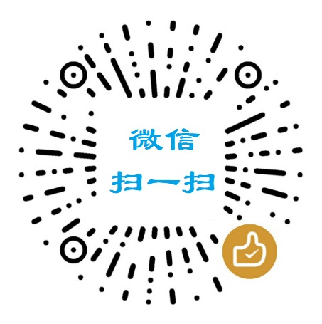

# 哈喽，欢迎你来到了这个页面

## 欢迎到来

首先：感谢你进入了这个页面~（因为这个页面的入口没有放到导航栏呀）

我是一名程序员，如果想了解更多关于我的资料，可以戳[这里](/others/about)。

我平时喜欢阅读，每年都要买很多书。有些读完觉得想收藏的，会摆在书柜里；有些书的内容消化完，暂时不想收藏的，会在咸鱼或者多抓鱼平台低价出给有缘人；经常也会踩到坑，买到内容比较一般的书，就会凑满一箱论斤捐了（换点蚂蚁森林的能量）。

如果你感兴趣的话，可以看看我的[豆瓣主页](https://book.douban.com/people/wenyuan1024/)，或者推荐我一些你觉得不错的书。

如果我的文章或者开源项目对你有帮助，或者纯粹想壕一把过个瘾，或者有钱任性，愿意赠我一本书的话，本人就在这里先行谢过啦！

## 打赏方式

我现在想读的在[我的豆瓣](https://book.douban.com/people/wenyuan1024/wish)中可以找到。

打赏金额不限，多少你说了算。一分也是对我的鼓励，当凑满一本书的价钱时，我就会入手它。

如果你决定要支持我阅读的话，希望能够备注一下 **博客赞赏+你的昵称+留言**，例如「博客赞赏：王大锤：感谢分享，坚持坚持」。每一笔赞赏我都会记下，汇总整理后写个页面，把赞赏人和我用这笔赞赏金买的书列出来。

### 方式一：支付宝扫一扫

用支付宝扫下面这个二维码，金额随意~

  

### 方式二：微信扫一扫

固定金额的打赏方式，多种金额选择。

  

## Q & A

### 我赞赏给你的钱真的会用来买书吗？

可能会买别的东西，但都是用在学习上，比如极客时间、慕课网，等等。

事实上，每年用在学习上的开销还是比较高的（很多时候买的不太值，唉），所以赞赏的钱不太可能用于别的地方。而且我本身也是农村出生，目前在打拼阶段，不舍得在其他方面消费。

### 你每年在学习上花多少钱？

除了书籍，还有上面提到的一些学习平台的学习资源，另外还有在知识付费平台当一下韭菜（说多了都是泪，希望你们不要跟我一样踩坑），加起来得上千。不过有些是众筹的，所以价格会低一些，不然消费更多了。

总的来说，虽然是程序员，但是要学的东西包括但不仅限于编程，因此每年的学习支出金额不固定。

### 阅读的话，都是买的实体书吗？

是的，都是买的纸质书，因为电子版的读起来没有那种感觉，而且不能很方便地做笔记、贴便利贴等等。此外也是为了保护视力啦，因为程序员平时盯着屏幕真的已经够久了。

我看到有些人会用 Kindle，我也留意过，首先价格不便宜，万一买来用着不适应，退货也麻烦（会给京东造成「二手东」的困扰，东哥是我偶像，京东是我最喜欢的购物平台），所以暂时就不入手了。

### 赞赏你买的书，会反过来卖书赚钱吗？

其实我卖书都是低价卖的，有时候还会倒贴钱，什么意思呢？

就好比去年以一块钱和五块钱的价格分别在咸鱼上卖了九成新的《JavaScript权威指南》、《Maven实战》、《SpringBoot实战》，然后运费是让咸鱼自己计算的。但快递员揽收时，实际运费会高出个 5、6 块钱。

不过一想到大家都是打工人，都热爱学习，我还是愿意贴钱的。互帮互助嘛~

### 你有公众号吗？

目前完全没有考虑。虽然以前想过运营公众号，但是比较尴尬，我想弄公众号的时候已经注册不到留言号了，也就没弄。不过也是好事，因为要打理好公众号（持续输出原创优质内容）也挺花时间的。

而且公众号传播的一般是碎片化的东西和近期热点，我的使用场景是梳理知识体系，所以用公众号记录知识点就显得不那么合适了。

同时我现在关注的技术公众号也不太多（仅关注了某些大厂团队运营的纯技术号）。小白时期以为加一堆公众号、进很多技术交流群就可以提升技术了，最后发现这只是心理上的平衡感。加太多群，会在不知不觉中消磨掉很多时间（水群），真正获取的知识很有限，时间久了反而会引起焦虑。焦虑多了，就容易冲动消费（曾冲动消费了 2000，年少无知，损失惨重啊……来龙去脉有机会再说吧）

### 可以加个微信吗？

以前在博客公示过微信二维码，但一直被广告「骚扰」，所以就取消了。

我不是做自媒体或者付费社群的，因此也不弄私域流量，那一套玩不起来，所以微信好友偏向于加有过一定了解的人。

如果需要联系我，可以先给我发邮件，我看到后一般都会回复的。

## 最后

Thank you for your sponsor…
