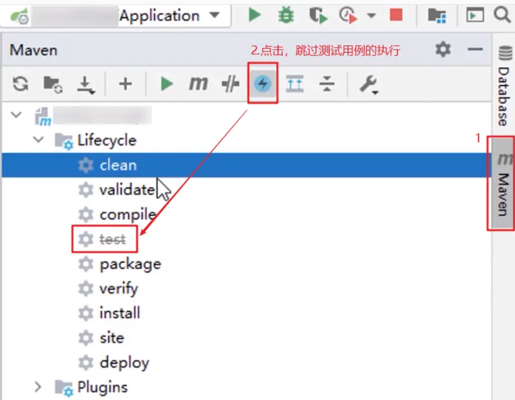
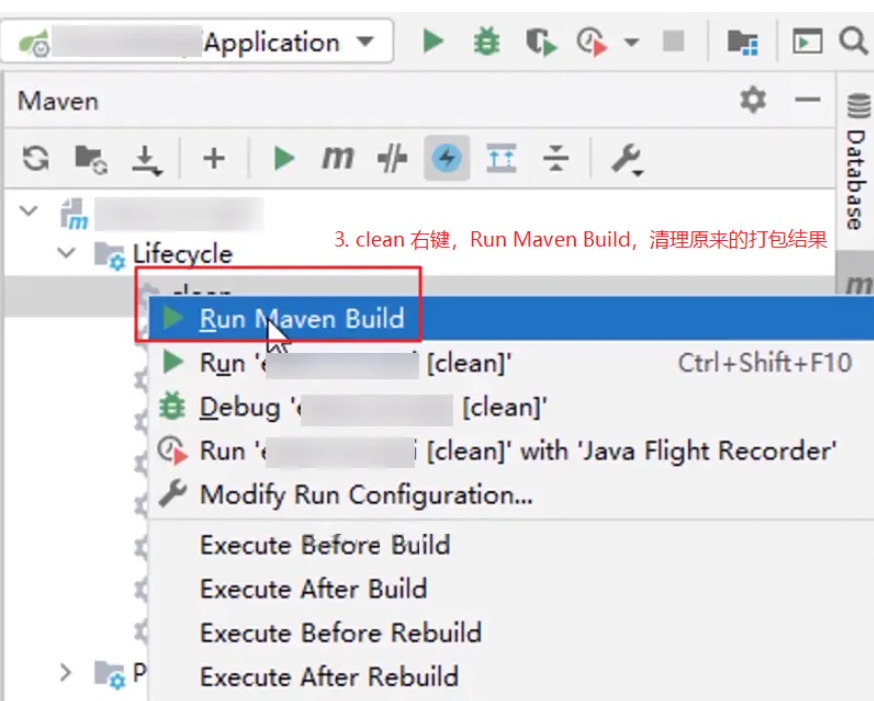
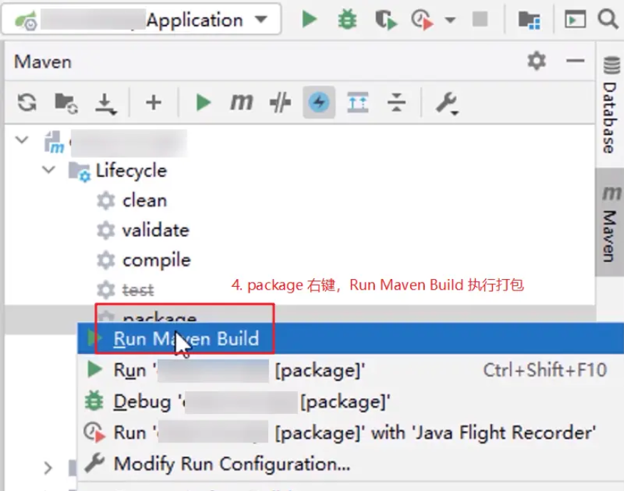

# 单体 SpringBoot 项目

## 环境准备

- Ubuntu 20+
- 安装 MySQL（省略）
- 安装 Redis（省略）
- 安装 Nginx（省略）
- 编译前端（省略）

## 安装 openjdk

### 1. 更新软件包索引

```bash
sudo apt update
```

### 2. 安装 jdk

```bash
sudo apt install openjdk-17-jdk
```

### 3. 验证安装是否成功

```bash
java -version
javac -version
```

### 4. 配置用户环境变量（可选，有的人可能需要用到环境变量 `JAVA_HOME`）

```bash
# 查找 JDK 安装路径
readlink -f $(which java)

# 编辑用户的 `~/.bashrc` 文件
vim ~/.bashrc

# 在文件的末尾添加JDK的路径
export JAVA_HOME=/usr/lib/jvm/java-17-openjdk-amd64
export PATH=$JAVA_HOME/bin:$PATH
```

保存，关闭文件，输入如下命令，使配置生效：

```bash
source ~/.bashrc
```

验证环境变量是否成功：

```bash
echo $JAVA_HOME
java -version
javac -version
```

### 5. 可以选择配置系统环境变量（可选）

```bash
# 编辑系统环境变量配置文件
sudo vim /etc/environment

# 在文件末尾添加以下内容
JAVA_HOME="/usr/lib/jvm/java-17-openjdk-amd64"
PATH="$JAVA_HOME/bin:$PATH"

# 保存后执行以下命令即可完成配置
source /etc/environment
```

## 打包 jar 文件

<div style="text-align: center;">
  
  <p style="text-align: center; color: #888;">（跳过测试用例的执行）</p>
</div>

<div style="text-align: center;">
  
  <p style="text-align: center; color: #888;">（清理原来的打包结果）</p>
</div>

<div style="text-align: center;">
  
  <p style="text-align: center; color: #888;">（执行打包）</p>
</div>

稍等一会，命令行提示 `BUILD SUCCESS` 就表示打包已经成功了。

项目的 `target` 目录会出现 jar 文件，名字形如：`xxxxx-0.0.1-SNAPSHOT.jar`。

## 部署 jar 项目

在服务器的有关目录中，创建项目目录（一般就是项目名），然后把打包好的 `xxx.jar` 和`application.yml`文件上传到该目录。

主要要把 `application.yml` 文件中的数据库连接等部分换成 `localhost` 或特定值才可以。

然后运行 Java 项目：

```bash
nohup java -jar -Dfile.encoding=utf-8 xxx.jar --spring.config.location=application.yml >> out.log 2>&1 &
```

## 执行初始化 .sql 文件

```bash
mysql -u 用户名 -p 数据库名 < 文件名.sql
```

（完）
