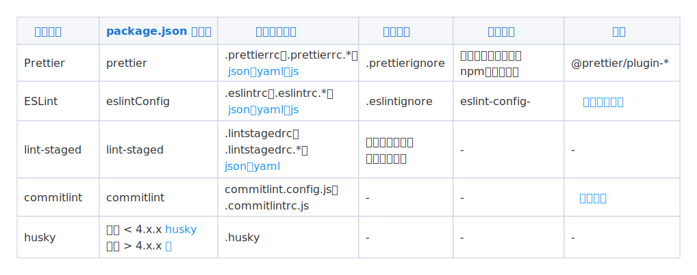

# Code Format 工程化实践

代码规范和质量是工作中很重要的一部分，目前有很多工具可以帮助我们处理。

## 工具分类介绍

检测代码的工具很多，主要分为三类：

* 第一类：代码格式化工具，专注代码结构美化，不处理任何有关语法的内容
  * [Prettier](https://prettier.io/)：专注代码格式化
  * [Stylelint](https://stylelint.io/)：专注 CSS 语法格式化

* 第二类：lint 类，这些工具也支持处理代码格式，但重点是检测代码语法质量
  * [ESLint](https://cn.eslint.org/)：可以配置代码格式规则，也可以检测代码语法质量

* 第三类：将不同的工具进行合成，成为一个包含子功能或者有定制功能的插件，可以避免 Prettier 和 Lint 二者在代码处理上的冲突
  * [eslint-config-prettier](https://github.com/prettier/eslint-config-prettier)：ESLint 检测和 Prettier 格式化
  * [tslint-config-prettier](https://github.com/prettier/tslint-config-prettier)：TS 检测和代码格式化
  * [lint-staged](https://github.com/okonet/lint-staged)：仅过滤 Git 暂存区上的文件，可以有效避免每次提交处理所有文件

这些工具配置都比较相似，但尤其要注意版本的不同，导致的配置不同。

::: tip 小贴士
Git 暂存区：执行命令 `git add` 后，要提交的代码存放的空间。
:::

## 工具原理和配置

### 原理

Prettier、ESLint：

两者的工作原理是将代码解析成 AST，再通过我们写的配置，还原格式化后的代码，具体转化可以到[这个网站](https://cn.eslint.org/parser/)体验下。

lint-staged、commitlint、husky：

* `lint-staged` 是获取 `git add` 后暂存区的代码。
* `commitlint` 是获取 `git commit` 的描述信息然后对格式进行规则校验。
* `husky` 是将 Git 内置的勾子函数暴露出来，便于配置。

### 配置对比

这些自动化工具，可以在不同的地方进行配置，版本也不同，看起来很复杂，其实并没有，除了注意大版本的不同，其他的配置方式都大同小异。

这里整理下这些配置通用的部分，后面就不再分开写，只展示 `package.json` 这一种方式。

<div style="text-align: center;">
  
  <p style="text-align: center; color: #888;">（自动化工具配置对比）</p>
</div>

## 代码格式美化：Prettier

### 插件使用

安装 Prettier 插件：

```bash
npm install --save-dev --save-exact prettier
```

执行命令：

```bash
npx prettier --write .
```

发现当前所有目录下的文件，都进行了格式化。

`prettier` 格式有一套默认的格式化规则，一般情况下，选择默认就可以了。

::: tip 小贴士
当然也可以自行配置，有两种配置方法：

* 在 package.json 中添加关键词 `prettier`
* 在项目根目录下新建 `.prettierrc` 文件，js、json、yaml 等也可以。

下面就不采用 package.json 中配置的方式了，具体关键字可以查看上面的表格。我们统一通过配置文件进行配置，其他的工具也是一样的。
:::

在根目录下新建文件 `.prettierrc`，具体有哪些配置项可写，可以参考官方文档：

```json
{
  "singleQuote": true,
  "printWidth": 120,
  "arrowParens": "avoid",
  "trailingComma": "none"
}
```

此时 Prettier 根据 `.prettierrc` 定义的规则，对整个项目做了格式化操作。但一些场景下需要我们对个别文件进行处理，可以通过覆盖配置来实现。

### 覆盖配置

修改 `.prettierrc` 文件，添加 `overrides` 字段：

```json
{
  "semi": false,
  "overrides": [
    {
      "files": "*.test.js",
      "options": {
        "semi": true
      }
    },
    {
      "files": ["*.html", "legacy/**/*.js"],
      "options": {
        "tabWidth": 4
      }
    }
  ]
}
```

这样针对 `test.js` 文件、`html` 文件和 `legacy/**/*.js` 的格式就会按当前配置走。

### 忽略文件

如果想要忽略某个文件的格式化，可以新建文件 `.prettierignore`，添加要忽略的文件：

```
/dist
*.html
```

## 代码质量检测：ESLint

### 插件使用

安装 ESLint 插件：

```bash
npm install eslint --save-dev
```

新建配置文件：

```bash
./node_modules/.bin/eslint --init
```

上述命令行会弹出选择提示，根据需要选择 eslint 规则，最后会在根目录下生成 `.eslintrc.js` 文件：

```javascript
module.exports = {
  "env": {
  "browser": true,
  "es2021": true
  },
  "extends": [
    "eslint:recommended",
    "plugin:react/recommended"
  ],
  "parserOptions": {
    "ecmaFeatures": {
      "jsx": true
    },
    "ecmaVersion": "latest",
    "sourceType": "module"
  },
  "plugins": [
    "react"
  ],
  "rules": {
    "quotes": ["error", "double"]
  }
}
```

* env：包含了执行环境配置，浏览器环境、Node 环境或支持 ES5、ES6。
* extends：使用的扩展配置，这里主要是引入一些集成好的检测规则
* parseOptioins：解析器配置
* plugins：引入的 eslint 插件
* rules：用来定义具体规则，检查缩进，函数是否有返回值等。

第一个参数，如果只有一个参数，直接使用字符串或数字就可以了：

* `"off"` 或 `0`：关闭规则
* `"warn"` 或 `1`：开启规则，使用警告级别的错误：`warn`（不会导致程序退出，即可以正常提交代码）
`"error"` 或 `2`：开启规则，使用错误级别的错误：`error`（当被触发的时候，程序会退出，存在 error 告警不能提交代码）

第二个参数，你想要的配置参数：

* `"quotes": ["error", "double"]`，如果存在单引号的就报错，终止提交。
* `"quotes": ["warn", "double"]`，如果存在单引号就告警，但可以正常提交。

ESLint 的[配置规则](https://cn.eslint.org/docs/rules/)。

执行如下命令，ESLint 就会对代码进行检测：

```bash
./node_modules/.bin/eslint src/*.js
```

注意，如果项目根目录配置了 `.eslintrc`，那么 `package.json` 中配置的 `eslintConfig` 将不会生效。

### 覆盖配置

如果基于官方推荐的配置，想要在这个基础上修改某个规则怎么办，使用 overrides 来覆盖，可以指定使用的范围。

```javascript
{
  "rules": {...},
  "overrides": [
    {
      "files": ["./src/*.js"],
      "rules": {
        "no-console": "error"
      }
    }
  ]
}
```

上面这个就可以针对指定的文件，让 `no-console` 告警出来了。

## Git 暂存区代码过滤：lint-staged

在实际使用过程，会遇到这样的问题：

* 每次都要全局处理代码，浪费时间
* 每个人对所有代码格式化，规则不同，导致大量代码冲突

lint-staged 可以实现：仅过滤 Git 暂存区的代码。

### 插件使用 

安装 lint-staged 插件：

```bash
npm install lint-staged --save-dev
```

在 `package.json` 中配置 lint-staged：

```json
{
  "lint-staged": {
    "*.js": "prettier -w .",
    "*.js": "eslint . --fix"
  }
}
```

执行命令：

```bash
# 修改业务代码
git add .
git commit -m "test lint-staged"
```

此时发现，这些命令仅对暂存区 `*.js` 的内容进行了格式化。

## Git 提交规范自动化

优秀的开源项目，对提交代码的描述信息都是很规范的。想要和这些项目一样清晰，我们可以借助插件 commitlint。关于这个可以参考下一篇文章 [Git Hooks 工程化实践](/project/solutions/git-hooks/)。

（完）
