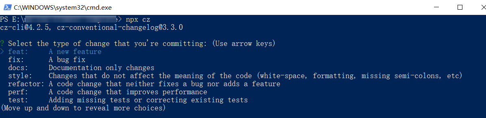

# Git Hooks 工程化实践

Git hooks 是前端工程化中非常重要的一环，也衍生出了很多相关的工具包，比如 husky、lint-staged、commitizen、commitlint 等，本文介绍下这些工具的使用以及原理。

## Git Hooks 是什么

hook 是计算机领域中一个很常见的概念，翻译过来的意思是钩子或者勾住，而在计算机领域中则要分为两种解释：

* 拦截消息，在消息到达目标前，提前对消息进行处理。
* 对特定的事件进行监听，当某个事件或动作被触发时也会同时触发对应的 hook。也就是说 hook 本身也是一段程序，只是它会在特定的时机被触发。

Git Hooks 就是在运行某些 Git 命令时，被触发的对应的程序。

::: tip 小贴士
在前端领域，钩子的概念也并不少见，比如 Vue 生命周期钩子、React Hooks、Webpack 钩子等，它们都是在特定的时机触发的方法或者函数。
:::

## 常见的 Git Hooks

Git Hooks 大体上分为两类：

**客户端 hook**：

* `pre-commit` hook，在运行 `git commit` 命令时且在 commit 完成前被触发。
* `commit-msg` hook，在编辑完 commit-msg 时被触发，并且接受一个参数，这个参数是存放当前 commit-msg 的临时文件的路径。
* `pre-push` hook，在运行 `git push` 命令时且在 push 命令完成前被触发。

**服务端 hook**：

* `pre-receive` hook，在服务端接受到推送时且在推送过程完成前被触发。
* `post-receive` hook，在服务端接收到推送且推送完成后被触发。

这里只列举了一部分，更多的 Git Hooks 详细信息见 [Git 官方文档](https://git-scm.com/docs/githooks)。

在本地 Git 仓库中的 `.git/hooks` 文件夹中也可以看到常用的 Git Hooks 示例：

```
.git/
├── hooks
│   │── applypatch-msg.sample
│   │── commit-msg.sample
│   │── fsmonitor-watchman.sample
│   │── post-update.sample
│   │── pre-applypatch.sample
│   │── pre-commit.sample
│   │── pre-merge-commit.sample
│   │── pre-push.sample
│   │── pre-rebase.sample
│   │── pre-receive.sample
│   │── prepare-commit-msg.sample
│   │── push-to-checkout.sample
│   └── update.sample
└── ...
```

它们默认都是 shell 脚本，只需要将示例文件的 `.sample` 扩展名去掉，那么示例文件即可生效。

一般来说，在前端工程中应用 Git Hooks 都是运行 javaScript 脚本，就像这样：

```bash
#!/bin/sh
node your/path/to/script/xxx.js
```

或者是这样：

```javascript
#!/usr/bin/env node
// your javascript code ...
```

## 原生的 Git Hooks 的缺陷

原生的 Git Hooks 有一个比较大的问题是 `.git` 文件夹下的内容不会被 Git 追踪。这就表示，无法保证让一个仓库中所有的成员都使用同样的 Git Hooks，除非仓库的所有成员都手动同步同一份 Git Hooks，但这显然不是个好办法。

## Husky 及相关工具库

* **husky**：Git Hooks 工具
  * 对 Git 执行的一些命令，通过对应的 Hooks 钩子触发，执行自定义的脚本程序。
* **lint-staged**：检测文件插件
  * 只检测 `git add .` 中暂存区的文件，对过滤出的文件执行脚本。
* **commitizen**：代码提交内容标准化
  * 提示定义输入标准的 `git commit` 内容。
* **commitlint**：代码提交检测
  * 检测 `git commit` 内容是否符合定义的规范。

### husky

#### 1）安装 husky：

```bash
npm install husky --save-dev
```

#### 2）在 packgae.json 中添加 prepare 脚本：

```json
{
  "scripts": {
    "prepare": "husky install"
  }
}
```

prepare 脚本会在 `npm install`（不带参数）之后自动执行。也就是说当我们执行 `npm install` 安装完项目依赖后会执行 `husky install` 命令，该命令会创建 `.husky/` 目录并指定该目录为 Git Hooks 所在的目录。

#### 3）添加 Git Hooks：

```bash
npx husky add .husky/${hook_name} ${command}

# 例如：
npx husky add .husky/pre-commit "npm run test"
```

运行完该示例命令后我们会看到 `.husky/` 目录下新增了一个名为 `pre-commit` 的 shell 脚本。该脚本的功能就是在执行 `git commit` 命令时会先执行 `npm run test` 这个命令。

### lint-staged

在 `pre-commit` hook 中，一般来说都是对当前要 `commit` 的文件进行校验、格式化等，因此在脚本中我们需要知道当前在 Git 暂存区的文件有哪些，而 Git 本身也没有向 pre-commit 脚本传递相关参数，`lint-staged` 这个包为我们解决了这个问题。

#### 1）安装 lint-staged：

```bash
npm install lint-staged --save-dev
```

#### 2）添加 Git Hooks：

在搭配 Husky 使用的情况下，可以运行下面的命令，在 `pre-commit` hook 中运行 `lint-staged`：

```bash
npx husky add .husky/pre-commit "npx lint-staged"
```

#### 3）配置 lint-staged：

关于 lint-staged 的配置，在形式上与常见的工具包的配置方式大同小异，可以通过在 `package.json` 中添加一个 `lint-staged` 项、也可以在根目录添加一个 `.lintstagedrc.json` 文件等，下面以在 package.json 中配置为例：

```json
{
  "lint-staged": {
    "glob pattern": "your-cmd"
  }
}
```

配置项中的 key 为 glob 模式匹配语句，值为要运行的命令（可以配置命令），例如想要为暂存区中 `src` 文件夹下所有的 `.ts` 和 `.tsx` 文件运行 eslint 检查以及 ts 类型检查，那么配置如下：

```json
{
  "lint-staged": {
    "src/**/*.{ts,tsx}": [
      "eslint",
      "tsc"  
    ]
  }
}
```

::: tip 小贴士
lint-staged 是如何知道当前暂存区有哪些文件的？

事实上，lint-staged 中也没有什么黑魔法，它在内部运行了 `git diff --staged --diff-filter=ACMR --name-only -z` 命令，这个命令会返回暂存区的文件信息，类似如下所示的代码：

```javascript
const { execSync } = require('child_process');
const lines = execSync('git diff --staged --diff-filter=ACMR --name-only -z')
    .toString()

const stagedFiles = lines
    .replace(/\u0000$/, '')
    .split('\u0000')
```
:::

### commitizen

在使用 Git 过程中，不可避免的需要填写 commit message，这其实是一件相当令人头疼的事情。如果没有良好的 [commit message 规范](/style-guide/version-control/git-commit-message/)，那么在查看历史 commit 的时候只会一脸懵。

而 `commitizen` 可以协助开发者填写 commit 信息

#### 1）安装 commitizen

```bash
npm install commitizen --save-dev
```

#### 2）初始化 commitizen

```bash
npx commitizen init cz-conventional-changelog --save-dev --save-exact
```

这个初始化命令做了下面三件事：

* 安装 `cz-conventional-changelog` 适配器 npm 模块
* 将其保存到 package.json 的 devDependencies 中
* config.commitizen 配置添加到 package.json 中 如下所示：
  ```json
  "config": {
    "commitizen": {
      "path": "./node_modules/cz-conventional-changelog"
    }
  }
  ```

`commitizen` 本身只提供命令行交互框架以及一些 Git 命令的执行，实际的规则则需要通过适配器来定义，commitizen 留有对应的适配器接口。而 `cz-conventional-changelog` 就是一个 commitizen 适配器。

此时运行 `npx cz` 命令（注意不能用 Git Bash 来运行，那个无法进行上下键选择，用 Win10 的 PowerShell），就会出现以下命令行交互界面：

<div style="text-align: center;">
  
  <p style="text-align: center; color: #888;">（npx cz 命令行交互页面）</p>
</div>

这个适配器生成的 commit message 模板如下：

```bash
<type>(<scope>): <subject>
<空行>
<body>
<空行>
<footer>
```

这也是最常见的提交约定，当然也可以安装其他适配器，或者自定义适配器来定制自己想要的 commit message 模板。

当运行 `npx cz`，commitizen 在通过适配器模板以及用户的输入拿到最终的 commit message 后，会在内部运行 `git commit -m "XXX" 命令`，到此为止，就完成了一次 `git commit` 操作。

官方的文档中会推荐在 `package.json` 的 `scripts` 中添加如下内容：

```json
commit: "cz"
```

这样就可以使用 `npm run commit` 来运行 commitizen 了。

::: tip 小贴士
如果想自定义适配器，那么可以选择使用 [cz-customizable](https://www.npmjs.com/package/cz-customizable) 这个工具包。

使用时：

* 先进行 commitizen 配置
  ```json
  "config": {
    "commitizen": {
      "path": "./node_modules/cz-customizable"
    }
  }
  ```
* cz-customizable 配置，在根目录新增一个 `.cz-config.js` 文件，配置示例参考：
  * [示例](https://github.com/leoforfree/cz-customizable/blob/master/cz-config-EXAMPLE.js)
  * [配置](https://github.com/leoforfree/cz-customizable)
:::

### commitlint

`commitlint` 这个工具库，可以通过配置一些规则来校验 commit message 是否规范。

那么我们已经有了 commitizen 为什么还需要 commitlint 呢？

commitizen 的作用是协助开发者填写 commit message，虽然可以通过选择不同的适配器或者自定义适配器来制定对应的 commit 信息规范以及模板，但是缺少了对 commit message 的校验功能，开发者仍然可能在无意中使用原生的 `git commit` 命令来提交，而 `commitlint` 在 `commit-msg` 这个 git hook 中对 commit message 进行校验，正好解决了这个问题。

#### 1）安装 commitlint

```bash
npm install @commitlint/config-conventional @commitlint/cli --save-dev
```

#### 2）使用 husky 添加 commit-msg hook

```bash
npx husky add .husky/commit-msg 'npx --no -- commitlint --edit $1'
```

#### 3）commitlint 配置

在项目根目录增加一个 `commitlint.config.js` 文件，文件内容如下：

```javascript
module.exports = {
  extends: ['@commitlint/config-conventional'],
  // 自定义部分规则
  rules: {
    'scope-case': [0, 'always', 'camel-case'],
    'scope-empty': [2, 'never'],
    'scope-enum': [2, 'always', [...]],
  },
};
```

commitlint 与 commitizen 一样，分为两部分，一部分是执行的主程序，另一部分是规则或者说是适配器。`@commitlint/cli` 是执行的主程序，`@commitlint/config-conventional` 则是规则。commitlint 和 commitizen 分别采用了策略模式和适配器模式，因此有非常高的可用性和良好的扩展性。

在 commitlint 的配置文件中，可以先引用一个 commitlint 规则包，然后在定义部分自己想要的规则，就像 eslint 的配置一样。

需要注意的是，在将 commitlint 添加到 commit-msg hooks 中时，执行 commitlint 的 shell 命令中 `--edit $1` 参数是必须的，这个参数的意思是：存储 commit message 的临时文件路径是 `$1`, 而 `$1` 则是 Git 传给 commit-msg hook 的参数，它的值是 commit message 的临时存储文件的路径，默认情况下是 `.git/COMMIT_EDITMSG`。如果不传这个参数，那么 commitlint 将无法得知当前的 commit message 是什么。

更多 commitlint 的相关详情看[这里](https://commitlint.js.org/)。

#### 4）commitlint 与 commitizen 的配置共用

前文中说到 commitlint 解决了 commitizen 没有对 commit message 做校验的问题，但是使用了 commitlint 后，新的问题出现了，如果 commitlint 的规则集与 commitizen 的适配器中的规则不一致，那么可能会导致使用 commitizen 生成的 commit message 被 commitlint 校验时不通过从而 git commit 失败。
解决这个问题的办法有两种：

* 将 commitizen 的适配器规则翻译为 commitlint 规则集，已有的对应工具包为 [`commitlint-config-cz`](https://www.npmjs.com/package/commitlint-config-cz)，这个包需要你所使用的 commitizen 适配器为 `cz-customizable`，也就是自定义适配器。
* 将 commitlint 规则集转化为 commitizen 的适配器，已有对应的工具包为 [`@commitlint/cz-commitlint`](https://www.npmjs.com/package/@commitlint/cz-commitlint)。

这里以第二种选用 `@commitlint/cz-commitlint` 为例：

* 安装
  ```bash
  npm install @commitlint/cz-commitlint --save-dev
  ```
* 修改 `packages.json` 中 commitizen 的配置
  ```json
  "config": {
    "commitizen": {
      "path": "./node_modules/@commitlint/cz-commitlint"
    }
  }
  ```

（完）
