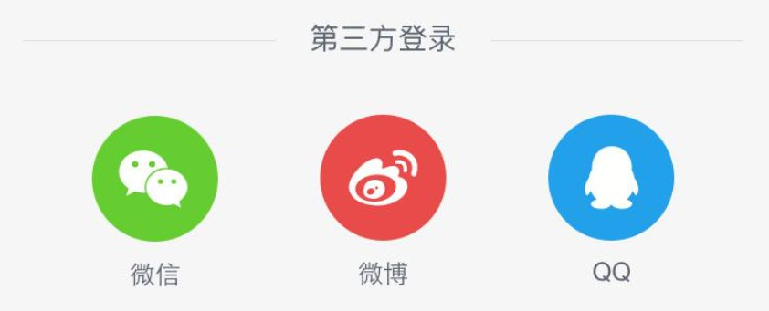
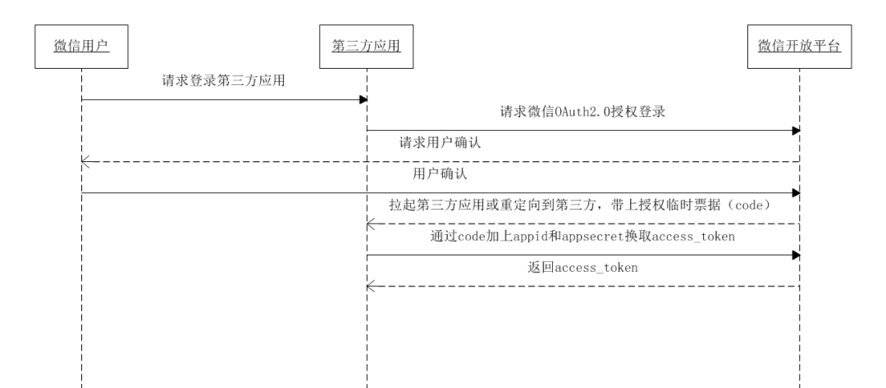

# 前端登录方案总结

## 场景描述

登录是几乎每个网站都有的一个基本功能，本文介绍几种常用的登录方式和背后的原理：

* Cookie + Session 登录
* Token 登录
* SSO 单点登录
* OAuth 第三方登录

## Cookie + Session 登录

HTTP 是一种无状态的协议，客户端每次发送请求时，首先要和服务器端建立一个连接，在请求完成后又会断开这个连接。

这种方式可以节省传输时占用的连接资源，但同时也存在一个问题：每次请求都是独立的，服务器端无法判断本次请求和上一次请求是否来自同一个用户，进而也就无法判断用户的登录状态。

为了解决 HTTP 无状态的问题，就有了 Cookie。

> Cookie 是服务器端发送给客户端的一段特殊信息，这些信息以文本的方式存放在客户端，客户端每次向服务器端发送请求时都会带上这些特殊信息。

有了 Cookie 之后，服务器端就能够获取到客户端传递过来的信息了，如果需要对信息进行验证，还需要通过 Session。

> 客户端请求服务端，服务端会为这次请求开辟一块内存空间，这个便是 Session 对象。

有了 Cookie 和 Session 之后，我们就可以进行登录认证了。

### 实现流程

Cookie + Session 的登录方式是最传统的一种登录方式，现在仍然有大量的企业在使用。

用户首次登录时：

<div style="text-align: center;">
  <svg id="SvgjsSvg1006" width="708" height="239" xmlns="http://www.w3.org/2000/svg" version="1.1" xmlns:xlink="http://www.w3.org/1999/xlink" xmlns:svgjs="http://svgjs.com/svgjs"><defs id="SvgjsDefs1007"><marker id="SvgjsMarker1028" markerWidth="14" markerHeight="10" refX="10" refY="5" viewBox="0 0 14 10" orient="auto" markerUnits="userSpaceOnUse" stroke-dasharray="0,0"><path id="SvgjsPath1029" d="M0,0 L14,5 L0,10 L0,0" fill="#323232" stroke="#323232" stroke-width="1"></path></marker><marker id="SvgjsMarker1044" markerWidth="14" markerHeight="10" refX="10" refY="5" viewBox="0 0 14 10" orient="auto" markerUnits="userSpaceOnUse" stroke-dasharray="0,0"><path id="SvgjsPath1045" d="M0,0 L14,5 L0,10 L0,0" fill="#323232" stroke="#323232" stroke-width="1"></path></marker><marker id="SvgjsMarker1060" markerWidth="14" markerHeight="10" refX="10" refY="5" viewBox="0 0 14 10" orient="auto" markerUnits="userSpaceOnUse" stroke-dasharray="0,0"><path id="SvgjsPath1061" d="M0,0 L14,5 L0,10 L0,0" fill="#323232" stroke="#323232" stroke-width="1"></path></marker><marker id="SvgjsMarker1076" markerWidth="14" markerHeight="10" refX="10" refY="5" viewBox="0 0 14 10" orient="auto" markerUnits="userSpaceOnUse" stroke-dasharray="0,0"><path id="SvgjsPath1077" d="M0,0 L14,5 L0,10 L0,0" fill="#323232" stroke="#323232" stroke-width="1"></path></marker><marker id="SvgjsMarker1090" markerWidth="14" markerHeight="10" refX="10" refY="5" viewBox="0 0 14 10" orient="auto" markerUnits="userSpaceOnUse" stroke-dasharray="0,0"><path id="SvgjsPath1091" d="M0,0 L14,5 L0,10 L0,0" fill="#323232" stroke="#323232" stroke-width="1"></path></marker><marker id="SvgjsMarker1094" markerWidth="14" markerHeight="10" refX="10" refY="5" viewBox="0 0 14 10" orient="auto" markerUnits="userSpaceOnUse" stroke-dasharray="0,0"><path id="SvgjsPath1095" d="M0,0 L14,5 L0,10 L0,0" fill="#323232" stroke="#323232" stroke-width="1"></path></marker></defs><g id="SvgjsG1008" transform="translate(37,25)"><path id="SvgjsPath1009" d="M 0 10C 0 -3.3333333333333335 20 -3.3333333333333335 20 10C 20 23.333333333333332 0 23.333333333333332 0 10Z" stroke="rgba(50,50,50,1)" stroke-width="2" fill-opacity="1" fill="#ffffff"></path><g id="SvgjsG1010"><text id="SvgjsText1011" font-family="微软雅黑" text-anchor="middle" font-size="13px" width="0px" fill="#323232" font-weight="400" align="middle" lineHeight="125%" anchor="middle" family="微软雅黑" size="13px" weight="400" font-style="" opacity="1" y="-0.625" transform="rotate(0)"></text></g></g><g id="SvgjsG1012"><path id="SvgjsPath1013" d="M25 61L47 61L47 61L69 61" stroke="#323232" stroke-width="2" fill="none"></path></g><g id="SvgjsG1014"><path id="SvgjsPath1015" d="M47 46L47 59.5L47 59.5L47 74" stroke="#323232" stroke-width="2" fill="none"></path></g><g id="SvgjsG1016"><path id="SvgjsPath1017" d="M46 73L29 91" stroke="#323232" stroke-width="2" fill="none"></path></g><g id="SvgjsG1018"><path id="SvgjsPath1019" d="M47 73L62 91" stroke="#323232" stroke-width="2" fill="none"></path></g><g id="SvgjsG1020" transform="translate(151,33)"><path id="SvgjsPath1021" d="M 0 0L 108 0L 108 56L 0 56Z" stroke="rgba(50,50,50,1)" stroke-width="2" fill-opacity="1" fill="#ffffff"></path><g id="SvgjsG1022"><text id="SvgjsText1023" font-family="微软雅黑" text-anchor="middle" font-size="13px" width="88px" fill="#323232" font-weight="400" align="middle" lineHeight="125%" anchor="middle" family="微软雅黑" size="13px" weight="400" font-style="" opacity="1" y="17.375" transform="rotate(0)"><tspan id="SvgjsTspan1024" dy="16" x="54"><tspan id="SvgjsTspan1025" style="text-decoration:;">a.com/page-a</tspan></tspan></text></g></g><g id="SvgjsG1026"><path id="SvgjsPath1027" d="M73 61L147.39999999999998 61" stroke="#323232" stroke-width="2" fill="none" marker-end="url(#SvgjsMarker1028)"></path><rect id="SvgjsRect1030" width="26" height="16" x="97.19999999999999" y="53" fill="#ffffff"></rect><text id="SvgjsText1031" font-family="微软雅黑" text-anchor="middle" font-size="13px" width="26px" fill="#323232" font-weight="400" align="top" lineHeight="16px" anchor="middle" family="微软雅黑" size="13px" weight="400" font-style="" opacity="1" y="50.375" transform="rotate(0)"><tspan id="SvgjsTspan1032" dy="16" x="110.19999999999999"><tspan id="SvgjsTspan1033" style="text-decoration:;">访问</tspan></tspan></text></g><g id="SvgjsG1034" transform="translate(365,33)"><path id="SvgjsPath1035" d="M 0 0L 108 0L 108 56L 0 56Z" stroke="rgba(50,50,50,1)" stroke-width="2" fill-opacity="1" fill="#ffffff"></path><g id="SvgjsG1036"><text id="SvgjsText1037" font-family="微软雅黑" text-anchor="middle" font-size="13px" width="88px" fill="#323232" font-weight="400" align="middle" lineHeight="125%" anchor="middle" family="微软雅黑" size="13px" weight="400" font-style="" opacity="1" y="8.875" transform="rotate(0)"><tspan id="SvgjsTspan1038" dy="16" x="54"><tspan id="SvgjsTspan1039" style="text-decoration:;">服务器</tspan></tspan><tspan id="SvgjsTspan1040" dy="16" x="54"><tspan id="SvgjsTspan1041" style="text-decoration:;">验证账号密码</tspan></tspan></text></g></g><g id="SvgjsG1042"><path id="SvgjsPath1043" d="M260 61L361.4 61" stroke="#323232" stroke-width="2" fill="none" marker-end="url(#SvgjsMarker1044)"></path><rect id="SvgjsRect1046" width="52" height="16" x="284.7" y="53" fill="#ffffff"></rect><text id="SvgjsText1047" font-family="微软雅黑" text-anchor="middle" font-size="13px" width="52px" fill="#323232" font-weight="400" align="top" lineHeight="16px" anchor="middle" family="微软雅黑" size="13px" weight="400" font-style="" opacity="1" y="50.375" transform="rotate(0)"><tspan id="SvgjsTspan1048" dy="16" x="310.7"><tspan id="SvgjsTspan1049" style="text-decoration:;">输入密码</tspan></tspan></text></g><g id="SvgjsG1050" transform="translate(575,33)"><path id="SvgjsPath1051" d="M 0 0L 108 0L 108 56L 0 56Z" stroke="rgba(50,50,50,1)" stroke-width="2" fill-opacity="1" fill="#ffffff"></path><g id="SvgjsG1052"><text id="SvgjsText1053" font-family="微软雅黑" text-anchor="middle" font-size="13px" width="88px" fill="#323232" font-weight="400" align="middle" lineHeight="125%" anchor="middle" family="微软雅黑" size="13px" weight="400" font-style="" opacity="1" y="8.875" transform="rotate(0)"><tspan id="SvgjsTspan1054" dy="16" x="54"><tspan id="SvgjsTspan1055" style="text-decoration:;">创建并保存</tspan></tspan><tspan id="SvgjsTspan1056" dy="16" x="54"><tspan id="SvgjsTspan1057" style="text-decoration:;">SessionId</tspan></tspan></text></g></g><g id="SvgjsG1058"><path id="SvgjsPath1059" d="M474 61L571.4 61" stroke="#323232" stroke-width="2" fill="none" marker-end="url(#SvgjsMarker1060)"></path><rect id="SvgjsRect1062" width="52" height="16" x="496.70000000000005" y="53" fill="#ffffff"></rect><text id="SvgjsText1063" font-family="微软雅黑" text-anchor="middle" font-size="13px" width="52px" fill="#323232" font-weight="400" align="top" lineHeight="16px" anchor="middle" family="微软雅黑" size="13px" weight="400" font-style="" opacity="1" y="50.375" transform="rotate(0)"><tspan id="SvgjsTspan1064" dy="16" x="522.7"><tspan id="SvgjsTspan1065" style="text-decoration:;">验证成功</tspan></tspan></text></g><g id="SvgjsG1066" transform="translate(365,158)"><path id="SvgjsPath1067" d="M 0 0L 108 0L 108 56L 0 56Z" stroke="rgba(50,50,50,1)" stroke-width="2" fill-opacity="1" fill="#ffffff"></path><g id="SvgjsG1068"><text id="SvgjsText1069" font-family="微软雅黑" text-anchor="middle" font-size="13px" width="88px" fill="#323232" font-weight="400" align="middle" lineHeight="125%" anchor="middle" family="微软雅黑" size="13px" weight="400" font-style="" opacity="1" y="8.875" transform="rotate(0)"><tspan id="SvgjsTspan1070" dy="16" x="54"><tspan id="SvgjsTspan1071" style="text-decoration:;">将 SessionId</tspan></tspan><tspan id="SvgjsTspan1072" dy="16" x="54"><tspan id="SvgjsTspan1073" style="text-decoration:;">写入 Cookie</tspan></tspan></text></g></g><g id="SvgjsG1074"><path id="SvgjsPath1075" d="M629 90L629 186L476.6 186" stroke="#323232" stroke-width="2" fill="none" marker-end="url(#SvgjsMarker1076)"></path><rect id="SvgjsRect1078" width="68" height="16" x="540" y="178" fill="#ffffff"></rect><text id="SvgjsText1079" font-family="微软雅黑" text-anchor="middle" font-size="13px" width="68px" fill="#323232" font-weight="400" align="top" lineHeight="16px" anchor="middle" family="微软雅黑" size="13px" weight="400" font-style="" opacity="1" y="175.375" transform="rotate(0)"><tspan id="SvgjsTspan1080" dy="16" x="574"><tspan id="SvgjsTspan1081" style="text-decoration:;">Set-Cookie</tspan></tspan></text></g><g id="SvgjsG1082" transform="translate(151,158)"><path id="SvgjsPath1083" d="M 0 0L 108 0L 108 56L 0 56Z" stroke="rgba(50,50,50,1)" stroke-width="2" fill-opacity="1" fill="#ffffff"></path><g id="SvgjsG1084"><text id="SvgjsText1085" font-family="微软雅黑" text-anchor="middle" font-size="13px" width="88px" fill="#323232" font-weight="400" align="middle" lineHeight="125%" anchor="middle" family="微软雅黑" size="13px" weight="400" font-style="" opacity="1" y="17.375" transform="rotate(0)"><tspan id="SvgjsTspan1086" dy="16" x="54"><tspan id="SvgjsTspan1087" style="text-decoration:;">登录成功</tspan></tspan></text></g></g><g id="SvgjsG1088"><path id="SvgjsPath1089" d="M364 186L312 186L312 186L262.6 186" stroke="#323232" stroke-width="2" fill="none" marker-end="url(#SvgjsMarker1090)"></path></g><g id="SvgjsG1092"><path id="SvgjsPath1093" d="M205 157L205 123.5L205 123.5L205 92.6" stroke="#323232" stroke-width="2" fill="none" marker-end="url(#SvgjsMarker1094)"></path><rect id="SvgjsRect1096" width="52" height="16" x="179" y="116.8" fill="#ffffff"></rect><text id="SvgjsText1097" font-family="微软雅黑" text-anchor="middle" font-size="13px" width="52px" fill="#323232" font-weight="400" align="top" lineHeight="16px" anchor="middle" family="微软雅黑" size="13px" weight="400" font-style="" opacity="1" y="114.175" transform="rotate(0)"><tspan id="SvgjsTspan1098" dy="16" x="205"><tspan id="SvgjsTspan1099" style="text-decoration:;">允许访问</tspan></tspan></text></g></svg>
  <p style="text-align:center; color: #888;">（Cookie + Session 实现流程 - 首次登录）</p>
</div>

1. 用户访问 `a.com/page-a`，并输入密码登录。
2. 服务器验证密码无误后，会创建 SessionId，并将它保存起来。
3. 服务器端响应这个 HTTP 请求，并通过 Set-Cookie 头信息，将 SessionId 写入 Cookie 中。

> 服务器端的 SessionId 可能存放在很多地方，例如：内存、文件、数据库等。

第一次登录完成之后，后续的访问就可以直接使用 Cookie 进行身份验证了：

<div style="text-align: center;">
  <svg id="SvgjsSvg1100" width="718" height="240" xmlns="http://www.w3.org/2000/svg" version="1.1" xmlns:xlink="http://www.w3.org/1999/xlink" xmlns:svgjs="http://svgjs.com/svgjs"><defs id="SvgjsDefs1101"><marker id="SvgjsMarker1122" markerWidth="14" markerHeight="10" refX="10" refY="5" viewBox="0 0 14 10" orient="auto" markerUnits="userSpaceOnUse" stroke-dasharray="0,0"><path id="SvgjsPath1123" d="M0,0 L14,5 L0,10 L0,0" fill="#323232" stroke="#323232" stroke-width="1"></path></marker><marker id="SvgjsMarker1138" markerWidth="14" markerHeight="10" refX="10" refY="5" viewBox="0 0 14 10" orient="auto" markerUnits="userSpaceOnUse" stroke-dasharray="0,0"><path id="SvgjsPath1139" d="M0,0 L14,5 L0,10 L0,0" fill="#323232" stroke="#323232" stroke-width="1"></path></marker><marker id="SvgjsMarker1152" markerWidth="14" markerHeight="10" refX="10" refY="5" viewBox="0 0 14 10" orient="auto" markerUnits="userSpaceOnUse" stroke-dasharray="0,0"><path id="SvgjsPath1153" d="M0,0 L14,5 L0,10 L0,0" fill="#323232" stroke="#323232" stroke-width="1"></path></marker><marker id="SvgjsMarker1166" markerWidth="14" markerHeight="10" refX="10" refY="5" viewBox="0 0 14 10" orient="auto" markerUnits="userSpaceOnUse" stroke-dasharray="0,0"><path id="SvgjsPath1167" d="M0,0 L14,5 L0,10 L0,0" fill="#323232" stroke="#323232" stroke-width="1"></path></marker><marker id="SvgjsMarker1174" markerWidth="14" markerHeight="10" refX="10" refY="5" viewBox="0 0 14 10" orient="auto" markerUnits="userSpaceOnUse" stroke-dasharray="0,0"><path id="SvgjsPath1175" d="M0,0 L14,5 L0,10 L0,0" fill="#323232" stroke="#323232" stroke-width="1"></path></marker></defs><g id="SvgjsG1102" transform="translate(37,25)"><path id="SvgjsPath1103" d="M 0 10C 0 -3.3333333333333335 20 -3.3333333333333335 20 10C 20 23.333333333333332 0 23.333333333333332 0 10Z" stroke="rgba(50,50,50,1)" stroke-width="2" fill-opacity="1" fill="#ffffff"></path><g id="SvgjsG1104"><text id="SvgjsText1105" font-family="微软雅黑" text-anchor="middle" font-size="13px" width="0px" fill="#323232" font-weight="400" align="middle" lineHeight="125%" anchor="middle" family="微软雅黑" size="13px" weight="400" font-style="" opacity="1" y="-0.625" transform="rotate(0)"></text></g></g><g id="SvgjsG1106"><path id="SvgjsPath1107" d="M25 61L47 61L47 61L69 61" stroke="#323232" stroke-width="2" fill="none"></path></g><g id="SvgjsG1108"><path id="SvgjsPath1109" d="M47 46L47 59.5L47 59.5L47 74" stroke="#323232" stroke-width="2" fill="none"></path></g><g id="SvgjsG1110"><path id="SvgjsPath1111" d="M46 73L29 91" stroke="#323232" stroke-width="2" fill="none"></path></g><g id="SvgjsG1112"><path id="SvgjsPath1113" d="M47 73L62 91" stroke="#323232" stroke-width="2" fill="none"></path></g><g id="SvgjsG1114" transform="translate(151,33)"><path id="SvgjsPath1115" d="M 0 0L 108 0L 108 56L 0 56Z" stroke="rgba(50,50,50,1)" stroke-width="2" fill-opacity="1" fill="#ffffff"></path><g id="SvgjsG1116"><text id="SvgjsText1117" font-family="微软雅黑" text-anchor="middle" font-size="13px" width="88px" fill="#323232" font-weight="400" align="middle" lineHeight="125%" anchor="middle" family="微软雅黑" size="13px" weight="400" font-style="" opacity="1" y="17.375" transform="rotate(0)"><tspan id="SvgjsTspan1118" dy="16" x="54"><tspan id="SvgjsTspan1119" style="text-decoration:;">a.com/page-b</tspan></tspan></text></g></g><g id="SvgjsG1120"><path id="SvgjsPath1121" d="M73 61L147.39999999999998 61" stroke="#323232" stroke-width="2" fill="none" marker-end="url(#SvgjsMarker1122)"></path><rect id="SvgjsRect1124" width="26" height="16" x="97.19999999999999" y="53" fill="#ffffff"></rect><text id="SvgjsText1125" font-family="微软雅黑" text-anchor="middle" font-size="13px" width="26px" fill="#323232" font-weight="400" align="top" lineHeight="16px" anchor="middle" family="微软雅黑" size="13px" weight="400" font-style="" opacity="1" y="50.375" transform="rotate(0)"><tspan id="SvgjsTspan1126" dy="16" x="110.19999999999999"><tspan id="SvgjsTspan1127" style="text-decoration:;">访问</tspan></tspan></text></g><g id="SvgjsG1128" transform="translate(385,33)"><path id="SvgjsPath1129" d="M 0 0L 108 0L 108 56L 0 56Z" stroke="rgba(50,50,50,1)" stroke-width="2" fill-opacity="1" fill="#ffffff"></path><g id="SvgjsG1130"><text id="SvgjsText1131" font-family="微软雅黑" text-anchor="middle" font-size="13px" width="88px" fill="#323232" font-weight="400" align="middle" lineHeight="125%" anchor="middle" family="微软雅黑" size="13px" weight="400" font-style="" opacity="1" y="8.875" transform="rotate(0)"><tspan id="SvgjsTspan1132" dy="16" x="54"><tspan id="SvgjsTspan1133" style="text-decoration:;">服务器</tspan></tspan><tspan id="SvgjsTspan1134" dy="16" x="54"><tspan id="SvgjsTspan1135" style="text-decoration:;">验证 Cookie</tspan></tspan></text></g></g><g id="SvgjsG1136"><path id="SvgjsPath1137" d="M260 61L381.4 61" stroke="#323232" stroke-width="2" fill="none" marker-end="url(#SvgjsMarker1138)"></path><rect id="SvgjsRect1140" width="73" height="16" x="284.2" y="53" fill="#ffffff"></rect><text id="SvgjsText1141" font-family="微软雅黑" text-anchor="middle" font-size="13px" width="73px" fill="#323232" font-weight="400" align="top" lineHeight="16px" anchor="middle" family="微软雅黑" size="13px" weight="400" font-style="" opacity="1" y="50.375" transform="rotate(0)"><tspan id="SvgjsTspan1142" dy="16" x="320.7"><tspan id="SvgjsTspan1143" style="text-decoration:;">传递 Cookie</tspan></tspan></text></g><g id="SvgjsG1144" transform="translate(585,33)"><path id="SvgjsPath1145" d="M 0 0L 108 0L 108 56L 0 56Z" stroke="rgba(50,50,50,1)" stroke-width="2" fill-opacity="1" fill="#ffffff"></path><g id="SvgjsG1146"><text id="SvgjsText1147" font-family="微软雅黑" text-anchor="middle" font-size="13px" width="88px" fill="#323232" font-weight="400" align="middle" lineHeight="125%" anchor="middle" family="微软雅黑" size="13px" weight="400" font-style="" opacity="1" y="17.375" transform="rotate(0)"><tspan id="SvgjsTspan1148" dy="16" x="54"><tspan id="SvgjsTspan1149" style="text-decoration:;">踢回登录</tspan></tspan></text></g></g><g id="SvgjsG1150"><path id="SvgjsPath1151" d="M494 61L581.4 61" stroke="#323232" stroke-width="2" fill="none" marker-end="url(#SvgjsMarker1152)"></path><rect id="SvgjsRect1154" width="26" height="16" x="524.7" y="53" fill="#ffffff"></rect><text id="SvgjsText1155" font-family="微软雅黑" text-anchor="middle" font-size="13px" width="26px" fill="#323232" font-weight="400" align="top" lineHeight="16px" anchor="middle" family="微软雅黑" size="13px" weight="400" font-style="" opacity="1" y="50.375" transform="rotate(0)"><tspan id="SvgjsTspan1156" dy="16" x="537.7"><tspan id="SvgjsTspan1157" style="text-decoration:;">无效</tspan></tspan></text></g><g id="SvgjsG1158" transform="translate(385,159)"><path id="SvgjsPath1159" d="M 0 0L 108 0L 108 56L 0 56Z" stroke="rgba(50,50,50,1)" stroke-width="2" fill-opacity="1" fill="#ffffff"></path><g id="SvgjsG1160"><text id="SvgjsText1161" font-family="微软雅黑" text-anchor="middle" font-size="13px" width="88px" fill="#323232" font-weight="400" align="middle" lineHeight="125%" anchor="middle" family="微软雅黑" size="13px" weight="400" font-style="" opacity="1" y="17.375" transform="rotate(0)"><tspan id="SvgjsTspan1162" dy="16" x="54"><tspan id="SvgjsTspan1163" style="text-decoration:;">登录成功</tspan></tspan></text></g></g><g id="SvgjsG1164"><path id="SvgjsPath1165" d="M439 90L439 124L439 124L439 155.4" stroke="#323232" stroke-width="2" fill="none" marker-end="url(#SvgjsMarker1166)"></path><rect id="SvgjsRect1168" width="26" height="16" x="426" y="114.7" fill="#ffffff"></rect><text id="SvgjsText1169" font-family="微软雅黑" text-anchor="middle" font-size="13px" width="26px" fill="#323232" font-weight="400" align="top" lineHeight="16px" anchor="middle" family="微软雅黑" size="13px" weight="400" font-style="" opacity="1" y="112.075" transform="rotate(0)"><tspan id="SvgjsTspan1170" dy="16" x="439"><tspan id="SvgjsTspan1171" style="text-decoration:;">有效</tspan></tspan></text></g><g id="SvgjsG1172"><path id="SvgjsPath1173" d="M384 187L205 187L205 92.6" stroke="#323232" stroke-width="2" fill="none" marker-end="url(#SvgjsMarker1174)"></path><rect id="SvgjsRect1176" width="52" height="16" x="221.3" y="179" fill="#ffffff"></rect><text id="SvgjsText1177" font-family="微软雅黑" text-anchor="middle" font-size="13px" width="52px" fill="#323232" font-weight="400" align="top" lineHeight="16px" anchor="middle" family="微软雅黑" size="13px" weight="400" font-style="" opacity="1" y="176.375" transform="rotate(0)"><tspan id="SvgjsTspan1178" dy="16" x="247.3"><tspan id="SvgjsTspan1179" style="text-decoration:;">允许访问</tspan></tspan></text></g></svg>
  <p style="text-align:center; color: #888;">（Cookie + Session 实现流程 - 身份验证）</p>
</div>

1. 用户访问 `a.com/page-b` 页面时，会自动带上第一次登录时写入的 Cookie。
2. 服务器端比对 Cookie 中的 SessionId 和保存在服务器端的 SessionId 是否一致。
3. 如果一致，则身份验证成功。

### 存在的问题

虽然使用 Cookie + Session 的方式可以完成登录验证，但仍然存在一些问题：

* 由于服务器端需要对接大量的客户端，也就需要存放大量的 SessionId，这样会导致服务器压力过大。
* 如果服务器端是一个集群，为了同步登录态，需要将 SessionId 同步到每一台机器上，无形中增加了服务器端维护成本。
* 由于 SessionId 存放在 Cookie 中，所以无法避免 CSRF 攻击。

## Token 登录

为了解决 Session + Cookie 机制暴露出的诸多问题，我们可以使用 Token 的登录方式。

> Token 是服务端生成的一串字符串，以作为客户端请求的一个令牌。当第一次登录后，服务器会生成一个 Token 并返回给客户端，客户端后续访问时，只需带上这个 Token 即可完成身份认证。

### Token 机制实现流程

用户首次登录时：

<div style="text-align: center;">
  <svg id="SvgjsSvg1180" width="518" height="240" xmlns="http://www.w3.org/2000/svg" version="1.1" xmlns:xlink="http://www.w3.org/1999/xlink" xmlns:svgjs="http://svgjs.com/svgjs"><defs id="SvgjsDefs1181"><marker id="SvgjsMarker1202" markerWidth="14" markerHeight="10" refX="10" refY="5" viewBox="0 0 14 10" orient="auto" markerUnits="userSpaceOnUse" stroke-dasharray="0,0"><path id="SvgjsPath1203" d="M0,0 L14,5 L0,10 L0,0" fill="#323232" stroke="#323232" stroke-width="1"></path></marker><marker id="SvgjsMarker1219" markerWidth="14" markerHeight="10" refX="10" refY="5" viewBox="0 0 14 10" orient="auto" markerUnits="userSpaceOnUse" stroke-dasharray="0,0"><path id="SvgjsPath1220" d="M0,0 L14,5 L0,10 L0,0" fill="#323232" stroke="#323232" stroke-width="1"></path></marker><marker id="SvgjsMarker1233" markerWidth="14" markerHeight="10" refX="10" refY="5" viewBox="0 0 14 10" orient="auto" markerUnits="userSpaceOnUse" stroke-dasharray="0,0"><path id="SvgjsPath1234" d="M0,0 L14,5 L0,10 L0,0" fill="#323232" stroke="#323232" stroke-width="1"></path></marker><marker id="SvgjsMarker1247" markerWidth="14" markerHeight="10" refX="10" refY="5" viewBox="0 0 14 10" orient="auto" markerUnits="userSpaceOnUse" stroke-dasharray="0,0"><path id="SvgjsPath1248" d="M0,0 L14,5 L0,10 L0,0" fill="#323232" stroke="#323232" stroke-width="1"></path></marker><marker id="SvgjsMarker1255" markerWidth="14" markerHeight="10" refX="10" refY="5" viewBox="0 0 14 10" orient="auto" markerUnits="userSpaceOnUse" stroke-dasharray="0,0"><path id="SvgjsPath1256" d="M0,0 L14,5 L0,10 L0,0" fill="#323232" stroke="#323232" stroke-width="1"></path></marker></defs><g id="SvgjsG1182" transform="translate(37,25)"><path id="SvgjsPath1183" d="M 0 10C 0 -3.3333333333333335 20 -3.3333333333333335 20 10C 20 23.333333333333332 0 23.333333333333332 0 10Z" stroke="rgba(50,50,50,1)" stroke-width="2" fill-opacity="1" fill="#ffffff"></path><g id="SvgjsG1184"><text id="SvgjsText1185" font-family="微软雅黑" text-anchor="middle" font-size="13px" width="0px" fill="#323232" font-weight="400" align="middle" lineHeight="125%" anchor="middle" family="微软雅黑" size="13px" weight="400" font-style="" opacity="1" y="-0.625" transform="rotate(0)"></text></g></g><g id="SvgjsG1186"><path id="SvgjsPath1187" d="M25 61L47 61L47 61L69 61" stroke="#323232" stroke-width="2" fill="none"></path></g><g id="SvgjsG1188"><path id="SvgjsPath1189" d="M47 46L47 59.5L47 59.5L47 74" stroke="#323232" stroke-width="2" fill="none"></path></g><g id="SvgjsG1190"><path id="SvgjsPath1191" d="M46 73L29 91" stroke="#323232" stroke-width="2" fill="none"></path></g><g id="SvgjsG1192"><path id="SvgjsPath1193" d="M47 73L62 91" stroke="#323232" stroke-width="2" fill="none"></path></g><g id="SvgjsG1194" transform="translate(151,33)"><path id="SvgjsPath1195" d="M 0 0L 108 0L 108 56L 0 56Z" stroke="rgba(50,50,50,1)" stroke-width="2" fill-opacity="1" fill="#ffffff"></path><g id="SvgjsG1196"><text id="SvgjsText1197" font-family="微软雅黑" text-anchor="middle" font-size="13px" width="88px" fill="#323232" font-weight="400" align="middle" lineHeight="125%" anchor="middle" family="微软雅黑" size="13px" weight="400" font-style="" opacity="1" y="17.375" transform="rotate(0)"><tspan id="SvgjsTspan1198" dy="16" x="54"><tspan id="SvgjsTspan1199" style="text-decoration:;">a.com/page-a</tspan></tspan></text></g></g><g id="SvgjsG1200"><path id="SvgjsPath1201" d="M73 61L147.39999999999998 61" stroke="#323232" stroke-width="2" fill="none" marker-end="url(#SvgjsMarker1202)"></path><rect id="SvgjsRect1204" width="26" height="16" x="97.19999999999999" y="53" fill="#ffffff"></rect><text id="SvgjsText1205" font-family="微软雅黑" text-anchor="middle" font-size="13px" width="26px" fill="#323232" font-weight="400" align="top" lineHeight="16px" anchor="middle" family="微软雅黑" size="13px" weight="400" font-style="" opacity="1" y="50.375" transform="rotate(0)"><tspan id="SvgjsTspan1206" dy="16" x="110.19999999999999"><tspan id="SvgjsTspan1207" style="text-decoration:;">访问</tspan></tspan></text></g><g id="SvgjsG1208" transform="translate(385,33)"><path id="SvgjsPath1209" d="M 0 0L 108 0L 108 56L 0 56Z" stroke="rgba(50,50,50,1)" stroke-width="2" fill-opacity="1" fill="#ffffff"></path><g id="SvgjsG1210"><text id="SvgjsText1211" font-family="微软雅黑" text-anchor="middle" font-size="13px" width="88px" fill="#323232" font-weight="400" align="middle" lineHeight="125%" anchor="middle" family="微软雅黑" size="13px" weight="400" font-style="" opacity="1" y="8.875" transform="rotate(0)"><tspan id="SvgjsTspan1212" dy="16" x="54"><tspan id="SvgjsTspan1213" style="text-decoration:;">服务器</tspan><tspan id="SvgjsTspan1214" style="text-decoration:;font-size: inherit;">验证</tspan></tspan><tspan id="SvgjsTspan1215" dy="16" x="54"><tspan id="SvgjsTspan1216" style="text-decoration:;font-size: inherit;">账号密码</tspan></tspan></text></g></g><g id="SvgjsG1217"><path id="SvgjsPath1218" d="M260 61L381.4 61" stroke="#323232" stroke-width="2" fill="none" marker-end="url(#SvgjsMarker1219)"></path><rect id="SvgjsRect1221" width="52" height="16" x="294.7" y="53" fill="#ffffff"></rect><text id="SvgjsText1222" font-family="微软雅黑" text-anchor="middle" font-size="13px" width="52px" fill="#323232" font-weight="400" align="top" lineHeight="16px" anchor="middle" family="微软雅黑" size="13px" weight="400" font-style="" opacity="1" y="50.375" transform="rotate(0)"><tspan id="SvgjsTspan1223" dy="16" x="320.7"><tspan id="SvgjsTspan1224" style="text-decoration:;">输入密码</tspan></tspan></text></g><g id="SvgjsG1225" transform="translate(385,159)"><path id="SvgjsPath1226" d="M 0 0L 108 0L 108 56L 0 56Z" stroke="rgba(50,50,50,1)" stroke-width="2" fill-opacity="1" fill="#ffffff"></path><g id="SvgjsG1227"><text id="SvgjsText1228" font-family="微软雅黑" text-anchor="middle" font-size="13px" width="88px" fill="#323232" font-weight="400" align="middle" lineHeight="125%" anchor="middle" family="微软雅黑" size="13px" weight="400" font-style="" opacity="1" y="17.375" transform="rotate(0)"><tspan id="SvgjsTspan1229" dy="16" x="54"><tspan id="SvgjsTspan1230" style="text-decoration:;">生成 token</tspan></tspan></text></g></g><g id="SvgjsG1231"><path id="SvgjsPath1232" d="M439 90L439 124L439 124L439 155.4" stroke="#323232" stroke-width="2" fill="none" marker-end="url(#SvgjsMarker1233)"></path><rect id="SvgjsRect1235" width="52" height="16" x="413" y="114.7" fill="#ffffff"></rect><text id="SvgjsText1236" font-family="微软雅黑" text-anchor="middle" font-size="13px" width="52px" fill="#323232" font-weight="400" align="top" lineHeight="16px" anchor="middle" family="微软雅黑" size="13px" weight="400" font-style="" opacity="1" y="112.075" transform="rotate(0)"><tspan id="SvgjsTspan1237" dy="16" x="439"><tspan id="SvgjsTspan1238" style="text-decoration:;">验证成功</tspan></tspan></text></g><g id="SvgjsG1239" transform="translate(151,159)"><path id="SvgjsPath1240" d="M 0 0L 108 0L 108 56L 0 56Z" stroke="rgba(50,50,50,1)" stroke-width="2" fill-opacity="1" fill="#ffffff"></path><g id="SvgjsG1241"><text id="SvgjsText1242" font-family="微软雅黑" text-anchor="middle" font-size="13px" width="88px" fill="#323232" font-weight="400" align="middle" lineHeight="125%" anchor="middle" family="微软雅黑" size="13px" weight="400" font-style="" opacity="1" y="17.375" transform="rotate(0)"><tspan id="SvgjsTspan1243" dy="16" x="54"><tspan id="SvgjsTspan1244" style="text-decoration:;">登录成功</tspan></tspan></text></g></g><g id="SvgjsG1245"><path id="SvgjsPath1246" d="M384 187L322 187L322 187L262.6 187" stroke="#323232" stroke-width="2" fill="none" marker-end="url(#SvgjsMarker1247)"></path><rect id="SvgjsRect1249" width="65" height="16" x="290.8" y="179" fill="#ffffff"></rect><text id="SvgjsText1250" font-family="微软雅黑" text-anchor="middle" font-size="13px" width="65px" fill="#323232" font-weight="400" align="top" lineHeight="16px" anchor="middle" family="微软雅黑" size="13px" weight="400" font-style="" opacity="1" y="176.375" transform="rotate(0)"><tspan id="SvgjsTspan1251" dy="16" x="323.3"><tspan id="SvgjsTspan1252" style="text-decoration:;">返回客户端</tspan></tspan></text></g><g id="SvgjsG1253"><path id="SvgjsPath1254" d="M205 158L205 124L205 124L205 92.6" stroke="#323232" stroke-width="2" fill="none" marker-end="url(#SvgjsMarker1255)"></path><rect id="SvgjsRect1257" width="52" height="16" x="179" y="117.3" fill="#ffffff"></rect><text id="SvgjsText1258" font-family="微软雅黑" text-anchor="middle" font-size="13px" width="52px" fill="#323232" font-weight="400" align="top" lineHeight="16px" anchor="middle" family="微软雅黑" size="13px" weight="400" font-style="" opacity="1" y="114.675" transform="rotate(0)"><tspan id="SvgjsTspan1259" dy="16" x="205"><tspan id="SvgjsTspan1260" style="text-decoration:;">允许访问</tspan></tspan></text></g></svg>
  <p style="text-align:center; color: #888;">（Token 机制实现流程 - 首次登录）</p>
</div>

1. 用户输入账号密码，并点击登录。
2. 服务器端验证账号密码无误，创建 Token。
3. 服务器端将 Token 返回给客户端，由**客户端自由保存**。

后续页面访问时：

<div style="text-align: center;">
  <svg id="SvgjsSvg1261" width="707" height="240" xmlns="http://www.w3.org/2000/svg" version="1.1" xmlns:xlink="http://www.w3.org/1999/xlink" xmlns:svgjs="http://svgjs.com/svgjs"><defs id="SvgjsDefs1262"><marker id="SvgjsMarker1283" markerWidth="14" markerHeight="10" refX="10" refY="5" viewBox="0 0 14 10" orient="auto" markerUnits="userSpaceOnUse" stroke-dasharray="0,0"><path id="SvgjsPath1284" d="M0,0 L14,5 L0,10 L0,0" fill="#323232" stroke="#323232" stroke-width="1"></path></marker><marker id="SvgjsMarker1299" markerWidth="14" markerHeight="10" refX="10" refY="5" viewBox="0 0 14 10" orient="auto" markerUnits="userSpaceOnUse" stroke-dasharray="0,0"><path id="SvgjsPath1300" d="M0,0 L14,5 L0,10 L0,0" fill="#323232" stroke="#323232" stroke-width="1"></path></marker><marker id="SvgjsMarker1313" markerWidth="14" markerHeight="10" refX="10" refY="5" viewBox="0 0 14 10" orient="auto" markerUnits="userSpaceOnUse" stroke-dasharray="0,0"><path id="SvgjsPath1314" d="M0,0 L14,5 L0,10 L0,0" fill="#323232" stroke="#323232" stroke-width="1"></path></marker><marker id="SvgjsMarker1327" markerWidth="14" markerHeight="10" refX="10" refY="5" viewBox="0 0 14 10" orient="auto" markerUnits="userSpaceOnUse" stroke-dasharray="0,0"><path id="SvgjsPath1328" d="M0,0 L14,5 L0,10 L0,0" fill="#323232" stroke="#323232" stroke-width="1"></path></marker><marker id="SvgjsMarker1335" markerWidth="14" markerHeight="10" refX="10" refY="5" viewBox="0 0 14 10" orient="auto" markerUnits="userSpaceOnUse" stroke-dasharray="0,0"><path id="SvgjsPath1336" d="M0,0 L14,5 L0,10 L0,0" fill="#323232" stroke="#323232" stroke-width="1"></path></marker></defs><g id="SvgjsG1263" transform="translate(37,25)"><path id="SvgjsPath1264" d="M 0 10C 0 -3.3333333333333335 20 -3.3333333333333335 20 10C 20 23.333333333333332 0 23.333333333333332 0 10Z" stroke="rgba(50,50,50,1)" stroke-width="2" fill-opacity="1" fill="#ffffff"></path><g id="SvgjsG1265"><text id="SvgjsText1266" font-family="微软雅黑" text-anchor="middle" font-size="13px" width="0px" fill="#323232" font-weight="400" align="middle" lineHeight="125%" anchor="middle" family="微软雅黑" size="13px" weight="400" font-style="" opacity="1" y="-0.625" transform="rotate(0)"></text></g></g><g id="SvgjsG1267"><path id="SvgjsPath1268" d="M25 61L47 61L47 61L69 61" stroke="#323232" stroke-width="2" fill="none"></path></g><g id="SvgjsG1269"><path id="SvgjsPath1270" d="M47 46L47 59.5L47 59.5L47 74" stroke="#323232" stroke-width="2" fill="none"></path></g><g id="SvgjsG1271"><path id="SvgjsPath1272" d="M46 73L29 91" stroke="#323232" stroke-width="2" fill="none"></path></g><g id="SvgjsG1273"><path id="SvgjsPath1274" d="M47 73L62 91" stroke="#323232" stroke-width="2" fill="none"></path></g><g id="SvgjsG1275" transform="translate(151,33)"><path id="SvgjsPath1276" d="M 0 0L 108 0L 108 56L 0 56Z" stroke="rgba(50,50,50,1)" stroke-width="2" fill-opacity="1" fill="#ffffff"></path><g id="SvgjsG1277"><text id="SvgjsText1278" font-family="微软雅黑" text-anchor="middle" font-size="13px" width="88px" fill="#323232" font-weight="400" align="middle" lineHeight="125%" anchor="middle" family="微软雅黑" size="13px" weight="400" font-style="" opacity="1" y="17.375" transform="rotate(0)"><tspan id="SvgjsTspan1279" dy="16" x="54"><tspan id="SvgjsTspan1280" style="text-decoration:;">a.com/page-b</tspan></tspan></text></g></g><g id="SvgjsG1281"><path id="SvgjsPath1282" d="M73 61L147.39999999999998 61" stroke="#323232" stroke-width="2" fill="none" marker-end="url(#SvgjsMarker1283)"></path><rect id="SvgjsRect1285" width="26" height="16" x="97.19999999999999" y="53" fill="#ffffff"></rect><text id="SvgjsText1286" font-family="微软雅黑" text-anchor="middle" font-size="13px" width="26px" fill="#323232" font-weight="400" align="top" lineHeight="16px" anchor="middle" family="微软雅黑" size="13px" weight="400" font-style="" opacity="1" y="50.375" transform="rotate(0)"><tspan id="SvgjsTspan1287" dy="16" x="110.19999999999999"><tspan id="SvgjsTspan1288" style="text-decoration:;">访问</tspan></tspan></text></g><g id="SvgjsG1289" transform="translate(385,33)"><path id="SvgjsPath1290" d="M 0 0L 108 0L 108 56L 0 56Z" stroke="rgba(50,50,50,1)" stroke-width="2" fill-opacity="1" fill="#ffffff"></path><g id="SvgjsG1291"><text id="SvgjsText1292" font-family="微软雅黑" text-anchor="middle" font-size="13px" width="88px" fill="#323232" font-weight="400" align="middle" lineHeight="125%" anchor="middle" family="微软雅黑" size="13px" weight="400" font-style="" opacity="1" y="8.875" transform="rotate(0)"><tspan id="SvgjsTspan1293" dy="16" x="54"><tspan id="SvgjsTspan1294" style="text-decoration:;">服务器</tspan></tspan><tspan id="SvgjsTspan1295" dy="16" x="54"><tspan id="SvgjsTspan1296" style="text-decoration:;font-size: inherit;">验证 token</tspan></tspan></text></g></g><g id="SvgjsG1297"><path id="SvgjsPath1298" d="M260 61L381.4 61" stroke="#323232" stroke-width="2" fill="none" marker-end="url(#SvgjsMarker1299)"></path><rect id="SvgjsRect1301" width="65" height="16" x="288.2" y="53" fill="#ffffff"></rect><text id="SvgjsText1302" font-family="微软雅黑" text-anchor="middle" font-size="13px" width="65px" fill="#323232" font-weight="400" align="top" lineHeight="16px" anchor="middle" family="微软雅黑" size="13px" weight="400" font-style="" opacity="1" y="50.375" transform="rotate(0)"><tspan id="SvgjsTspan1303" dy="16" x="320.7"><tspan id="SvgjsTspan1304" style="text-decoration:;">传递 token</tspan></tspan></text></g><g id="SvgjsG1305" transform="translate(385,159)"><path id="SvgjsPath1306" d="M 0 0L 108 0L 108 56L 0 56Z" stroke="rgba(50,50,50,1)" stroke-width="2" fill-opacity="1" fill="#ffffff"></path><g id="SvgjsG1307"><text id="SvgjsText1308" font-family="微软雅黑" text-anchor="middle" font-size="13px" width="88px" fill="#323232" font-weight="400" align="middle" lineHeight="125%" anchor="middle" family="微软雅黑" size="13px" weight="400" font-style="" opacity="1" y="17.375" transform="rotate(0)"><tspan id="SvgjsTspan1309" dy="16" x="54"><tspan id="SvgjsTspan1310" style="text-decoration:;">登录成功</tspan></tspan></text></g></g><g id="SvgjsG1311"><path id="SvgjsPath1312" d="M439 90L439 124L439 124L439 155.4" stroke="#323232" stroke-width="2" fill="none" marker-end="url(#SvgjsMarker1313)"></path><rect id="SvgjsRect1315" width="26" height="16" x="426" y="114.7" fill="#ffffff"></rect><text id="SvgjsText1316" font-family="微软雅黑" text-anchor="middle" font-size="13px" width="26px" fill="#323232" font-weight="400" align="top" lineHeight="16px" anchor="middle" family="微软雅黑" size="13px" weight="400" font-style="" opacity="1" y="112.075" transform="rotate(0)"><tspan id="SvgjsTspan1317" dy="16" x="439"><tspan id="SvgjsTspan1318" style="text-decoration:;">有效</tspan></tspan></text></g><g id="SvgjsG1319" transform="translate(574,33)"><path id="SvgjsPath1320" d="M 0 0L 108 0L 108 56L 0 56Z" stroke="rgba(50,50,50,1)" stroke-width="2" fill-opacity="1" fill="#ffffff"></path><g id="SvgjsG1321"><text id="SvgjsText1322" font-family="微软雅黑" text-anchor="middle" font-size="13px" width="88px" fill="#323232" font-weight="400" align="middle" lineHeight="125%" anchor="middle" family="微软雅黑" size="13px" weight="400" font-style="" opacity="1" y="17.375" transform="rotate(0)"><tspan id="SvgjsTspan1323" dy="16" x="54"><tspan id="SvgjsTspan1324" style="text-decoration:;">踢回登录</tspan></tspan></text></g></g><g id="SvgjsG1325"><path id="SvgjsPath1326" d="M494 61L533.5 61L533.5 61L570.4 61" stroke="#323232" stroke-width="2" fill="none" marker-end="url(#SvgjsMarker1327)"></path><rect id="SvgjsRect1329" width="26" height="16" x="519.2" y="53" fill="#ffffff"></rect><text id="SvgjsText1330" font-family="微软雅黑" text-anchor="middle" font-size="13px" width="26px" fill="#323232" font-weight="400" align="top" lineHeight="16px" anchor="middle" family="微软雅黑" size="13px" weight="400" font-style="" opacity="1" y="50.375" transform="rotate(0)"><tspan id="SvgjsTspan1331" dy="16" x="532.2"><tspan id="SvgjsTspan1332" style="text-decoration:;">无效</tspan></tspan></text></g><g id="SvgjsG1333"><path id="SvgjsPath1334" d="M384 187L205 187L205 92.6" stroke="#323232" stroke-width="2" fill="none" marker-end="url(#SvgjsMarker1335)"></path><rect id="SvgjsRect1337" width="52" height="16" x="221.3" y="179" fill="#ffffff"></rect><text id="SvgjsText1338" font-family="微软雅黑" text-anchor="middle" font-size="13px" width="52px" fill="#323232" font-weight="400" align="top" lineHeight="16px" anchor="middle" family="微软雅黑" size="13px" weight="400" font-style="" opacity="1" y="176.375" transform="rotate(0)"><tspan id="SvgjsTspan1339" dy="16" x="247.3"><tspan id="SvgjsTspan1340" style="text-decoration:;">允许访问</tspan></tspan></text></g></svg>
  <p style="text-align:center; color: #888;">（Token 机制实现流程 - 身份验证）</p>
</div>

1. 用户访问 `a.com/pageB` 时，带上第一次登录时获取的 Token。
2. 服务器端验证 Token ，有效则身份验证成功。

### Token 机制的特点

根据上面的案例，我们可以分析出 Token 的优缺点：

* 服务器端不需要存放 Token，所以不会对服务器端造成压力，即使是服务器集群，也不需要增加维护成本。
* Token 可以存放在前端任何地方，可以不用保存在 Cookie 中，提升了页面的安全性。
* Token 下发之后，只要在生效时间之内，就一直有效，如果服务器端想收回此 Token 的权限，并不容易。

### Token 的生成方式

最常见的 Token 生成方式是使用 JWT（Json Web Token），它是一种简洁的，自包含的方法用于通信双方之间以 JSON 对象的形式安全的传递信息。

前面说到，使用 Token 后，服务器端并不会存储 Token，那怎么判断客户端发过来的 Token 是合法有效的呢？

答案其实就在 Token 字符串中，其实 Token 并不是一串杂乱无章的字符串，而是通过多种算法拼接组合而成的字符串，我们来具体分析一下。

JWT 算法主要分为 3 个部分：header（头信息），playload（消息体），signature（签名）。

header 部分指定了该 JWT 使用的签名算法：

```javascript
header = '{"alg":"HS256","typ":"JWT"}'   // "HS256" 表示使用了 HMAC-SHA256 来生成签名。
```

playload 部分表明了 JWT 的意图：

```javascript
payload = '{"loggedInAs":"admin","iat":1422779638}'   // iat 表示令牌生成的时间
```

signature 部分为 JWT 的签名，主要为了让 JWT 不能被随意篡改，签名的方法分为两个步骤：

* 输入 `base64url` 编码的 header 部分、`.`、`base64url` 编码的 playload 部分，输出 unsignedToken。
* 输入服务器端私钥、unsignedToken，输出 signature 签名。

```javascript
const base64Header = encodeBase64(header)
const base64Payload = encodeBase64(payload)
const unsignedToken = `${base64Header}.${base64Payload}`
const key = '服务器私钥'

signature = HMAC(key, unsignedToken)
```

最后的 Token 计算如下：

```javascript
const base64Header = encodeBase64(header)
const base64Payload = encodeBase64(payload)
const base64Signature = encodeBase64(signature)

token = `${base64Header}.${base64Payload}.${base64Signature}`
```

服务器在判断 Token 时：

```javascript
const [base64Header, base64Payload, base64Signature] = token.split('.')

const signature1 = decodeBase64(base64Signature)
const unsignedToken = `${base64Header}.${base64Payload}`
const signature2 = HMAC('服务器私钥', unsignedToken)

if(signature1 === signature2) {
  return '签名验证成功，token 没有被篡改'
}

const payload =  decodeBase64(base64Payload)
if(new Date() - payload.iat < 'token 有效期'){
  return 'token 有效'
}
```

有了 Token 之后，登录方式已经变得非常高效。

## SSO 单点登录

单点登录指的是在公司内部搭建一个公共的认证中心，公司下的所有产品的登录都可以在认证中心里完成，一个产品在认证中心登录后，再去访问另一个产品，可以不用再次登录，即可获取登录状态。

### SSO 机制实现流程

用户首次访问时，需要在认证中心登录：

<div style="text-align: center;">
  <svg id="SvgjsSvg1006" width="899.5" height="566" xmlns="http://www.w3.org/2000/svg" version="1.1" xmlns:xlink="http://www.w3.org/1999/xlink" xmlns:svgjs="http://svgjs.com/svgjs"><defs id="SvgjsDefs1007"><marker id="SvgjsMarker1050" markerWidth="14" markerHeight="10" refX="10" refY="5" viewBox="0 0 14 10" orient="auto" markerUnits="userSpaceOnUse" stroke-dasharray="0,0"><path id="SvgjsPath1051" d="M0,0 L14,5 L0,10 L0,0" fill="#323232" stroke="#323232" stroke-width="1"></path></marker><marker id="SvgjsMarker1066" markerWidth="14" markerHeight="10" refX="10" refY="5" viewBox="0 0 14 10" orient="auto" markerUnits="userSpaceOnUse" stroke-dasharray="0,0"><path id="SvgjsPath1067" d="M0,0 L14,5 L0,10 L0,0" fill="#323232" stroke="#323232" stroke-width="1"></path></marker><marker id="SvgjsMarker1076" markerWidth="14" markerHeight="10" refX="10" refY="5" viewBox="0 0 14 10" orient="auto" markerUnits="userSpaceOnUse" stroke-dasharray="0,0"><path id="SvgjsPath1077" d="M0,0 L14,5 L0,10 L0,0" fill="#323232" stroke="#323232" stroke-width="1"></path></marker><marker id="SvgjsMarker1092" markerWidth="14" markerHeight="10" refX="10" refY="5" viewBox="0 0 14 10" orient="auto" markerUnits="userSpaceOnUse" stroke-dasharray="0,0"><path id="SvgjsPath1093" d="M0,0 L14,5 L0,10 L0,0" fill="#323232" stroke="#323232" stroke-width="1"></path></marker><marker id="SvgjsMarker1108" markerWidth="14" markerHeight="10" refX="10" refY="5" viewBox="0 0 14 10" orient="auto" markerUnits="userSpaceOnUse" stroke-dasharray="0,0"><path id="SvgjsPath1109" d="M0,0 L14,5 L0,10 L0,0" fill="#323232" stroke="#323232" stroke-width="1"></path></marker><marker id="SvgjsMarker1118" markerWidth="14" markerHeight="10" refX="10" refY="5" viewBox="0 0 14 10" orient="auto" markerUnits="userSpaceOnUse" stroke-dasharray="0,0"><path id="SvgjsPath1119" d="M0,0 L14,5 L0,10 L0,0" fill="#323232" stroke="#323232" stroke-width="1"></path></marker><marker id="SvgjsMarker1128" markerWidth="14" markerHeight="10" refX="10" refY="5" viewBox="0 0 14 10" orient="auto" markerUnits="userSpaceOnUse" stroke-dasharray="0,0"><path id="SvgjsPath1129" d="M0,0 L14,5 L0,10 L0,0" fill="#323232" stroke="#323232" stroke-width="1"></path></marker><marker id="SvgjsMarker1144" markerWidth="14" markerHeight="10" refX="10" refY="5" viewBox="0 0 14 10" orient="auto" markerUnits="userSpaceOnUse" stroke-dasharray="0,0"><path id="SvgjsPath1145" d="M0,0 L14,5 L0,10 L0,0" fill="#323232" stroke="#323232" stroke-width="1"></path></marker><marker id="SvgjsMarker1148" markerWidth="14" markerHeight="10" refX="10" refY="5" viewBox="0 0 14 10" orient="auto" markerUnits="userSpaceOnUse" stroke-dasharray="0,0"><path id="SvgjsPath1149" d="M0,0 L14,5 L0,10 L0,0" fill="#323232" stroke="#323232" stroke-width="1"></path></marker><marker id="SvgjsMarker1152" markerWidth="14" markerHeight="10" refX="10" refY="5" viewBox="0 0 14 10" orient="auto" markerUnits="userSpaceOnUse" stroke-dasharray="0,0"><path id="SvgjsPath1153" d="M0,0 L14,5 L0,10 L0,0" fill="#323232" stroke="#323232" stroke-width="1"></path></marker><marker id="SvgjsMarker1174" markerWidth="14" markerHeight="10" refX="10" refY="5" viewBox="0 0 14 10" orient="auto" markerUnits="userSpaceOnUse" stroke-dasharray="0,0"><path id="SvgjsPath1175" d="M0,0 L14,5 L0,10 L0,0" fill="#323232" stroke="#323232" stroke-width="1"></path></marker></defs><g id="SvgjsG1008"><path id="SvgjsPath1009" d="M91 68L91 541" stroke-dasharray="8,5" stroke="#e0e0e0" stroke-width="2" fill="none"></path></g><g id="SvgjsG1010"><path id="SvgjsPath1011" d="M390 67L390 531" stroke-dasharray="8,5" stroke="#e0e0e0" stroke-width="2" fill="none"></path></g><g id="SvgjsG1012"><path id="SvgjsPath1013" d="M689 68L689 537.5" stroke-dasharray="8,5" stroke="#e0e0e0" stroke-width="2" fill="none"></path></g><g id="SvgjsG1014" transform="translate(623,25)"><path id="SvgjsPath1015" d="M 0 0L 132 0L 132 42L 0 42Z" stroke="rgba(50,50,50,1)" stroke-width="2" fill-opacity="1" fill="#ffe0b2"></path><g id="SvgjsG1016"><text id="SvgjsText1017" font-family="微软雅黑" text-anchor="middle" font-size="13px" width="112px" fill="#323232" font-weight="400" align="middle" lineHeight="125%" anchor="middle" family="微软雅黑" size="13px" weight="400" font-style="" opacity="1" y="10.375" transform="rotate(0)"><tspan id="SvgjsTspan1018" dy="16" x="66"><tspan id="SvgjsTspan1019" style="text-decoration:;">认证中心(sso.com)</tspan></tspan></text></g></g><g id="SvgjsG1020" transform="translate(324,25)"><path id="SvgjsPath1021" d="M 0 0L 132 0L 132 42L 0 42Z" stroke="rgba(50,50,50,1)" stroke-width="2" fill-opacity="1" fill="#fff9c4"></path><g id="SvgjsG1022"><text id="SvgjsText1023" font-family="微软雅黑" text-anchor="middle" font-size="13px" width="112px" fill="#323232" font-weight="400" align="middle" lineHeight="125%" anchor="middle" family="微软雅黑" size="13px" weight="400" font-style="" opacity="1" y="10.375" transform="rotate(0)"><tspan id="SvgjsTspan1024" dy="16" x="66"><tspan id="SvgjsTspan1025" style="text-decoration:;">系统 A(a.com)</tspan></tspan></text></g></g><g id="SvgjsG1026" transform="translate(25,25)"><path id="SvgjsPath1027" d="M 0 0L 132 0L 132 42L 0 42Z" stroke="rgba(50,50,50,1)" stroke-width="2" fill-opacity="1" fill="#bbdefb"></path><g id="SvgjsG1028"><text id="SvgjsText1029" font-family="微软雅黑" text-anchor="middle" font-size="13px" width="112px" fill="#323232" font-weight="400" align="middle" lineHeight="125%" anchor="middle" family="微软雅黑" size="13px" weight="400" font-style="" opacity="1" y="10.375" transform="rotate(0)"><tspan id="SvgjsTspan1030" dy="16" x="66"><tspan id="SvgjsTspan1031" style="text-decoration:;">浏览器</tspan></tspan></text></g></g><g id="SvgjsG1032" transform="translate(81,114.5)"><path id="SvgjsPath1033" d="M 0 0L 20 0L 20 75L 0 75Z" stroke="rgba(50,50,50,1)" stroke-width="2" fill-opacity="1" fill="#bbdefb"></path><g id="SvgjsG1034"><text id="SvgjsText1035" font-family="微软雅黑" text-anchor="middle" font-size="13px" width="0px" fill="#323232" font-weight="400" align="middle" lineHeight="125%" anchor="middle" family="微软雅黑" size="13px" weight="400" font-style="" opacity="1" y="26.875" transform="rotate(0)"></text></g></g><g id="SvgjsG1036" transform="translate(380,114.5)"><path id="SvgjsPath1037" d="M 0 0L 20 0L 20 75L 0 75Z" stroke="rgba(50,50,50,1)" stroke-width="2" fill-opacity="1" fill="#fff9c4"></path><g id="SvgjsG1038"><text id="SvgjsText1039" font-family="微软雅黑" text-anchor="middle" font-size="13px" width="0px" fill="#323232" font-weight="400" align="middle" lineHeight="125%" anchor="middle" family="微软雅黑" size="13px" weight="400" font-style="" opacity="1" y="26.875" transform="rotate(0)"></text></g></g><g id="SvgjsG1040" transform="translate(81,251.5)"><path id="SvgjsPath1041" d="M 0 0L 20 0L 20 259L 0 259Z" stroke="rgba(50,50,50,1)" stroke-width="2" fill-opacity="1" fill="#bbdefb"></path><g id="SvgjsG1042"><text id="SvgjsText1043" font-family="微软雅黑" text-anchor="middle" font-size="13px" width="0px" fill="#323232" font-weight="400" align="middle" lineHeight="125%" anchor="middle" family="微软雅黑" size="13px" weight="400" font-style="" opacity="1" y="118.875" transform="rotate(0)"></text></g></g><g id="SvgjsG1044" transform="translate(679,251.5)"><path id="SvgjsPath1045" d="M 0 0L 20 0L 20 259L 0 259Z" stroke="rgba(50,50,50,1)" stroke-width="2" fill-opacity="1" fill="#ffe0b2"></path><g id="SvgjsG1046"><text id="SvgjsText1047" font-family="微软雅黑" text-anchor="middle" font-size="13px" width="0px" fill="#323232" font-weight="400" align="middle" lineHeight="125%" anchor="middle" family="微软雅黑" size="13px" weight="400" font-style="" opacity="1" y="118.875" transform="rotate(0)"></text></g></g><g id="SvgjsG1048"><path id="SvgjsPath1049" d="M102 114.84452575685384L240.42758649849338 114.84452575685384L240.42758649849338 114.84452575685384L376.4 114.84452575685384" stroke="#323232" stroke-width="2" fill="none" marker-end="url(#SvgjsMarker1050)"></path></g><g id="SvgjsG1052" transform="translate(181.5,84)"><path id="SvgjsPath1053" d="M 0 0L 119 0L 119 30L 0 30Z" stroke="none" fill="none"></path><g id="SvgjsG1054"><text id="SvgjsText1055" font-family="微软雅黑" text-anchor="middle" font-size="13px" width="119px" fill="#323232" font-weight="400" align="middle" lineHeight="125%" anchor="middle" family="微软雅黑" size="13px" weight="400" font-style="" opacity="1" y="4.375" transform="rotate(0)"><tspan id="SvgjsTspan1056" dy="16" x="59.5"><tspan id="SvgjsTspan1057" style="text-decoration:;">访问受保护页面</tspan></tspan></text></g></g><g id="SvgjsG1058" transform="translate(144.5,119)"><path id="SvgjsPath1059" d="M 0 0L 193 0L 193 22L 0 22Z" stroke="none" fill-opacity="1" fill="#e0e0e0"></path><g id="SvgjsG1060"><text id="SvgjsText1061" font-family="微软雅黑" text-anchor="middle" font-size="13px" width="173px" fill="#323232" font-weight="400" align="middle" lineHeight="125%" anchor="middle" family="微软雅黑" size="13px" weight="400" font-style="" opacity="1" y="0.375" transform="rotate(0)"><tspan id="SvgjsTspan1062" dy="16" x="96.5"><tspan id="SvgjsTspan1063" style="text-decoration:;">www.a.com/page-a</tspan></tspan></text></g></g><g id="SvgjsG1064"><path id="SvgjsPath1065" d="M400.9860544094445 117.1120754343518C 479 123 472 137 403.4537995365141 150.98448596190178" stroke="#323232" stroke-width="2" fill="none" marker-end="url(#SvgjsMarker1066)"></path></g><g id="SvgjsG1068" transform="translate(435.5,115)"><path id="SvgjsPath1069" d="M 0 0L 119 0L 119 30L 0 30Z" stroke="none" fill="none"></path><g id="SvgjsG1070"><text id="SvgjsText1071" font-family="微软雅黑" text-anchor="middle" font-size="13px" width="119px" fill="#323232" font-weight="400" align="middle" lineHeight="125%" anchor="middle" family="微软雅黑" size="13px" weight="400" font-style="" opacity="1" y="4.375" transform="rotate(0)"><tspan id="SvgjsTspan1072" dy="16" x="59.5"><tspan id="SvgjsTspan1073" style="text-decoration:;">验证未登录</tspan></tspan></text></g></g><g id="SvgjsG1074"><path id="SvgjsPath1075" d="M379 185.22339182284404L104.60000000000002 185.22339182284404" stroke="#323232" stroke-width="2" fill="none" marker-end="url(#SvgjsMarker1076)"></path></g><g id="SvgjsG1078" transform="translate(181.5,159)"><path id="SvgjsPath1079" d="M 0 0L 119 0L 119 30L 0 30Z" stroke="none" fill="none"></path><g id="SvgjsG1080"><text id="SvgjsText1081" font-family="微软雅黑" text-anchor="middle" font-size="13px" width="119px" fill="#323232" font-weight="400" align="middle" lineHeight="125%" anchor="middle" family="微软雅黑" size="13px" weight="400" font-style="" opacity="1" y="4.375" transform="rotate(0)"><tspan id="SvgjsTspan1082" dy="16" x="59.5"><tspan id="SvgjsTspan1083" style="text-decoration:;">302 重定向</tspan></tspan></text></g></g><g id="SvgjsG1084" transform="translate(103,193)"><path id="SvgjsPath1085" d="M 0 0L 332.5 0L 332.5 22L 0 22Z" stroke="none" fill-opacity="1" fill="#e0e0e0"></path><g id="SvgjsG1086"><text id="SvgjsText1087" font-family="微软雅黑" text-anchor="middle" font-size="13px" width="313px" fill="#323232" font-weight="400" align="middle" lineHeight="125%" anchor="middle" family="微软雅黑" size="13px" weight="400" font-style="" opacity="1" y="0.375" transform="rotate(0)"><tspan id="SvgjsTspan1088" dy="16" x="166.5"><tspan id="SvgjsTspan1089" style="text-decoration:;">www.sso.com/login?redirect=www.a.com/page-a</tspan></tspan></text></g></g><g id="SvgjsG1090"><path id="SvgjsPath1091" d="M102 253.84729635533387L675.4 253.84729635533387" stroke="#323232" stroke-width="2" fill="none" marker-end="url(#SvgjsMarker1092)"></path></g><g id="SvgjsG1094" transform="translate(307.25,226)"><path id="SvgjsPath1095" d="M 0 0L 119 0L 119 30L 0 30Z" stroke="none" fill="none"></path><g id="SvgjsG1096"><text id="SvgjsText1097" font-family="微软雅黑" text-anchor="middle" font-size="13px" width="119px" fill="#323232" font-weight="400" align="middle" lineHeight="125%" anchor="middle" family="微软雅黑" size="13px" weight="400" font-style="" opacity="1" y="4.375" transform="rotate(0)"><tspan id="SvgjsTspan1098" dy="16" x="59.5"><tspan id="SvgjsTspan1099" style="text-decoration:;">访问 www.sso.com</tspan></tspan></text></g></g><g id="SvgjsG1100" transform="translate(205.25,260)"><path id="SvgjsPath1101" d="M 0 0L 348.75 0L 348.75 22L 0 22Z" stroke="none" fill-opacity="1" fill="#e0e0e0"></path><g id="SvgjsG1102"><text id="SvgjsText1103" font-family="微软雅黑" text-anchor="middle" font-size="13px" width="329px" fill="#323232" font-weight="400" align="middle" lineHeight="125%" anchor="middle" family="微软雅黑" size="13px" weight="400" font-style="" opacity="1" y="0.375" transform="rotate(0)"><tspan id="SvgjsTspan1104" dy="16" x="174.5"><tspan id="SvgjsTspan1105" style="text-decoration:;">www.sso.com/login?redirect=www.a.com/page-a</tspan></tspan></text></g></g><g id="SvgjsG1106"><path id="SvgjsPath1107" d="M699.9377795270102 252.28300998928887C 771 263 716.6447150240459 298 702.4035464371821 297.32702444614347" stroke="#323232" stroke-width="2" fill="none" marker-end="url(#SvgjsMarker1108)"></path></g><g id="SvgjsG1110" transform="translate(714.5,256)"><path id="SvgjsPath1111" d="M 0 0L 119 0L 119 30L 0 30Z" stroke="none" fill="none"></path><g id="SvgjsG1112"><text id="SvgjsText1113" font-family="微软雅黑" text-anchor="middle" font-size="13px" width="119px" fill="#323232" font-weight="400" align="middle" lineHeight="125%" anchor="middle" family="微软雅黑" size="13px" weight="400" font-style="" opacity="1" y="4.375" transform="rotate(0)"><tspan id="SvgjsTspan1114" dy="16" x="59.5"><tspan id="SvgjsTspan1115" style="text-decoration:;">验证未登录</tspan></tspan></text></g></g><g id="SvgjsG1116"><path id="SvgjsPath1117" d="M678 318L104.60000000000002 318" stroke="#323232" stroke-width="2" fill="none" marker-end="url(#SvgjsMarker1118)"></path></g><g id="SvgjsG1120" transform="translate(307.25,292.5)"><path id="SvgjsPath1121" d="M 0 0L 119 0L 119 30L 0 30Z" stroke="none" fill="none"></path><g id="SvgjsG1122"><text id="SvgjsText1123" font-family="微软雅黑" text-anchor="middle" font-size="13px" width="119px" fill="#323232" font-weight="400" align="middle" lineHeight="125%" anchor="middle" family="微软雅黑" size="13px" weight="400" font-style="" opacity="1" y="4.375" transform="rotate(0)"><tspan id="SvgjsTspan1124" dy="16" x="59.5"><tspan id="SvgjsTspan1125" style="text-decoration:;">展示登录 form</tspan></tspan></text></g></g><g id="SvgjsG1126"><path id="SvgjsPath1127" d="M102 370L675.4 370" stroke="#323232" stroke-width="2" fill="none" marker-end="url(#SvgjsMarker1128)"></path></g><g id="SvgjsG1130" transform="translate(307.25,341)"><path id="SvgjsPath1131" d="M 0 0L 119 0L 119 30L 0 30Z" stroke="none" fill="none"></path><g id="SvgjsG1132"><text id="SvgjsText1133" font-family="微软雅黑" text-anchor="middle" font-size="13px" width="119px" fill="#323232" font-weight="400" align="middle" lineHeight="125%" anchor="middle" family="微软雅黑" size="13px" weight="400" font-style="" opacity="1" y="4.375" transform="rotate(0)"><tspan id="SvgjsTspan1134" dy="16" x="59.5"><tspan id="SvgjsTspan1135" style="text-decoration:;">POST 用户名+密码</tspan></tspan></text></g></g><g id="SvgjsG1136" transform="translate(205.25,376)"><path id="SvgjsPath1137" d="M 0 0L 348.75 0L 348.75 22L 0 22Z" stroke="none" fill-opacity="1" fill="#e0e0e0"></path><g id="SvgjsG1138"><text id="SvgjsText1139" font-family="微软雅黑" text-anchor="middle" font-size="13px" width="329px" fill="#323232" font-weight="400" align="middle" lineHeight="125%" anchor="middle" family="微软雅黑" size="13px" weight="400" font-style="" opacity="1" y="0.375" transform="rotate(0)"><tspan id="SvgjsTspan1140" dy="16" x="174.5"><tspan id="SvgjsTspan1141" style="text-decoration:;">www.sso.com/login?redirect=www.a.com/page-a</tspan></tspan></text></g></g><g id="SvgjsG1142"><path id="SvgjsPath1143" d="M699.9615239476408 369.27472112789735C 762 374 741 401 702.4423198398267 403.9462286204612" stroke="#323232" stroke-width="2" fill="none" marker-end="url(#SvgjsMarker1144)"></path></g><g id="SvgjsG1146"><path id="SvgjsPath1147" d="M699.9528888156635 410.30331980644746C 770 417 731 444 702.473730724737 444.05491013548044" stroke="#323232" stroke-width="2" fill="none" marker-end="url(#SvgjsMarker1148)"></path></g><g id="SvgjsG1150"><path id="SvgjsPath1151" d="M699.9528755086391 450.3033616077157C 777 458 722 482 702.449762779039 482.97085629363175" stroke="#323232" stroke-width="2" fill="none" marker-end="url(#SvgjsMarker1152)"></path></g><g id="SvgjsG1154" transform="translate(744.5,372)"><path id="SvgjsPath1155" d="M 0 0L 130.5 0L 130.5 30L 0 30Z" stroke="none" fill="none"></path><g id="SvgjsG1156"><text id="SvgjsText1157" font-family="微软雅黑" text-anchor="middle" font-size="13px" width="131px" fill="#323232" font-weight="400" align="middle" lineHeight="125%" anchor="middle" family="微软雅黑" size="13px" weight="400" font-style="" opacity="1" y="4.375" transform="rotate(0)"><tspan id="SvgjsTspan1158" dy="16" x="65.5"><tspan id="SvgjsTspan1159" style="text-decoration:;">验证用户名和密码成功</tspan></tspan></text></g></g><g id="SvgjsG1160" transform="translate(723.5,411)"><path id="SvgjsPath1161" d="M 0 0L 119 0L 119 30L 0 30Z" stroke="none" fill="none"></path><g id="SvgjsG1162"><text id="SvgjsText1163" font-family="微软雅黑" text-anchor="middle" font-size="13px" width="119px" fill="#323232" font-weight="400" align="middle" lineHeight="125%" anchor="middle" family="微软雅黑" size="13px" weight="400" font-style="" opacity="1" y="4.375" transform="rotate(0)"><tspan id="SvgjsTspan1164" dy="16" x="59.5"><tspan id="SvgjsTspan1165" style="text-decoration:;">创建全局会话</tspan></tspan></text></g></g><g id="SvgjsG1166" transform="translate(725,446)"><path id="SvgjsPath1167" d="M 0 0L 103 0L 103 36L 0 36Z" stroke="none" fill="none"></path><g id="SvgjsG1168"><text id="SvgjsText1169" font-family="微软雅黑" text-anchor="middle" font-size="13px" width="103px" fill="#323232" font-weight="400" align="middle" lineHeight="125%" anchor="middle" family="微软雅黑" size="13px" weight="400" font-style="" opacity="1" y="7.375" transform="rotate(0)"><tspan id="SvgjsTspan1170" dy="16" x="51.5"><tspan id="SvgjsTspan1171" style="text-decoration:;">创建 ticket</tspan></tspan></text></g></g><g id="SvgjsG1172"><path id="SvgjsPath1173" d="M678 486L104.60000000000002 486" stroke="#323232" stroke-width="2" fill="none" marker-end="url(#SvgjsMarker1174)"></path></g><g id="SvgjsG1176" transform="translate(307.25,456)"><path id="SvgjsPath1177" d="M 0 0L 119 0L 119 30L 0 30Z" stroke="none" fill="none"></path><g id="SvgjsG1178"><text id="SvgjsText1179" font-family="微软雅黑" text-anchor="middle" font-size="13px" width="119px" fill="#323232" font-weight="400" align="middle" lineHeight="125%" anchor="middle" family="微软雅黑" size="13px" weight="400" font-style="" opacity="1" y="4.375" transform="rotate(0)"><tspan id="SvgjsTspan1180" dy="16" x="59.5"><tspan id="SvgjsTspan1181" style="text-decoration:;">302 重定向</tspan></tspan></text></g></g><g id="SvgjsG1182" transform="translate(205.25,492)"><path id="SvgjsPath1183" d="M 0 0L 348.75 0L 348.75 45.5L 0 45.5Z" stroke="none" fill-opacity="1" fill="#e0e0e0"></path><g id="SvgjsG1184"><text id="SvgjsText1185" font-family="微软雅黑" text-anchor="middle" font-size="13px" width="329px" fill="#323232" font-weight="400" align="middle" lineHeight="125%" anchor="middle" family="微软雅黑" size="13px" weight="400" font-style="" opacity="1" y="3.625" transform="rotate(0)"><tspan id="SvgjsTspan1186" dy="16" x="174.5"><tspan id="SvgjsTspan1187" style="text-decoration:;">Set cookie: ssoid=1234, sso.com</tspan></tspan><tspan id="SvgjsTspan1188" dy="16" x="174.5"><tspan id="SvgjsTspan1189" style="text-decoration:;">redirect 目标: www.a.com/page-a?ticket=T123</tspan></tspan></text></g></g></svg>
  <p style="text-align:center; color: #888;">（SSO 机制实现流程 - 首次访问）</p>
</div>

1. 用户访问网站 `a.com` 下的 page-a 页面。
2. 由于没有登录，则会重定向到认证中心，并带上回调地址 `www.sso.com/login?redirect=www.a.com/page-a`，以便登录后直接进入对应页面。
3. 用户在认证中心输入账号密码，提交登录。
4. 认证中心验证账号密码有效，然后重定向  `a.com?ticket=123` 带上授权码 ticket，并将认证中心 `sso.com` 的登录态写入 Cookie。
5. 在 `a.com` 服务器中，拿着 ticket 向认证中心确认，授权码 ticket 真实有效。
6. 验证成功后，服务器将登录信息写入 Cookie（此时客户端有 2 个 Cookie 分别存有 `a.com` 和 `sso.com` 的登录态）。

<hr>

认证中心登录完成之后，继续访问 `a.com` 下的其他页面：

<div style="text-align: center;">
  <svg id="SvgjsSvg1006" width="840" height="566" xmlns="http://www.w3.org/2000/svg" version="1.1" xmlns:xlink="http://www.w3.org/1999/xlink" xmlns:svgjs="http://svgjs.com/svgjs"><defs id="SvgjsDefs1007"><marker id="SvgjsMarker1066" markerWidth="14" markerHeight="10" refX="10" refY="5" viewBox="0 0 14 10" orient="auto" markerUnits="userSpaceOnUse" stroke-dasharray="0,0"><path id="SvgjsPath1067" d="M0,0 L14,5 L0,10 L0,0" fill="#323232" stroke="#323232" stroke-width="1"></path></marker><marker id="SvgjsMarker1070" markerWidth="14" markerHeight="10" refX="10" refY="5" viewBox="0 0 14 10" orient="auto" markerUnits="userSpaceOnUse" stroke-dasharray="0,0"><path id="SvgjsPath1071" d="M0,0 L14,5 L0,10 L0,0" fill="#323232" stroke="#323232" stroke-width="1"></path></marker><marker id="SvgjsMarker1080" markerWidth="14" markerHeight="10" refX="10" refY="5" viewBox="0 0 14 10" orient="auto" markerUnits="userSpaceOnUse" stroke-dasharray="0,0"><path id="SvgjsPath1081" d="M0,0 L14,5 L0,10 L0,0" fill="#323232" stroke="#323232" stroke-width="1"></path></marker><marker id="SvgjsMarker1090" markerWidth="14" markerHeight="10" refX="10" refY="5" viewBox="0 0 14 10" orient="auto" markerUnits="userSpaceOnUse" stroke-dasharray="0,0"><path id="SvgjsPath1091" d="M0,0 L14,5 L0,10 L0,0" fill="#323232" stroke="#323232" stroke-width="1"></path></marker><marker id="SvgjsMarker1100" markerWidth="14" markerHeight="10" refX="10" refY="5" viewBox="0 0 14 10" orient="auto" markerUnits="userSpaceOnUse" stroke-dasharray="0,0"><path id="SvgjsPath1101" d="M0,0 L14,5 L0,10 L0,0" fill="#323232" stroke="#323232" stroke-width="1"></path></marker><marker id="SvgjsMarker1110" markerWidth="14" markerHeight="10" refX="10" refY="5" viewBox="0 0 14 10" orient="auto" markerUnits="userSpaceOnUse" stroke-dasharray="0,0"><path id="SvgjsPath1111" d="M0,0 L14,5 L0,10 L0,0" fill="#323232" stroke="#323232" stroke-width="1"></path></marker><marker id="SvgjsMarker1120" markerWidth="14" markerHeight="10" refX="10" refY="5" viewBox="0 0 14 10" orient="auto" markerUnits="userSpaceOnUse" stroke-dasharray="0,0"><path id="SvgjsPath1121" d="M0,0 L14,5 L0,10 L0,0" fill="#323232" stroke="#323232" stroke-width="1"></path></marker><marker id="SvgjsMarker1130" markerWidth="14" markerHeight="10" refX="10" refY="5" viewBox="0 0 14 10" orient="auto" markerUnits="userSpaceOnUse" stroke-dasharray="0,0"><path id="SvgjsPath1131" d="M0,0 L14,5 L0,10 L0,0" fill="#323232" stroke="#323232" stroke-width="1"></path></marker><marker id="SvgjsMarker1140" markerWidth="14" markerHeight="10" refX="10" refY="5" viewBox="0 0 14 10" orient="auto" markerUnits="userSpaceOnUse" stroke-dasharray="0,0"><path id="SvgjsPath1141" d="M0,0 L14,5 L0,10 L0,0" fill="#323232" stroke="#323232" stroke-width="1"></path></marker><marker id="SvgjsMarker1156" markerWidth="14" markerHeight="10" refX="10" refY="5" viewBox="0 0 14 10" orient="auto" markerUnits="userSpaceOnUse" stroke-dasharray="0,0"><path id="SvgjsPath1157" d="M0,0 L14,5 L0,10 L0,0" fill="#323232" stroke="#323232" stroke-width="1"></path></marker><marker id="SvgjsMarker1166" markerWidth="14" markerHeight="10" refX="10" refY="5" viewBox="0 0 14 10" orient="auto" markerUnits="userSpaceOnUse" stroke-dasharray="0,0"><path id="SvgjsPath1167" d="M0,0 L14,5 L0,10 L0,0" fill="#323232" stroke="#323232" stroke-width="1"></path></marker></defs><g id="SvgjsG1008"><path id="SvgjsPath1009" d="M91 68L91 541" stroke-dasharray="8,5" stroke="#e0e0e0" stroke-width="2" fill="none"></path></g><g id="SvgjsG1010"><path id="SvgjsPath1011" d="M390 67L390 541" stroke-dasharray="8,5" stroke="#e0e0e0" stroke-width="2" fill="none"></path></g><g id="SvgjsG1012"><path id="SvgjsPath1013" d="M689 68L689 537.5" stroke-dasharray="8,5" stroke="#e0e0e0" stroke-width="2" fill="none"></path></g><g id="SvgjsG1014" transform="translate(623,25)"><path id="SvgjsPath1015" d="M 0 0L 132 0L 132 42L 0 42Z" stroke="rgba(50,50,50,1)" stroke-width="2" fill-opacity="1" fill="#ffe0b2"></path><g id="SvgjsG1016"><text id="SvgjsText1017" font-family="微软雅黑" text-anchor="middle" font-size="13px" width="112px" fill="#323232" font-weight="400" align="middle" lineHeight="125%" anchor="middle" family="微软雅黑" size="13px" weight="400" font-style="" opacity="1" y="10.375" transform="rotate(0)"><tspan id="SvgjsTspan1018" dy="16" x="66"><tspan id="SvgjsTspan1019" style="text-decoration:;">认证中心(sso.com)</tspan></tspan></text></g></g><g id="SvgjsG1020" transform="translate(324,25)"><path id="SvgjsPath1021" d="M 0 0L 132 0L 132 42L 0 42Z" stroke="rgba(50,50,50,1)" stroke-width="2" fill-opacity="1" fill="#fff9c4"></path><g id="SvgjsG1022"><text id="SvgjsText1023" font-family="微软雅黑" text-anchor="middle" font-size="13px" width="112px" fill="#323232" font-weight="400" align="middle" lineHeight="125%" anchor="middle" family="微软雅黑" size="13px" weight="400" font-style="" opacity="1" y="10.375" transform="rotate(0)"><tspan id="SvgjsTspan1024" dy="16" x="66"><tspan id="SvgjsTspan1025" style="text-decoration:;">系统 A(a.com)</tspan></tspan></text></g></g><g id="SvgjsG1026" transform="translate(25,25)"><path id="SvgjsPath1027" d="M 0 0L 132 0L 132 42L 0 42Z" stroke="rgba(50,50,50,1)" stroke-width="2" fill-opacity="1" fill="#bbdefb"></path><g id="SvgjsG1028"><text id="SvgjsText1029" font-family="微软雅黑" text-anchor="middle" font-size="13px" width="112px" fill="#323232" font-weight="400" align="middle" lineHeight="125%" anchor="middle" family="微软雅黑" size="13px" weight="400" font-style="" opacity="1" y="10.375" transform="rotate(0)"><tspan id="SvgjsTspan1030" dy="16" x="66"><tspan id="SvgjsTspan1031" style="text-decoration:;">浏览器</tspan></tspan></text></g></g><g id="SvgjsG1032" transform="translate(81,114.5)"><path id="SvgjsPath1033" d="M 0 0L 20 0L 20 257.5L 0 257.5Z" stroke="rgba(50,50,50,1)" stroke-width="2" fill-opacity="1" fill="#bbdefb"></path><g id="SvgjsG1034"><text id="SvgjsText1035" font-family="微软雅黑" text-anchor="middle" font-size="13px" width="0px" fill="#323232" font-weight="400" align="middle" lineHeight="125%" anchor="middle" family="微软雅黑" size="13px" weight="400" font-style="" opacity="1" y="118.125" transform="rotate(0)"></text></g></g><g id="SvgjsG1036" transform="translate(380,175)"><path id="SvgjsPath1037" d="M 0 0L 20 0L 20 197L 0 197Z" stroke="rgba(50,50,50,1)" stroke-width="2" fill-opacity="1" fill="#fff9c4"></path><g id="SvgjsG1038"><text id="SvgjsText1039" font-family="微软雅黑" text-anchor="middle" font-size="13px" width="0px" fill="#323232" font-weight="400" align="middle" lineHeight="125%" anchor="middle" family="微软雅黑" size="13px" weight="400" font-style="" opacity="1" y="87.875" transform="rotate(0)"></text></g></g><g id="SvgjsG1040" transform="translate(81,430)"><path id="SvgjsPath1041" d="M 0 0L 20 0L 20 80.5L 0 80.5Z" stroke="rgba(50,50,50,1)" stroke-width="2" fill-opacity="1" fill="#bbdefb"></path><g id="SvgjsG1042"><text id="SvgjsText1043" font-family="微软雅黑" text-anchor="middle" font-size="13px" width="0px" fill="#323232" font-weight="400" align="middle" lineHeight="125%" anchor="middle" family="微软雅黑" size="13px" weight="400" font-style="" opacity="1" y="29.625" transform="rotate(0)"></text></g></g><g id="SvgjsG1044" transform="translate(679,160.5)"><path id="SvgjsPath1045" d="M 0 0L 20 0L 20 124.5L 0 124.5Z" stroke="rgba(50,50,50,1)" stroke-width="2" fill-opacity="1" fill="#ffe0b2"></path><g id="SvgjsG1046"><text id="SvgjsText1047" font-family="微软雅黑" text-anchor="middle" font-size="13px" width="0px" fill="#323232" font-weight="400" align="middle" lineHeight="125%" anchor="middle" family="微软雅黑" size="13px" weight="400" font-style="" opacity="1" y="51.625" transform="rotate(0)"></text></g></g><g id="SvgjsG1048" transform="translate(134.5,114.5)"><path id="SvgjsPath1049" d="M 0 0L 169.5 0L 169.5 29.5L 0 29.5Z" stroke="none" fill="none"></path><g id="SvgjsG1050"><text id="SvgjsText1051" font-family="微软雅黑" text-anchor="middle" font-size="13px" width="170px" fill="#323232" font-weight="400" align="middle" lineHeight="125%" anchor="middle" family="微软雅黑" size="13px" weight="400" font-style="" opacity="1" y="4.125" transform="rotate(0)"><tspan id="SvgjsTspan1052" dy="16" x="85"><tspan id="SvgjsTspan1053" style="text-decoration:;">保存 sso.com 的 cookie</tspan></tspan></text></g></g><g id="SvgjsG1054" transform="translate(124.25,353.5)"><path id="SvgjsPath1055" d="M 0 0L 232.5 0L 232.5 24.5L 0 24.5Z" stroke="none" fill-opacity="1" fill="#e0e0e0"></path><g id="SvgjsG1056"><text id="SvgjsText1057" font-family="微软雅黑" text-anchor="middle" font-size="13px" width="213px" fill="#323232" font-weight="400" align="middle" lineHeight="125%" anchor="middle" family="微软雅黑" size="13px" weight="400" font-style="" opacity="1" y="1.625" transform="rotate(0)"><tspan id="SvgjsTspan1058" dy="16" x="116.5"><tspan id="SvgjsTspan1059" style="text-decoration:;">Set cookie: sessionid=xxxx, a.com</tspan></tspan></text></g></g><g id="SvgjsG1060" transform="translate(380,430)"><path id="SvgjsPath1061" d="M 0 0L 20 0L 20 80.5L 0 80.5Z" stroke="rgba(50,50,50,1)" stroke-width="2" fill-opacity="1" fill="#fff9c4"></path><g id="SvgjsG1062"><text id="SvgjsText1063" font-family="微软雅黑" text-anchor="middle" font-size="13px" width="0px" fill="#323232" font-weight="400" align="middle" lineHeight="125%" anchor="middle" family="微软雅黑" size="13px" weight="400" font-style="" opacity="1" y="29.625" transform="rotate(0)"></text></g></g><g id="SvgjsG1064"><path id="SvgjsPath1065" d="M101.97753660527621 117.2107657119767C 159 122 155 134 104.36395057678453 146.7178781193073" stroke="#323232" stroke-width="2" fill="none" marker-end="url(#SvgjsMarker1066)"></path></g><g id="SvgjsG1068"><path id="SvgjsPath1069" d="M102 188L376.4 188" stroke="#323232" stroke-width="2" fill="none" marker-end="url(#SvgjsMarker1070)"></path></g><g id="SvgjsG1072" transform="translate(123.25,160.5)"><path id="SvgjsPath1073" d="M 0 0L 234.5 0L 234.5 27.5L 0 27.5Z" stroke="none" fill="none"></path><g id="SvgjsG1074"><text id="SvgjsText1075" font-family="微软雅黑" text-anchor="middle" font-size="13px" width="235px" fill="#323232" font-weight="400" align="middle" lineHeight="125%" anchor="middle" family="微软雅黑" size="13px" weight="400" font-style="" opacity="1" y="3.125" transform="rotate(0)"><tspan id="SvgjsTspan1076" dy="16" x="117.5"><tspan id="SvgjsTspan1077" style="text-decoration:;">www.a.com/page-a?ticket=T123</tspan></tspan></text></g></g><g id="SvgjsG1078"><path id="SvgjsPath1079" d="M401 187L675.4 187" stroke="#323232" stroke-width="2" fill="none" marker-end="url(#SvgjsMarker1080)"></path></g><g id="SvgjsG1082" transform="translate(442.5,160.5)"><path id="SvgjsPath1083" d="M 0 0L 169.5 0L 169.5 29.5L 0 29.5Z" stroke="none" fill="none"></path><g id="SvgjsG1084"><text id="SvgjsText1085" font-family="微软雅黑" text-anchor="middle" font-size="13px" width="170px" fill="#323232" font-weight="400" align="middle" lineHeight="125%" anchor="middle" family="微软雅黑" size="13px" weight="400" font-style="" opacity="1" y="4.125" transform="rotate(0)"><tspan id="SvgjsTspan1086" dy="16" x="85"><tspan id="SvgjsTspan1087" style="text-decoration:;">验证 ticket</tspan></tspan></text></g></g><g id="SvgjsG1088"><path id="SvgjsPath1089" d="M699.9678414941243 186.25156081223298C 766 192 739 214 702.3805419509584 221.51228593051127" stroke="#323232" stroke-width="2" fill="none" marker-end="url(#SvgjsMarker1090)"></path></g><g id="SvgjsG1092" transform="translate(736,182)"><path id="SvgjsPath1093" d="M 0 0L 79 0L 79 36L 0 36Z" stroke="none" fill="none"></path><g id="SvgjsG1094"><text id="SvgjsText1095" font-family="微软雅黑" text-anchor="middle" font-size="13px" width="79px" fill="#323232" font-weight="400" align="middle" lineHeight="125%" anchor="middle" family="微软雅黑" size="13px" weight="400" font-style="" opacity="1" y="7.375" transform="rotate(0)"><tspan id="SvgjsTspan1096" dy="16" x="39.5"><tspan id="SvgjsTspan1097" style="text-decoration:;">ticket 有效</tspan></tspan></text></g></g><g id="SvgjsG1098"><path id="SvgjsPath1099" d="M697.96252089222 233.27120754421668C 775 237 722 270 700.465543384554 268.0253159230942" stroke="#323232" stroke-width="2" fill="none" marker-end="url(#SvgjsMarker1100)"></path></g><g id="SvgjsG1102" transform="translate(736,229.5)"><path id="SvgjsPath1103" d="M 0 0L 79 0L 79 36L 0 36Z" stroke="none" fill="none"></path><g id="SvgjsG1104"><text id="SvgjsText1105" font-family="微软雅黑" text-anchor="middle" font-size="13px" width="79px" fill="#323232" font-weight="400" align="middle" lineHeight="125%" anchor="middle" family="微软雅黑" size="13px" weight="400" font-style="" opacity="1" y="7.375" transform="rotate(0)"><tspan id="SvgjsTspan1106" dy="16" x="39.5"><tspan id="SvgjsTspan1107" style="text-decoration:;">注册系统 A</tspan></tspan></text></g></g><g id="SvgjsG1108"><path id="SvgjsPath1109" d="M678 273.5L403.6 273.5" stroke="#323232" stroke-width="2" fill="none" marker-end="url(#SvgjsMarker1110)"></path></g><g id="SvgjsG1112" transform="translate(438.5,247.5)"><path id="SvgjsPath1113" d="M 0 0L 169.5 0L 169.5 29.5L 0 29.5Z" stroke="none" fill="none"></path><g id="SvgjsG1114"><text id="SvgjsText1115" font-family="微软雅黑" text-anchor="middle" font-size="13px" width="170px" fill="#323232" font-weight="400" align="middle" lineHeight="125%" anchor="middle" family="微软雅黑" size="13px" weight="400" font-style="" opacity="1" y="4.125" transform="rotate(0)"><tspan id="SvgjsTspan1116" dy="16" x="85"><tspan id="SvgjsTspan1117" style="text-decoration:;">令牌有效</tspan></tspan></text></g></g><g id="SvgjsG1118"><path id="SvgjsPath1119" d="M400.94931991990256 295.31431145330106C 472 306 431 334 403.41341629114334 337.8560641524293" stroke="#323232" stroke-width="2" fill="none" marker-end="url(#SvgjsMarker1120)"></path></g><g id="SvgjsG1122" transform="translate(406,299)"><path id="SvgjsPath1123" d="M 0 0L 157 0L 157 30L 0 30Z" stroke="none" fill="none"></path><g id="SvgjsG1124"><text id="SvgjsText1125" font-family="微软雅黑" text-anchor="middle" font-size="13px" width="157px" fill="#323232" font-weight="400" align="middle" lineHeight="125%" anchor="middle" family="微软雅黑" size="13px" weight="400" font-style="" opacity="1" y="4.375" transform="rotate(0)"><tspan id="SvgjsTspan1126" dy="16" x="78.5"><tspan id="SvgjsTspan1127" style="text-decoration:;">创建局部会话</tspan></tspan></text></g></g><g id="SvgjsG1128"><path id="SvgjsPath1129" d="M379 349C 268.4 349 212.60000000000002 349.0000000000001 104.60000000000002 349" stroke="#323232" stroke-width="2" fill="none" marker-end="url(#SvgjsMarker1130)"></path></g><g id="SvgjsG1132" transform="translate(134.5,321.5)"><path id="SvgjsPath1133" d="M 0 0L 169.5 0L 169.5 29.5L 0 29.5Z" stroke="none" fill="none"></path><g id="SvgjsG1134"><text id="SvgjsText1135" font-family="微软雅黑" text-anchor="middle" font-size="13px" width="170px" fill="#323232" font-weight="400" align="middle" lineHeight="125%" anchor="middle" family="微软雅黑" size="13px" weight="400" font-style="" opacity="1" y="4.125" transform="rotate(0)"><tspan id="SvgjsTspan1136" dy="16" x="85"><tspan id="SvgjsTspan1137" style="text-decoration:;">返回受保护资源 page-a</tspan></tspan></text></g></g><g id="SvgjsG1138"><path id="SvgjsPath1139" d="M101.01522120763303 431.3486229709906L376.9315389351832 431.3486229709906" stroke="#323232" stroke-width="2" fill="none" marker-end="url(#SvgjsMarker1140)"></path></g><g id="SvgjsG1142" transform="translate(129.5,405.5)"><path id="SvgjsPath1143" d="M 0 0L 222 0L 222 24.5L 0 24.5Z" stroke="none" fill="none"></path><g id="SvgjsG1144"><text id="SvgjsText1145" font-family="微软雅黑" text-anchor="middle" font-size="13px" width="222px" fill="#323232" font-weight="400" align="middle" lineHeight="125%" anchor="middle" family="微软雅黑" size="13px" weight="400" font-style="" opacity="1" y="1.625" transform="rotate(0)"><tspan id="SvgjsTspan1146" dy="16" x="111"><tspan id="SvgjsTspan1147" style="text-decoration:;">访问另外一个受保护资源 page-a1</tspan></tspan></text></g></g><g id="SvgjsG1148" transform="translate(119,435.5)"><path id="SvgjsPath1149" d="M 0 0L 232.5 0L 232.5 24.5L 0 24.5Z" stroke="none" fill-opacity="1" fill="#e0e0e0"></path><g id="SvgjsG1150"><text id="SvgjsText1151" font-family="微软雅黑" text-anchor="middle" font-size="13px" width="213px" fill="#323232" font-weight="400" align="middle" lineHeight="125%" anchor="middle" family="微软雅黑" size="13px" weight="400" font-style="" opacity="1" y="1.625" transform="rotate(0)"><tspan id="SvgjsTspan1152" dy="16" x="116.5"><tspan id="SvgjsTspan1153" style="text-decoration:;">cookie: sessionid=xxxx, a.com</tspan></tspan></text></g></g><g id="SvgjsG1154"><path id="SvgjsPath1155" d="M400.9523392635343 432.305040861412C 473 441 423 465 403.3678961151569 468.9782784276773" stroke="#323232" stroke-width="2" fill="none" marker-end="url(#SvgjsMarker1156)"></path></g><g id="SvgjsG1158" transform="translate(406,432.75)"><path id="SvgjsPath1159" d="M 0 0L 157 0L 157 30L 0 30Z" stroke="none" fill="none"></path><g id="SvgjsG1160"><text id="SvgjsText1161" font-family="微软雅黑" text-anchor="middle" font-size="13px" width="157px" fill="#323232" font-weight="400" align="middle" lineHeight="125%" anchor="middle" family="微软雅黑" size="13px" weight="400" font-style="" opacity="1" y="4.375" transform="rotate(0)"><tspan id="SvgjsTspan1162" dy="16" x="78.5"><tspan id="SvgjsTspan1163" style="text-decoration:;">验证已经登录</tspan></tspan></text></g></g><g id="SvgjsG1164"><path id="SvgjsPath1165" d="M379 508.26794919243116L104.60000000000002 508.26794919243116" stroke="#323232" stroke-width="2" fill="none" marker-end="url(#SvgjsMarker1166)"></path></g><g id="SvgjsG1168" transform="translate(119,484.5)"><path id="SvgjsPath1169" d="M 0 0L 222 0L 222 24.5L 0 24.5Z" stroke="none" fill="none"></path><g id="SvgjsG1170"><text id="SvgjsText1171" font-family="微软雅黑" text-anchor="middle" font-size="13px" width="222px" fill="#323232" font-weight="400" align="middle" lineHeight="125%" anchor="middle" family="微软雅黑" size="13px" weight="400" font-style="" opacity="1" y="1.625" transform="rotate(0)"><tspan id="SvgjsTspan1172" dy="16" x="111"><tspan id="SvgjsTspan1173" style="text-decoration:;">返回 page-a1</tspan></tspan></text></g></g></svg>
  <p style="text-align:center; color: #888;">（SSO 机制实现流程 - 系统 A 身份验证）</p>
</div>

这个时候，由于 `a.com` 存在已登录的 Cookie 信息，所以服务器端直接认证成功。

<hr>

如果认证中心登录完成之后，访问 `b.com` 下的页面：

<div style="text-align: center;">
  <svg id="SvgjsSvg1006" width="866.5" height="425" xmlns="http://www.w3.org/2000/svg" version="1.1" xmlns:xlink="http://www.w3.org/1999/xlink" xmlns:svgjs="http://svgjs.com/svgjs"><defs id="SvgjsDefs1007"><marker id="SvgjsMarker1050" markerWidth="14" markerHeight="10" refX="10" refY="5" viewBox="0 0 14 10" orient="auto" markerUnits="userSpaceOnUse" stroke-dasharray="0,0"><path id="SvgjsPath1051" d="M0,0 L14,5 L0,10 L0,0" fill="#323232" stroke="#323232" stroke-width="1"></path></marker><marker id="SvgjsMarker1066" markerWidth="14" markerHeight="10" refX="10" refY="5" viewBox="0 0 14 10" orient="auto" markerUnits="userSpaceOnUse" stroke-dasharray="0,0"><path id="SvgjsPath1067" d="M0,0 L14,5 L0,10 L0,0" fill="#323232" stroke="#323232" stroke-width="1"></path></marker><marker id="SvgjsMarker1076" markerWidth="14" markerHeight="10" refX="10" refY="5" viewBox="0 0 14 10" orient="auto" markerUnits="userSpaceOnUse" stroke-dasharray="0,0"><path id="SvgjsPath1077" d="M0,0 L14,5 L0,10 L0,0" fill="#323232" stroke="#323232" stroke-width="1"></path></marker><marker id="SvgjsMarker1092" markerWidth="14" markerHeight="10" refX="10" refY="5" viewBox="0 0 14 10" orient="auto" markerUnits="userSpaceOnUse" stroke-dasharray="0,0"><path id="SvgjsPath1093" d="M0,0 L14,5 L0,10 L0,0" fill="#323232" stroke="#323232" stroke-width="1"></path></marker><marker id="SvgjsMarker1110" markerWidth="14" markerHeight="10" refX="10" refY="5" viewBox="0 0 14 10" orient="auto" markerUnits="userSpaceOnUse" stroke-dasharray="0,0"><path id="SvgjsPath1111" d="M0,0 L14,5 L0,10 L0,0" fill="#323232" stroke="#323232" stroke-width="1"></path></marker><marker id="SvgjsMarker1120" markerWidth="14" markerHeight="10" refX="10" refY="5" viewBox="0 0 14 10" orient="auto" markerUnits="userSpaceOnUse" stroke-dasharray="0,0"><path id="SvgjsPath1121" d="M0,0 L14,5 L0,10 L0,0" fill="#323232" stroke="#323232" stroke-width="1"></path></marker></defs><g id="SvgjsG1008"><path id="SvgjsPath1009" d="M91 68L91 400" stroke-dasharray="8,5" stroke="#e0e0e0" stroke-width="2" fill="none"></path></g><g id="SvgjsG1010"><path id="SvgjsPath1011" d="M390 67L390 400" stroke-dasharray="8,5" stroke="#e0e0e0" stroke-width="2" fill="none"></path></g><g id="SvgjsG1012"><path id="SvgjsPath1013" d="M689 68L689 398" stroke-dasharray="8,5" stroke="#e0e0e0" stroke-width="2" fill="none"></path></g><g id="SvgjsG1014" transform="translate(623,25)"><path id="SvgjsPath1015" d="M 0 0L 132 0L 132 42L 0 42Z" stroke="rgba(50,50,50,1)" stroke-width="2" fill-opacity="1" fill="#ffe0b2"></path><g id="SvgjsG1016"><text id="SvgjsText1017" font-family="微软雅黑" text-anchor="middle" font-size="13px" width="112px" fill="#323232" font-weight="400" align="middle" lineHeight="125%" anchor="middle" family="微软雅黑" size="13px" weight="400" font-style="" opacity="1" y="10.375" transform="rotate(0)"><tspan id="SvgjsTspan1018" dy="16" x="66"><tspan id="SvgjsTspan1019" style="text-decoration:;">认证中心(sso.com)</tspan></tspan></text></g></g><g id="SvgjsG1020" transform="translate(324,25)"><path id="SvgjsPath1021" d="M 0 0L 132 0L 132 42L 0 42Z" stroke="rgba(50,50,50,1)" stroke-width="2" fill-opacity="1" fill="#c8e6c9"></path><g id="SvgjsG1022"><text id="SvgjsText1023" font-family="微软雅黑" text-anchor="middle" font-size="13px" width="112px" fill="#323232" font-weight="400" align="middle" lineHeight="125%" anchor="middle" family="微软雅黑" size="13px" weight="400" font-style="" opacity="1" y="10.375" transform="rotate(0)"><tspan id="SvgjsTspan1024" dy="16" x="66"><tspan id="SvgjsTspan1025" style="text-decoration:;">系统 B(b.com)</tspan></tspan></text></g></g><g id="SvgjsG1026" transform="translate(25,25)"><path id="SvgjsPath1027" d="M 0 0L 132 0L 132 42L 0 42Z" stroke="rgba(50,50,50,1)" stroke-width="2" fill-opacity="1" fill="#bbdefb"></path><g id="SvgjsG1028"><text id="SvgjsText1029" font-family="微软雅黑" text-anchor="middle" font-size="13px" width="112px" fill="#323232" font-weight="400" align="middle" lineHeight="125%" anchor="middle" family="微软雅黑" size="13px" weight="400" font-style="" opacity="1" y="10.375" transform="rotate(0)"><tspan id="SvgjsTspan1030" dy="16" x="66"><tspan id="SvgjsTspan1031" style="text-decoration:;">浏览器</tspan></tspan></text></g></g><g id="SvgjsG1032" transform="translate(81,114.5)"><path id="SvgjsPath1033" d="M 0 0L 20 0L 20 75L 0 75Z" stroke="rgba(50,50,50,1)" stroke-width="2" fill-opacity="1" fill="#bbdefb"></path><g id="SvgjsG1034"><text id="SvgjsText1035" font-family="微软雅黑" text-anchor="middle" font-size="13px" width="0px" fill="#323232" font-weight="400" align="middle" lineHeight="125%" anchor="middle" family="微软雅黑" size="13px" weight="400" font-style="" opacity="1" y="26.875" transform="rotate(0)"></text></g></g><g id="SvgjsG1036" transform="translate(380,114.5)"><path id="SvgjsPath1037" d="M 0 0L 20 0L 20 75L 0 75Z" stroke="rgba(50,50,50,1)" stroke-width="2" fill-opacity="1" fill="#c8e6c9"></path><g id="SvgjsG1038"><text id="SvgjsText1039" font-family="微软雅黑" text-anchor="middle" font-size="13px" width="0px" fill="#323232" font-weight="400" align="middle" lineHeight="125%" anchor="middle" family="微软雅黑" size="13px" weight="400" font-style="" opacity="1" y="26.875" transform="rotate(0)"></text></g></g><g id="SvgjsG1040" transform="translate(81,251.5)"><path id="SvgjsPath1041" d="M 0 0L 20 0L 20 115.5L 0 115.5Z" stroke="rgba(50,50,50,1)" stroke-width="2" fill-opacity="1" fill="#bbdefb"></path><g id="SvgjsG1042"><text id="SvgjsText1043" font-family="微软雅黑" text-anchor="middle" font-size="13px" width="0px" fill="#323232" font-weight="400" align="middle" lineHeight="125%" anchor="middle" family="微软雅黑" size="13px" weight="400" font-style="" opacity="1" y="47.125" transform="rotate(0)"></text></g></g><g id="SvgjsG1044" transform="translate(679,251.5)"><path id="SvgjsPath1045" d="M 0 0L 20 0L 20 115.5L 0 115.5Z" stroke="rgba(50,50,50,1)" stroke-width="2" fill-opacity="1" fill="#ffe0b2"></path><g id="SvgjsG1046"><text id="SvgjsText1047" font-family="微软雅黑" text-anchor="middle" font-size="13px" width="0px" fill="#323232" font-weight="400" align="middle" lineHeight="125%" anchor="middle" family="微软雅黑" size="13px" weight="400" font-style="" opacity="1" y="47.125" transform="rotate(0)"></text></g></g><g id="SvgjsG1048"><path id="SvgjsPath1049" d="M102 114.84452575685384L240.42758649849338 114.84452575685384L240.42758649849338 114.84452575685384L376.4 114.84452575685384" stroke="#323232" stroke-width="2" fill="none" marker-end="url(#SvgjsMarker1050)"></path></g><g id="SvgjsG1052" transform="translate(157,86.5)"><path id="SvgjsPath1053" d="M 0 0L 160.5 0L 160.5 28L 0 28Z" stroke="none" fill="none"></path><g id="SvgjsG1054"><text id="SvgjsText1055" font-family="微软雅黑" text-anchor="middle" font-size="13px" width="161px" fill="#323232" font-weight="400" align="middle" lineHeight="125%" anchor="middle" family="微软雅黑" size="13px" weight="400" font-style="" opacity="1" y="3.375" transform="rotate(0)"><tspan id="SvgjsTspan1056" dy="16" x="80.5"><tspan id="SvgjsTspan1057" style="text-decoration:;">访问系统 B 的受保护资源</tspan></tspan></text></g></g><g id="SvgjsG1058" transform="translate(144.5,119)"><path id="SvgjsPath1059" d="M 0 0L 193 0L 193 22L 0 22Z" stroke="none" fill-opacity="1" fill="#e0e0e0"></path><g id="SvgjsG1060"><text id="SvgjsText1061" font-family="微软雅黑" text-anchor="middle" font-size="13px" width="173px" fill="#323232" font-weight="400" align="middle" lineHeight="125%" anchor="middle" family="微软雅黑" size="13px" weight="400" font-style="" opacity="1" y="0.375" transform="rotate(0)"><tspan id="SvgjsTspan1062" dy="16" x="96.5"><tspan id="SvgjsTspan1063" style="text-decoration:;">www.b.com/page-b</tspan></tspan></text></g></g><g id="SvgjsG1064"><path id="SvgjsPath1065" d="M400.9860544094445 117.1120754343518C 479 123 472 137 403.4537995365141 150.98448596190178" stroke="#323232" stroke-width="2" fill="none" marker-end="url(#SvgjsMarker1066)"></path></g><g id="SvgjsG1068" transform="translate(435.5,115)"><path id="SvgjsPath1069" d="M 0 0L 180.5 0L 180.5 30L 0 30Z" stroke="none" fill="none"></path><g id="SvgjsG1070"><text id="SvgjsText1071" font-family="微软雅黑" text-anchor="middle" font-size="13px" width="181px" fill="#323232" font-weight="400" align="middle" lineHeight="125%" anchor="middle" family="微软雅黑" size="13px" weight="400" font-style="" opacity="1" y="4.375" transform="rotate(0)"><tspan id="SvgjsTspan1072" dy="16" x="90.5"><tspan id="SvgjsTspan1073" style="text-decoration:;">未登录(没有局部会话)</tspan></tspan></text></g></g><g id="SvgjsG1074"><path id="SvgjsPath1075" d="M379 185.22339182284404L104.60000000000002 185.22339182284404" stroke="#323232" stroke-width="2" fill="none" marker-end="url(#SvgjsMarker1076)"></path></g><g id="SvgjsG1078" transform="translate(181.5,159.5)"><path id="SvgjsPath1079" d="M 0 0L 119 0L 119 30L 0 30Z" stroke="none" fill="none"></path><g id="SvgjsG1080"><text id="SvgjsText1081" font-family="微软雅黑" text-anchor="middle" font-size="13px" width="119px" fill="#323232" font-weight="400" align="middle" lineHeight="125%" anchor="middle" family="微软雅黑" size="13px" weight="400" font-style="" opacity="1" y="4.375" transform="rotate(0)"><tspan id="SvgjsTspan1082" dy="16" x="59.5"><tspan id="SvgjsTspan1083" style="text-decoration:;">302 重定向</tspan></tspan></text></g></g><g id="SvgjsG1084" transform="translate(101,193)"><path id="SvgjsPath1085" d="M 0 0L 332.5 0L 332.5 22L 0 22Z" stroke="none" fill-opacity="1" fill="#e0e0e0"></path><g id="SvgjsG1086"><text id="SvgjsText1087" font-family="微软雅黑" text-anchor="middle" font-size="13px" width="313px" fill="#323232" font-weight="400" align="middle" lineHeight="125%" anchor="middle" family="微软雅黑" size="13px" weight="400" font-style="" opacity="1" y="0.375" transform="rotate(0)"><tspan id="SvgjsTspan1088" dy="16" x="166.5"><tspan id="SvgjsTspan1089" style="text-decoration:;">www.sso.com/login?redirect=www.b.com/page-b</tspan></tspan></text></g></g><g id="SvgjsG1090"><path id="SvgjsPath1091" d="M102 252.54676729359483L675.4 252.54676729359483" stroke="#323232" stroke-width="2" fill="none" marker-end="url(#SvgjsMarker1092)"></path></g><g id="SvgjsG1094" transform="translate(307.25,226)"><path id="SvgjsPath1095" d="M 0 0L 119 0L 119 30L 0 30Z" stroke="none" fill="none"></path><g id="SvgjsG1096"><text id="SvgjsText1097" font-family="微软雅黑" text-anchor="middle" font-size="13px" width="119px" fill="#323232" font-weight="400" align="middle" lineHeight="125%" anchor="middle" family="微软雅黑" size="13px" weight="400" font-style="" opacity="1" y="4.375" transform="rotate(0)"><tspan id="SvgjsTspan1098" dy="16" x="59.5"><tspan id="SvgjsTspan1099" style="text-decoration:;">访问 www.sso.com</tspan></tspan></text></g></g><g id="SvgjsG1100" transform="translate(205.25,260)"><path id="SvgjsPath1101" d="M 0 0L 347.75 0L 347.75 41L 0 41Z" stroke="none" fill-opacity="1" fill="#e0e0e0"></path><g id="SvgjsG1102"><text id="SvgjsText1103" font-family="微软雅黑" text-anchor="middle" font-size="13px" width="328px" fill="#323232" font-weight="400" align="middle" lineHeight="125%" anchor="middle" family="微软雅黑" size="13px" weight="400" font-style="" opacity="1" y="1.375" transform="rotate(0)"><tspan id="SvgjsTspan1104" dy="16" x="174"><tspan id="SvgjsTspan1105" style="text-decoration:;">www.sso.com/login?redirect=www.b.com/page-b</tspan></tspan><tspan id="SvgjsTspan1106" dy="16" x="174"><tspan id="SvgjsTspan1107" style="text-decoration:;">Cookie: ssoid=1234</tspan></tspan></text></g></g><g id="SvgjsG1108"><path id="SvgjsPath1109" d="M699.9569302267545 251.98465175072067C 732 259 760 272 702.163639613562 294.2820406304279" stroke="#323232" stroke-width="2" fill="none" marker-end="url(#SvgjsMarker1110)"></path></g><g id="SvgjsG1112" transform="translate(714.5,256)"><path id="SvgjsPath1113" d="M 0 0L 127.5 0L 127.5 30L 0 30Z" stroke="none" fill="none"></path><g id="SvgjsG1114"><text id="SvgjsText1115" font-family="微软雅黑" text-anchor="middle" font-size="13px" width="128px" fill="#323232" font-weight="400" align="middle" lineHeight="125%" anchor="middle" family="微软雅黑" size="13px" weight="400" font-style="" opacity="1" y="4.375" transform="rotate(0)"><tspan id="SvgjsTspan1116" dy="16" x="64"><tspan id="SvgjsTspan1117" style="text-decoration:;">验证已经登录</tspan></tspan></text></g></g><g id="SvgjsG1118"><path id="SvgjsPath1119" d="M678 349L104.60000000000002 349" stroke="#323232" stroke-width="2" fill="none" marker-end="url(#SvgjsMarker1120)"></path></g><g id="SvgjsG1122" transform="translate(311.5,319.5)"><path id="SvgjsPath1123" d="M 0 0L 119 0L 119 30L 0 30Z" stroke="none" fill="none"></path><g id="SvgjsG1124"><text id="SvgjsText1125" font-family="微软雅黑" text-anchor="middle" font-size="13px" width="119px" fill="#323232" font-weight="400" align="middle" lineHeight="125%" anchor="middle" family="微软雅黑" size="13px" weight="400" font-style="" opacity="1" y="4.375" transform="rotate(0)"><tspan id="SvgjsTspan1126" dy="16" x="59.5"><tspan id="SvgjsTspan1127" style="text-decoration:;">302 重定向</tspan></tspan></text></g></g><g id="SvgjsG1128" transform="translate(254.375,354)"><path id="SvgjsPath1129" d="M 0 0L 249.5 0L 249.5 23L 0 23Z" stroke="none" fill-opacity="1" fill="#e0e0e0"></path><g id="SvgjsG1130"><text id="SvgjsText1131" font-family="微软雅黑" text-anchor="middle" font-size="13px" width="230px" fill="#323232" font-weight="400" align="middle" lineHeight="125%" anchor="middle" family="微软雅黑" size="13px" weight="400" font-style="" opacity="1" y="0.875" transform="rotate(0)"><tspan id="SvgjsTspan1132" dy="16" x="125"><tspan id="SvgjsTspan1133" style="text-decoration:;">www.b.com/page-b?ticket=T5678</tspan></tspan></text></g></g></svg>
  <p style="text-align:center; color: #888;">（SSO 机制实现流程 - 系统 B 身份验证）</p>
</div>

这个时候，由于认证中心存在之前登录过的 Cookie，所以也不用再次输入账号密码，直接返回第 4 步，下发 ticket 给 `b.com` 即可。

### SSO 单点登录退出

目前我们已经完成了单点登录，在同一套认证中心的管理下，多个产品可以共享登录态。现在我们需要考虑退出了，即：在一个产品中退出了登录，怎么让其他的产品也都退出登录？

原理其实不难，可以回过头来看第 5 步，每一个产品在向认证中心验证 ticket 时，其实可以顺带将自己的退出登录 api 发送到认证中心。

当某个产品 `c.com` 退出登录时：

1. 清空 `c.com` 中的登录态 Cookie。
2. 请求认证中心 `sso.com` 中的退出 api。
3. 认证中心遍历下发过 ticket 的所有产品，并调用对应的退出 api，完成退出。

## OAuth 第三方登录

在上一种方案中，我们使用单点登录完成了多产品的登录态共享，但都是建立在一套统一的认证中心下，对于一些小型企业，未免太麻烦，有没有一种登录能够做到开箱即用？

其实是有的，很多大厂都会提供自己的第三方登录服务，我们一起来分析一下。

<div style="text-align: center;">
  
  <p style="text-align: center; color: #888;">（OAuth 第三方登录）</p>
</div>

### OAuth 机制实现流程

这里以微信开放平台的接入流程为例：

<div style="text-align: center;">
  
  <p style="text-align: center; color: #888;">（微信开放平台的接入流程，图来源于网络）</p>
</div>

1. 首先，`a.com` 的运营者需要在微信开放平台注册账号，并向微信申请使用微信登录功能。
2. 申请成功后，得到申请的 appid、appsecret。
3. 用户在 `a.com` 上选择使用微信登录。
4. 这时会跳转微信的 OAuth 授权登录，并带上 `a.com` 的回调地址。
5. 用户输入微信账号和密码，登录成功后，需要选择具体的授权范围，如：授权用户的头像、昵称等。
6. 授权之后，微信会根据拉起 `a.com?code=123`，这时带上了一个临时票据 code。
7. 获取 code 之后，`a.com` 会拿着 code 、appid、appsecret，向微信服务器申请 token，验证成功后，微信会下发一个 token。
8. 有了 token 之后，`a.com` 就可以凭借 token 拿到对应的微信用户头像，用户昵称等信息了。
9. `a.com` 提示用户登录成功，并将登录状态写入 Cookie，以作为后续访问的凭证。

## 总结

本文介绍了 4 种常见的登录方式及其原理，总结一下这 4 种方案的使用场景：

* Cookie + Session 历史悠久，适合于简单的后端架构，需开发人员自己处理好安全问题。
* Token 方案对后端压力小，适合大型分布式的后端架构，但已分发出去的 token ，如果想收回权限，就不是很方便了。
* SSO 单点登录，适用于中大型企业，想要统一内部所有产品的登录方式。
* OAuth 第三方登录，简单易用，对用户和开发者都友好，但第三方平台很多，需要选择合适自己的第三方登录平台。

（完）
