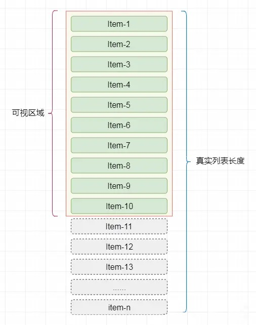
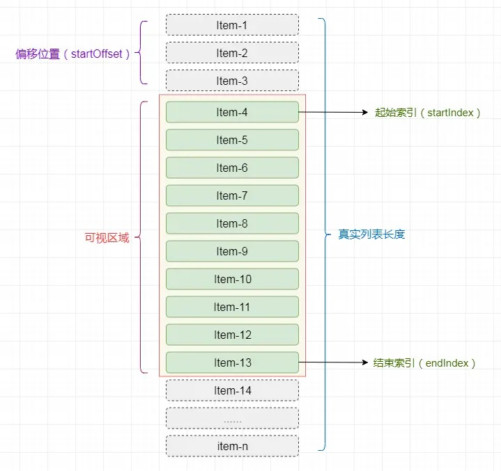
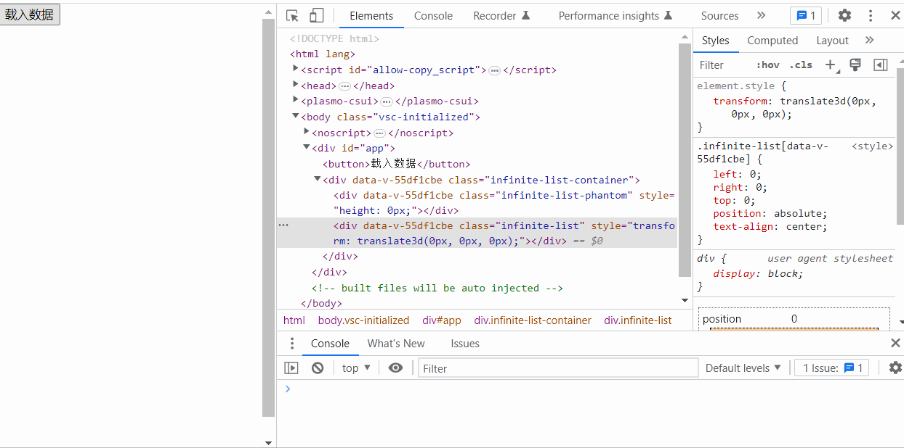
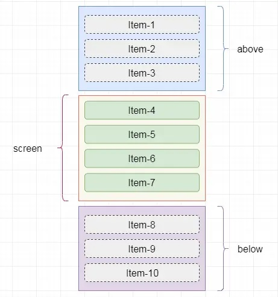
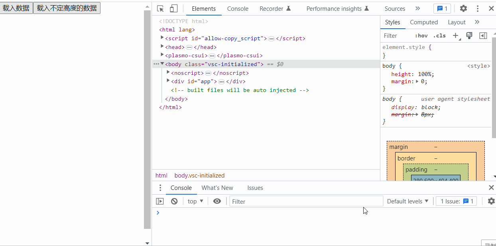

# 高性能渲染大量数据（虚拟列表）

## 场景描述

有一道看似无厘头的面试题：「后端一次性返回 10w 条数据，前端如何优雅展示？」

不过细细想来，有时确实会遇到一些不能使用分页方式来加载列表数据的业务情况（这种列表称为长列表）。比如在一些交易系统中，前端会实时的展示用户的持仓情况（收益、亏损、手数等），此时对于用户的持仓列表一般是不能分页的。再比如一个地图需要显示某片范围的门店，有多少家渲染多少家。

* 实例代码仓库：[virtual-list](https://github.com/wenyuan/virtual-list)

### 场景模拟

假设我们的长列表需要展示 10w 条记录，同时将这些记录渲染到页面中，先来看看需要花费多长时间：

```html
<!DOCTYPE html>
<html lang="zh-CN">

<head>
  <meta charset="UTF-8">
  <title>一次性渲染10w条数据</title>
</head>

<body>
  <div>
    <button id="button">载入数据</button><br>
    <ul id="container"></ul>
  </div>
</body>
<script type="text/javascript">
  document.getElementById('button').addEventListener('click', function () {
    // 记录任务开始时间
    let now = Date.now();
    // 插入10w条数据
    const total = 100000;
    // 获取容器
    let ul = document.getElementById('container');
    // 将数据插入容器中
    for (let i = 0; i < total; i++) {
      let li = document.createElement('li');
      li.innerText = `第 ${i+1} 条数据`;
      ul.appendChild(li);
    }
    console.log('JS运行时间(ms)：', Date.now() - now);
    setTimeout(() => {
      console.log('总运行时间(ms)：', Date.now() - now);
    }, 0)
  })
</script>

</html>
```

点击按钮后，会向页面中加入 10w 条记录。通过控制台的输出可以粗略地统计到，JS 的运行时间为 `117ms`，但渲染完成后的总时间为 `3911ms`。

通过 Chrome 的 Performance 工具来分析这段代码的性能瓶颈在哪里，可以看出，代码从执行到渲染结束，共消耗了 `3963.4ms`，其中的主要时间消耗如下：

* Event(click)：`117.49ms`
* Recalculate Style：`586.12ms`
* Layout：`2.68s`
* Pre-Paint：`420.08ms`
* Paint：`17ms`

那么在执行过程中，消耗时间最多的两个阶段就是：

* `Recalculate Style`：样式计算，浏览器根据 CSS 选择器计算哪些元素应该应用哪些规则，确定每个元素具体的样式。
* `Layout`：布局，知道元素应用哪些规则之后，浏览器开始计算它要占据的空间大小及其在屏幕的位置。

在实际的工作中，列表项必然不会像例子中仅仅只由一个 li 标签组成，必然是由复杂 DOM 节点组成的。那么可以想象的是，当列表项数过多并且列表项结构复杂的时候，同时渲染时，会在 `Recalculate Style` 和 `Layout` 阶段消耗大量的时间。

### 传统做法

对于长列表渲染，传统的方法是使用懒加载的方式：

下拉到底部获取新的内容加载进来，其实就相当于是在垂直方向上的分页叠加功能。优点很明显，不需要一次将数据请求完，当用户下拉到底部时，才使用发送异步请求从服务器获取接下来的数据。

但是这又导致了一个问题，如果用户疯狂进行下拉，浏览器就会创建多个多余的节点，出现冗余。随着加载数据越来越多，浏览器的回流和重绘的开销将会越来越大，整个滑动也会造成卡顿，这个时候我们想，如果能只渲染用户可视区域的节点，便能很好的解决这个问题，这便是虚拟列表。

## 虚拟列表核心思想

虚拟列表的核心思想就是在处理用户滚动时，只对可见区域进行渲染，对非可见区域中的数据不渲染或部分渲染。它本质上也是一种按需显示的技术。

假设有 10w 条记录需要同时渲染，我们屏幕的可见区域的高度为 `500px`，而列表项的高度为 `50px`，则此时我们在屏幕中最多只能看到 10 个列表项，那么在首次渲染的时候，我们只需加载 10 条即可。

<div style="text-align: center;">
  
  <p style="text-align: center; color: #888;">（首次加载十个列表项）</p>
</div>

当滚动发生时，可以通过计算当前滚动值，得到此时在屏幕可见区域应该显示的列表项。

假设滚动发生，滚动条距顶部的位置为 `150px`，即有 3 个列表项从可是区域上面出去了，则此时在可见区域内的列表项为第 4 项至第 13 项。

<div style="text-align: center;">
  
  <p style="text-align: center; color: #888;">（滚动后计算可见列表项）</p>
</div>

## 固定高度虚拟列表实现

### 实现思路

在首屏加载的时候，只加载**可视区域**内需要的列表项。当滚动发生时，通过**动态计算**获得可视区域内的列表项，并将非可视区域内存在的列表项删除。

操作步骤如下：

* 计算当前可视区域起始数据索引（`startIndex`）
* 计算当前可视区域结束数据索引（`endIndex`）
* 得到当前可视区域的数据，并渲染到页面中
* 计算 `startIndex` 对应的数据在整个列表中的偏移位置 `startOffset` 并设置到列表上

<div style="text-align: center;">
  
  <p style="text-align: center; color: #888;">（滚动后计算数据偏移位置）</p>
</div>

由于只是对可视区域内的列表项进行渲染，所以为了保持列表容器的高度并可正常的触发滚动，将 HTML 结构设计成如下：

```html
<div class="infinite-list-container">
  <div class="infinite-list-phantom"></div>
  <div class="infinite-list">
  <!-- item-1 -->
  <!-- item-2 -->
  <!-- ...... -->
  <!-- item-n -->
  </div>
</div>
```

其中：

* `infinite-list-container` 为可视区域的容器
* `infinite-list-phantom` 为容器内的占位，高度为总列表高度，用于形成滚动条
* `infinite-list` 为列表项的渲染区域

接着，监听 `infinite-list-container` 的 `scroll` 事件，获取滚动位置 `scrollTop`：

* 假定可视区域高度固定，称之为 `screenHeight`
* 假定列表每项高度固定，称之为 `itemSize`
* 假定列表数据称之为 `listData`
* 假定当前滚动位置称之为 `scrollTop`

则可计算出：

* 列表总高度 `listHeight = listData.length * itemSize`
* 可显示的列表项数（向上取整） `visibleCount = Math.ceil(screenHeight / itemSize)`
* 数据的起始索引（去尾取整） `startIndex = Math.floor(scrollTop / itemSize)`
* 数据的结束索引 `endIndex = startIndex + visibleCount`
* 列表显示数据为 `visibleData = listData.slice(startIndex, endIndex)`

当滚动后，由于渲染区域相对于可视区域已经发生了偏移，此时我需要获取一个偏移量 `startOffset`，通过样式控制将渲染区域偏移至可视区域中。

* 偏移量 `startOffset = scrollTop - (scrollTop % itemSize)`

> 偏移量仅在前一条记录正好完全离开可视区域，即起始索引发生变化的时候触发。例如列表每一项高度是 `100px`，滚动条滚动了 `100px`，虚拟列表的原理使得可显示的列表项元素进行了变化，但是随着滚动条的移动，可显示列表项的第一个元素所在位置已经被移出了可视区域（移出了 `100px`），此时需要修改偏移量，让列表向下偏移 `100px`，将第一个元素的位置拉回来，让其正常显示出来。
>
> 除此之外，比如滚动条滚动了 `120px`，根据虚拟列表的原理，原先的第二条记录成了现在可显示列表项里的第一条记录，这条记录只有一小半即 `20px` 移出了可视区域，按照日常习惯，我们期待的结果是这条记录一小半在屏幕外、一大半在屏幕内。那么此时的 `startOffset = scrollTop - (scrollTop % itemSize)` 就是 `startOffset = 120 - 120 % 100` 得到偏移距离为 `100`，这个偏移值符合我们要求。
> 
> 如果设置 `startOffset = scrollTop`，那么我们看到的效果将是：随着滚动条滚动，每次列表项的切换都是「闪现」的，即一条完整的记录突然变成另一条完整的记录，不会出现「一条记录渐渐地移出屏幕」这种动态变化的效果。

### 代码实现

最终的简易代码参考：[virtual-list：FixedHeightVirtualList.vue](https://github.com/wenyuan/virtual-list/blob/main/vue-example/src/components/FixedHeightVirtualList.vue)

对比渲染效果：

<div style="text-align: center;">
  
  <p style="text-align: center; color: #888;">（不使用虚拟列表，直接渲染 10w 条数据）</p>
</div>

<div style="text-align: center;">
  
  <p style="text-align: center; color: #888;">（使用虚拟列表，按需渲染 10w 条数据）</p>
</div>

## 动态高度虚拟列表实现

### 实现思路

在之前的实现中，列表项的高度是固定的，因为高度固定，所以可以很轻易地获取列表项的整体高度以及滚动时的显示数据与对应的偏移量。而实际应用的时候，当列表中包含文本之类的可变内容，会导致列表项的高度并不相同。

在虚拟列表中应对这种动态高度的情况，解决方案一般有如下三种：

* 对组件属性 `itemSize` **进行扩展**，支持传递类型为数字、数组、函数
  * 可以是一个固定值，如 `100`，此时列表项是固高的
  * 可以是一个包含所有列表项高度的数据，如 `[50, 20, 100, 80, ...]`
  * 可以是一个根据列表项索引返回其高度的函数，如 `(index: number): number`

> 这种方式虽然有比较好的灵活度，但仅适用于可以预先知道或可以通过计算得知列表项高度的情况，依然无法解决列表项高度由内容撑开的情况。

* 将列表项**渲染到屏幕外**，对其高度进行测量并缓存，然后再将其渲染至可视区域内。

> 由于预先渲染至屏幕外，再渲染至屏幕内，这导致渲染成本增加一倍，这对于数百万用户在低端移动设备上使用的产品来说是不切实际的。

* 以**预估高度**先行渲染，然后获取真实高度并缓存。

> 这是我选择的实现方式，可以避免前两种方案的不足。

### 代码实现

首先给虚拟列表组件定义一个属性 `estimatedItemSize`，用于接收预估高度：

```javascript
props: {
  //预估高度
  estimatedItemSize: {
    type: Number
  }
}
```

再定义 `positions`，用于列表项渲染后存储每一项的高度以及位置信息：

```javascript
this.positions = [
  // 存储形如下面这样的数据结构
  {
    top: 0,
    bottom: 100,
    height: 100
  }
];
```

在组件初始化时，根据 `estimatedItemSize` 对 `positions` 进行初始化：

```javascript
initPositions() {
  this.positions = this.listData.map((item, index)=>{
    return {
      index,
      top: index * this.estimatedItemSize,
      height: this.estimatedItemSize,
      bottom: (index + 1) * this.estimatedItemSize
    }
  })
}
```

尽管列表项高度不定，但由于我们维护了 `positions`，它记录了每一项的位置，因此**列表总高度**实际就可以等于列表中最后一项的底部与列表顶部的距离：

```javascript
// 列表总高度
listHeight() {
  return this.positions[this.positions.length - 1].bottom;
}
```

由于需要在（可视区域内的列表项）渲染完成后，获取列表每项的位置信息并缓存，所以使用钩子函数 `updated` 来实现：

```javascript
updated() {
  let nodes = this.$refs.items;
  nodes.forEach((node)=>{
    // 获取元素在浏览器视口（viewport）中的位置和尺寸信息
    let rect = node.getBoundingClientRect();
    let height = rect.height;
    // 使用一元加（+）操作符将提取出的子字符串（例如123）转换为数字类型
    let index = +node.id.slice(1)
    let oldHeight = this.positions[index].height;
    let dValue = oldHeight - height;
    // 存在差值
    if(dValue){
      this.positions[index].bottom = this.positions[index].bottom - dValue;
      this.positions[index].height = height;
      for(let k = index + 1; k<this.positions.length; k++){
        this.positions[k].top = this.positions[k-1].bottom;
        this.positions[k].bottom = this.positions[k].bottom - dValue;
      }
    }
  })
}
```

滚动后获取列表开始索引的方式修改为从缓存中获取：

```javascript
// 获取列表起始索引
getStartIndex(scrollTop = 0) {
  let item = this.positions.find(i => i && i.bottom > scrollTop);
  return item.index;
}
```

由于我们的缓存数据，本身就是有顺序的，所以获取开始索引的方法可以考虑通过二分查找的方式来降低检索次数：

```javascript
// 获取列表起始索引
getStartIndex(scrollTop = 0) {
  // 二分法查找
  return this.binarySearch(this.positions,scrollTop)
},
//二分法查找
binarySearch(list,value) {
  let start = 0;
  let end = list.length - 1;
  let tempIndex = null;
  while(start <= end){
    let midIndex = parseInt((start + end)/2);
    let midValue = list[midIndex].bottom;
    if(midValue === value){
      return midIndex + 1;
    }else if(midValue < value){
      start = midIndex + 1;
    }else if(midValue > value){
      if(tempIndex === null || tempIndex > midIndex){
        tempIndex = midIndex;
      }
      end = end - 1;
    }
  }
  return tempIndex;
}
```

滚动后将偏移量的获取方式变更：

```javascript
scrollEvent() {
  //...省略
  if(this.start >= 1) {
    this.startOffset = this.positions[this.start - 1].bottom
  } else {
    this.startOffset = 0;
  }
}
```

上面的逻辑已经初步实现了基于文字内容动态撑高列表项情况下的虚拟列表。接下来为了防止滚动过快时，出现短暂的白屏现象。可以多做一步：在可见区域的上方和下方渲染额外的项目，这样可以在滚动时给予一些缓冲。

所以将屏幕分为三个区域：

* 可视区域上方：`above`
* 可视区域：`screen`
* 可视区域下方：`below`

<div style="text-align: center;">
  
  <p style="text-align: center; color: #888;">（滚动缓冲：将屏幕分为三个区域）</p>
</div>

定义组件属性 `bufferScale`，用于接收缓冲区数据与可视区数据的比例：

```javascript
props: {
  // 缓冲区比例
  bufferScale: {
    type: Number,
    default: 1
  }
}
```

可视区上方渲染条数 `aboveCount` 获取方式如下：

```javascript
aboveCount() {
  return Math.min(this.start, this.bufferScale * this.visibleCount)
}
```

可视区下方渲染条数 `belowCount` 获取方式如下：

```javascript
belowCount() {
  return Math.min(this.listData.length - this.end, this.bufferScale * this.visibleCount);
}
```

真实渲染数据 `visibleData` 获取方式如下：

```javascript
visibleData() {
  let start = this.start - this.aboveCount;
  let end = this.end + this.belowCount;
  return this.listData.slice(start, end);
}
```

最后，通过 [faker.js](https://github.com/faker-js/faker) 来创建一些随机数据：

```javascript
let data = [];
for (let id = 0; id < 100000; id++) {
  data.push({
    id,
    value: faker.lorem.sentences() // 长文本
  })
}
```

最终的简易代码参考：[virtual-list：DynamicHeightVirtualList.vue](https://github.com/wenyuan/virtual-list/blob/main/vue-example/src/components/DynamicHeightVirtualList.vue)

渲染效果：

<div style="text-align: center;">
  
  <p style="text-align: center; color: #888;">（使用动态高度虚拟列表，渲染 10w 条高度不固定的数据）</p>
</div>

## 生产中使用虚拟列表

上面手写的虚拟列表主要是为了了解其实现原理，实际开发中如果只用上面的版本还是有一些需要完善之处的：

* 使用监听 `scroll` 事件的方式来触发可视区域中数据的更新，当滚动发生后，scroll 事件会频繁触发，很多时候会造成重复计算的问题，从性能上来说不是最优解。
* 如果列表项中包含图片，并且列表高度由图片撑开，由于图片会发送网络请求，此时无法保证我们在获取列表项真实高度时图片是否已经加载完成，因此会出现计算不准确的情况。
* 其它

只有经过很多人使用、测试，并且长期维护的项目才是比较稳妥的方案。因此实际生产中使用虚拟列表，建议使用一些 UI 组件库官方配套的方案，或者有海量开发者参与使用的开源项目。

这里推荐几个：

* [Element Plus](https://element-plus.org/zh-CN/component/button.html)：自带了虚拟列表选择器、虚拟化表格、虚拟化树形控件。
* [Ant Design](https://ant.design/components/overview-cn/)：搜一下关键字，可以发现很多组件也引入虚拟滚动技术。

（完）
