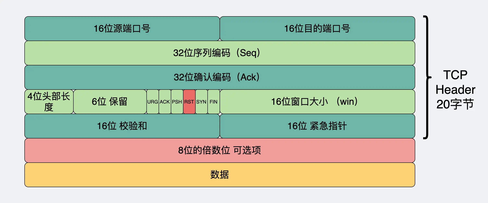

# HTTP 错误状态码及排查路径

## 502 Bad Gateway

### 产生原因

这个报错一般是由网关代理（Nginx）发出的，产生的原因是网关代理把客户端的请求转发给了服务端，但服务端却发出了「无效响应」。

展开解释：

* 原本客户端到服务端是直连的，也就是每次请求是一个 TCP 连接；引入 Nginx 后，客户端需要先连接 Nginx，Nginx 再连接服务端，此时就从一个 TCP 连接变成了两个 TCP 连接。
* 而当服务端发生异常时，Nginx 发送给服务器的那条 TCP 连接就不能正常响应，Nginx 在得到这一信息后，就会返回 5xx 错误码给客户端。这里的 502 错误码就是错误的一种。

> 上面提到的「无效响应」通常指：
> 
> * TCP 的 `RST` 报文：网络发生异常时，通过在 TCP 包头放入标志位来表示「异常地关闭一个连接」。
> * 四次挥手的 `FIN` 报文：优雅地断开了 TCP 连接。
> 
> <div style="text-align: center;">
>   
>   <p style="text-align: center; color: #888;">（TCP 的 RST 报文，图来源于网络）</p>
> </div>
>
> 之所以发出 `RST` 报文，一般有两个常见原因：
>
> * 服务端过早断开连接，导致 Nginx 在将客户端请求转发给服务端时，收到服务端内核返回的 `RST` 报文或四次挥手的 `FIN` 报文，迫使 Nginx 这边的连接结束。
>   * 可能1：服务端设置的超时时间过短，在你所使用的后端编程语言的框架中，将相应的超时参数调大即可。
>   * 可能2：服务端应用进程崩了，导致没有一个进程在监听服务器端口，而此时 Nginx 却尝试向一个不存在的端口发数据，服务器的 Linux 内核协议栈自然就会响应一个 `RST` 数据包。
> * 网关将请求打到了一个不存在的 IP 上。如果使用 Nginx 来实现负载均衡，那么有可能会出现这种情况。此时有可能是 IP 填写错了，或者 IP 动态变化了，总之就是当前 Nginx 转发的那个 IP 不存在了。

### 排查路径

看到错误码是 5xx，就可以先确定两个方向：

* 此类报错的原因是 Nginx 发送给服务器的那条 TCP 连接不能正常响应，因此**问题在服务器上，优先排查服务器**。
* 此类报错是由 Nginx 识别出来并返回给客户端的，那么服务端本身并不会有携带 5xx 关键词的日志信息，而应该**优先查看 Nginx 的运行日志**。

第一步，查看 Nginx 日志：

* 定位到对应异常时间点的 Nginx 日志，根据具体的错误信息，进行针对性的解决。比如：
  ```bash
  # 这个异常是由于响应中 Header 信息过大导致的
  61112#0: *1 upstream sent too big header while reading response header from upstream
  ```

第二步，结合报错信息，开展问题定位和解决：

* 如果是服务端应用进程崩了（这也是一种相对常见的情况）。大部分的服务器都会将挂掉的服务重启，因此我们需要判断下服务是否曾经崩溃过：
  ```bash
  # 查看进程最近一次的启动时间
  ps -o lstart {pid}
  ```
  确定是这个原因后，再顺藤摸瓜找出崩溃的原因。是对未初始化的内存地址进行了写操作，还是内存访问越界，等等。这种情况几乎都是程序有代码逻辑问题，可以根据代码的堆栈报错去排查问题。当然也可能是内存泄露导致进程占用内存越来越多，最后导致超过服务器的最大内存限制，触发 OOM（out of memory），进程直接就被操作系统 kill 掉。这些都涉及到具体的代码问题了，需要仔细排查。
* 如果确定服务没有崩过，那也可能是网关将请求打到了一个不存在的 IP 上。查看 Nginx 的配置文件，里面看有没有关于负载均衡的配置：
  ```bash
  upstream www.demo.com {
      server 192.168.80.121:80 weight=3;
      server 192.168.80.122:80 weight=2;
      server 192.168.80.123:80 weight=3;
  }
  ```
  可以看到这些值是需要自己手动配置的。一旦实际部署的 IP 发生了变化，那么这个配置也需要及时更新。

  不少公司会基于 Nginx 进行二次开发，在服务启动时，让服务主动将自己的 IP 告诉 Nginx，然后 Nginx 自己生成这样的一个配置并重新加载，通过类似这样的一个服务注册的功能来节省部署成本。但如果这个服务注册功能有问题，比方说服务启动后，新服务没注册上，但老服务已经被销毁了。

  要排查这种问题也不难，可以看下 Nginx 是否有打印相关的日志，看下转发的 IP 和端口是否符合预期，如果不符合预期，那么 502 报错的原因就找到了！
