# B 端产品文案指南

> B 端文案不同于 C 端，面对的用户都是企业为主，语言风格上要正式官方，以帮助用户高效地使用产品、完成工作为核心目标，据此来组织内容和语言。

## 前言

* 本文**主要面向 B 类业务、简体中文语境**，提供实操性指南。
* 行业内约定俗成的常用语请继续沿用，可以不依照这里的建议。
* 本文所指的文案不包含营销推广类文案。

## 原则

### 帮助用户高效操作

* 站在产品官方的角度来传达信息，表达上要官方、正式。
* 以帮助用户高效地使用产品、完成工作为核心目标，据此来组织内容和语言。

  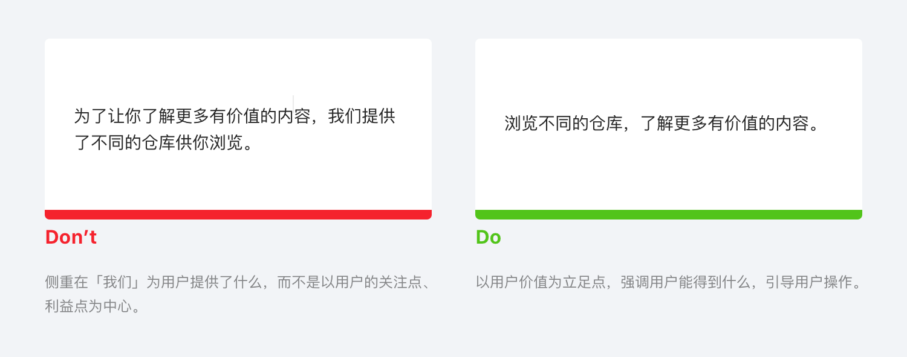
  
（帮助用户高效操作，图片来源于网络）

### 一致性

* 描述同一个事物和同样动作的词汇保持统一。
* 上下文的语法、语种、语序保持统一。
* 表述角色一致，不要在同一个句式中混用「你」和「我」。

  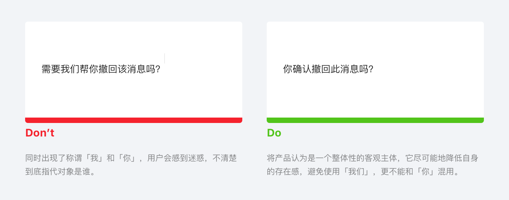
  
（一致性，图片来源于网络）

**提示**：本指南中无法涵盖在业务中可能遇到的全部场景/文案，可以通过一致性的原则选择扩充文案。

例如在页面模板的列表中，点击后到详情内容的操作字段的选择上，因为目前已有的是「查看全部」、「加载更多」这些文案，所以选择使用「查看详情」这一同类短语。

### 内容完整、语言精简

B 类产品通常有一定的学习成本，但阅读冗长的文案会消耗用户大量的精力，因此需要在保证内容完整性的同时，采用精练的语言。

避免不够完整明确的表达。

  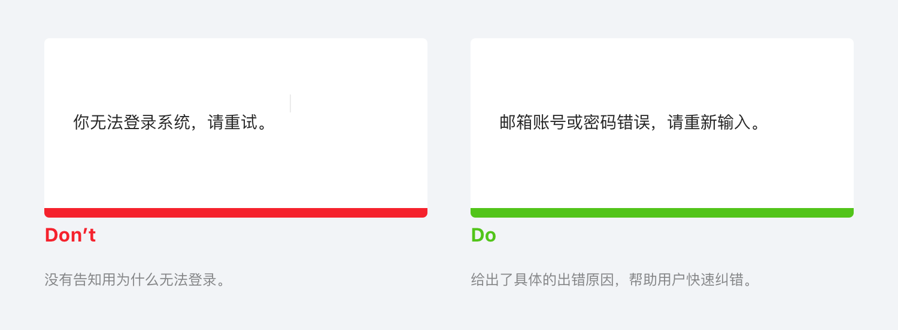
  
（避免不够完整明确的表达，图片来源于网络）

避免累赘的词句、意思重复的用词。

  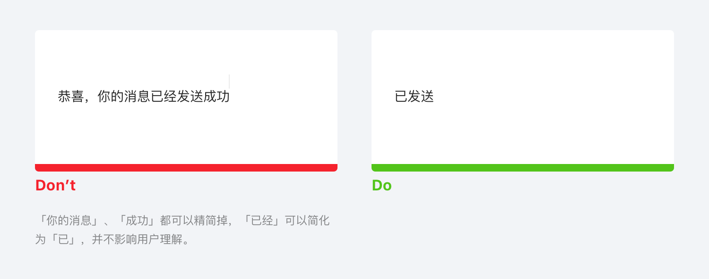
  
（避免累赘的词句，图片来源于网络）

  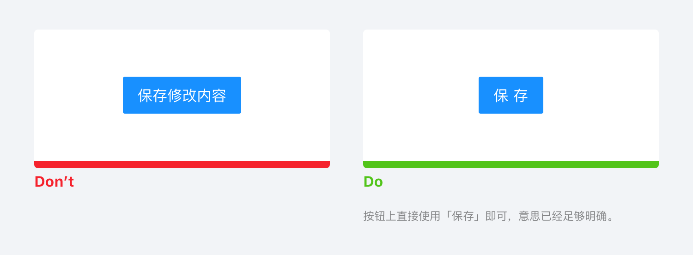
  
（避免意思重复的用词，图片来源于网络）

文字完整易读：完整词语在一行不拆分，账号，数字，标点符号不折行。

目前行业内文字均是根据手机分辨率自动折行，有些机型会出现词被拆开，或是一个字或标点符号单独一行的问题。常见问题页面有三种类型：协议类、系统弹层、产品说明和活动说明页面。

  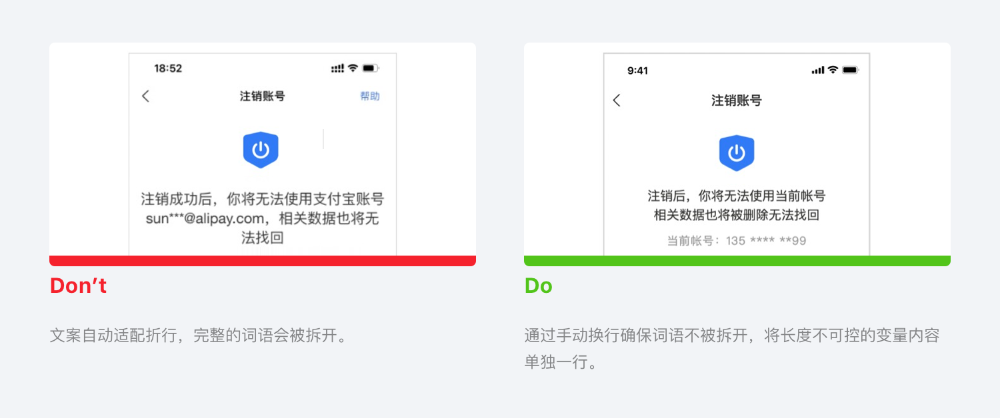
  
（通过手动换行确保词语不被拆开，图片来源于网络）

### 用词专业、精准

需要充分了解用户背景，采用专业度适当、精练准确的词语来高效地传达信息，提高用户理解的效率。

* 避免对目标用户来说过于专业难懂的词语。
* 避免使用错别字、口语、夸大的用词、含糊的比喻、网络流行语。

  
  
（用词专业、精准，图片来源于网络）

### 语气友好、正面

B 类产品需要表现「有温度」的专业形象，而不是浮躁、冰冷、苛刻的态度。

避免使用过于极端、绝对、夸张的表述。

  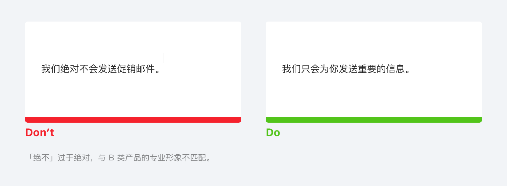
  
（避免使用过于夸张的表述，图片来源于网络）

避免强迫用户、责怪用户的语气。

  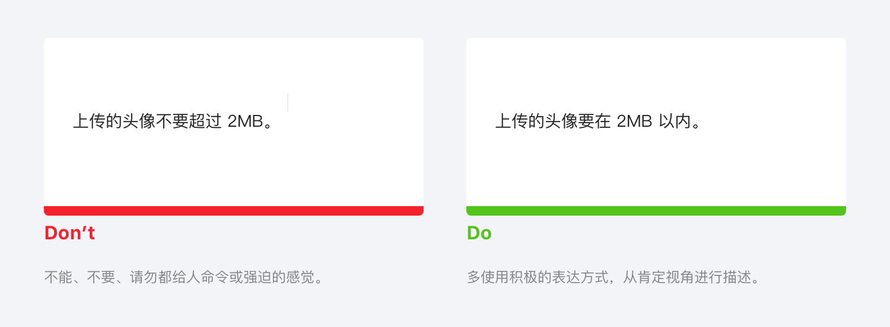
  
（避免强迫用户的语气，图片来源于网络）

避免否定视角、采用积极的表达方式。

  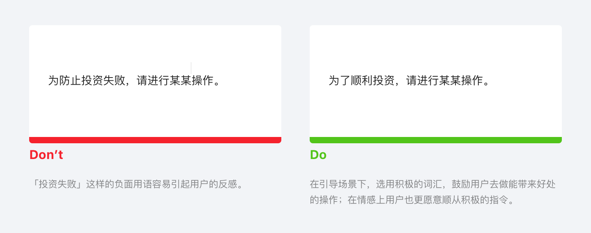
  
（避免否定视角，图片来源于网络）

## 词表

说明：这里列举了通用的，且需要与类似词语有所区分的容易写错/混淆的词汇和短语。

  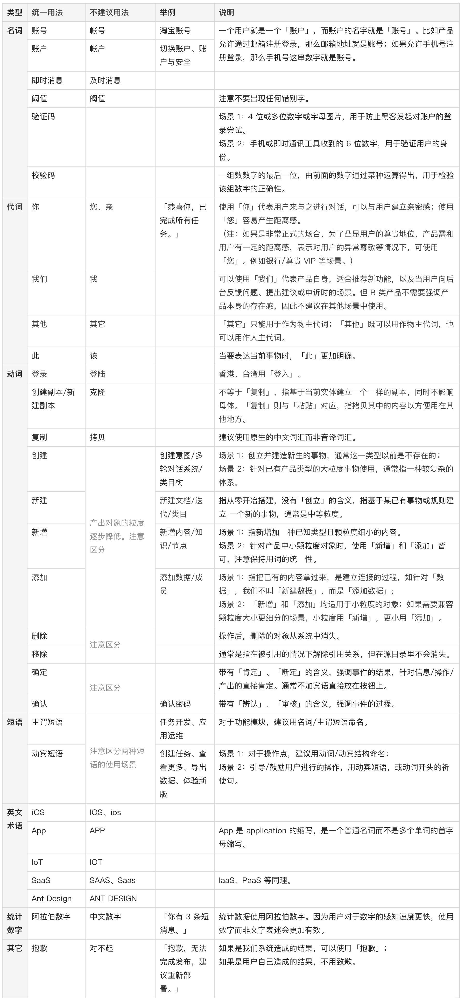
  
（常用词表，图片来源于网络）

## 格式

### 段落

首行不空格，段与段之间空一行。

### 空格

* 英文与非标点的中文之间需要有一个空格。
* 数字与非标点的中文之间需要有一个空格。
* 数字与单位之间需要有一个空格。
* 中文标点与其他字符间不加空格。
* 百分比数字与百分号之间不加空格（如「56%」）。

### 标点

* 只有中文或中英文混排中，使用中文全角标点；
* 中英文混排中如果出现整句英文，则在这句英文中使用英文/半角标点；
* 具体使用请参考 1995 年中国标准出版社出版的《标点符号用法》。

  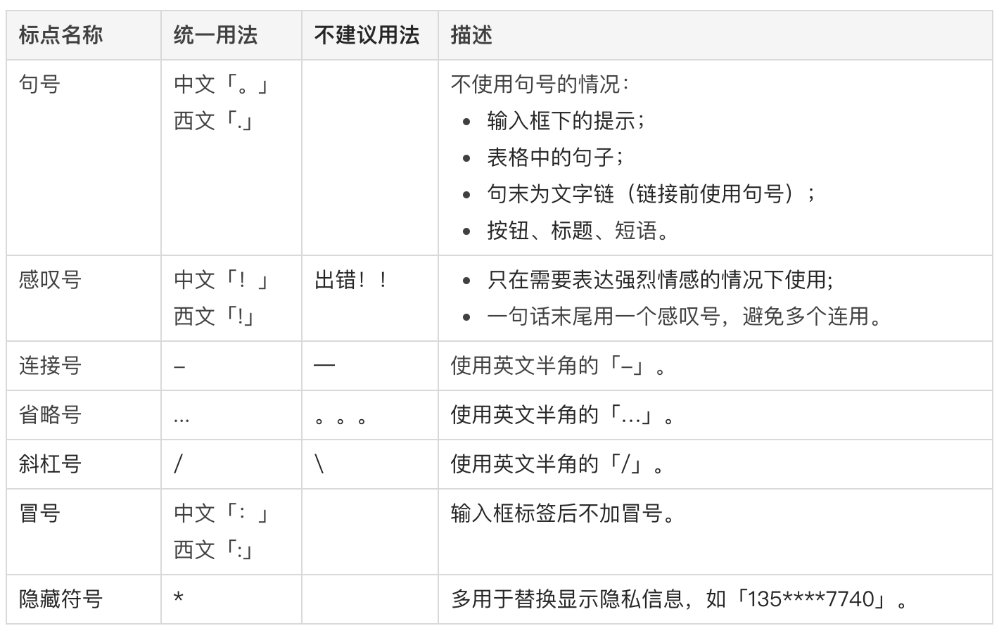
  
（标点符号用法部分内容，图片来源于网络）

## 文案类型

为便于查阅和参考，这里按常用的具体场景，阐述统一的原则在场景中的应用和正反案例。使用中请举一反三。

### 系统通知

系统通知是各类产品的基础功能，目的是从产品的角度向用户传达信息并进行必要的处理。

阐述角度：以产品的视角陈述，精准、实时地告知用户客观信息，让用户及时了解情况。

  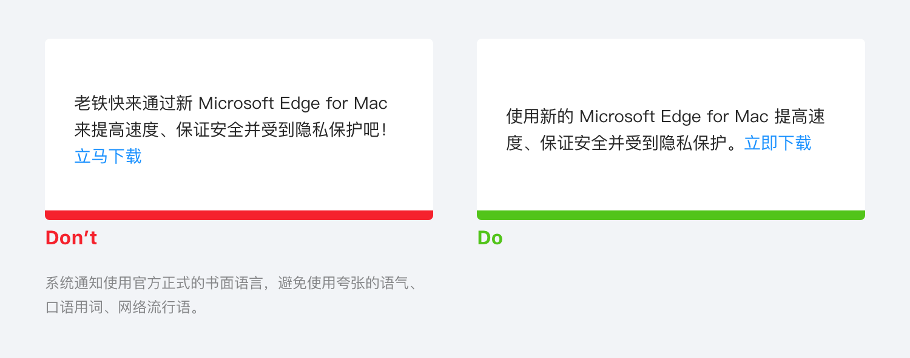
  
（以产品的视角陈述，图片来源于网络）

通用句式：「情况陈述 + 相关操作（可选）」。

如果需要用户针对通知的信息尽快进行某些操作，需要提供相关引导。

  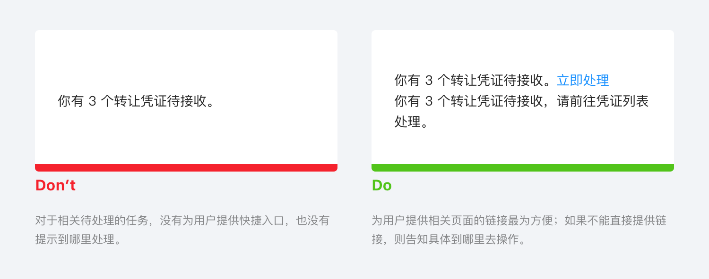
  
（必要时提供相关引导，图片来源于网络）

主动语态：使用简洁流畅的主动语态，少用被动语态。

  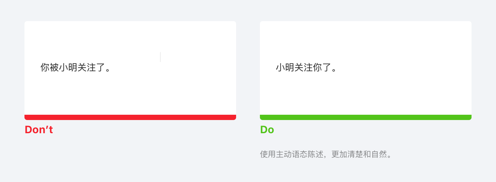
  
（使用主动语态，图片来源于网络）

### 帮助/提示

帮助/提示指的是内嵌在产品界面的信息，用来帮助用户理解产品、消除疑虑、合理操作。

这里的帮助不同于帮助中心或帮助文档，后者通常是通过单独的网站或一系列网页，系统地阐述产品功能、定价、操作步骤、常见问题等，帮助用户购买和操作的内容。

阐述角度：让用户高效地理解当前的情况、了解产品功能、完成当下的任务。

  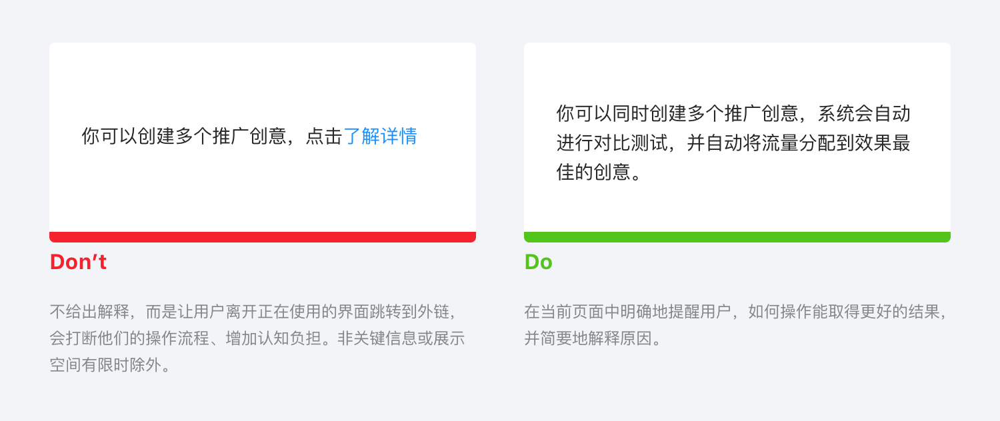
  
（让用户高效地理解，图片来源于网络）

逐条表述：当内容较多时，建议按内容逻辑分段分条目来陈述，建议一组不超过 5 条，每条不超过 3 行。

  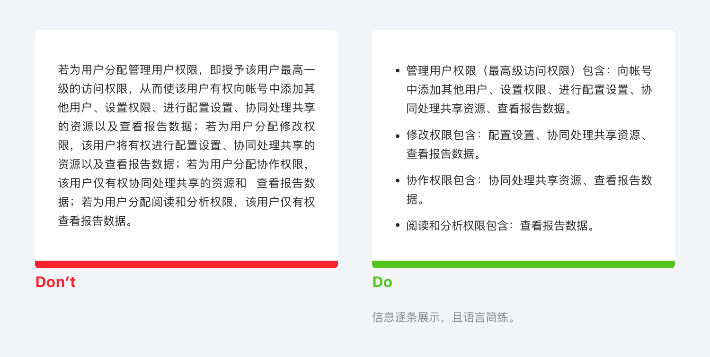
  
（分段分条目，图片来源于网络）

### 操作引导

操作引导用于指导和推动用户执行某些操作，常用于新手用户的初始化、空状态、新功能引导等场景。

* 阐述角度：从用户角度出发，关注点是用户能用产品做什么、收获什么，从而引导用户进行相应操作。
* 通用句式：「目的或重要性（可选）+ 具体操作」。

当我们希望用户执行一个动作时，要专注于用户能得到什么以及用户的感受，因此在操作前告知用户其目的或重要性，能促进用户更愿意去做。

  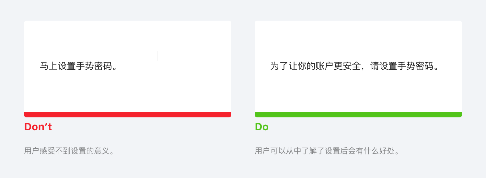
  
（告知用户目的或重要性，图片来源于网络）

动词开头：使用动词开头的祈使句或动宾短语。

  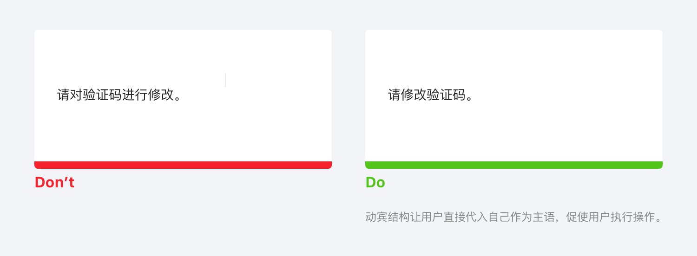
  
（使用动词祈使句或动宾短语，图片来源于网络）

避免方向性词语：明确指出具体的功能/组件，而不是表意不够精准的方向性词语，如错误案例「在屏幕顶部」。

  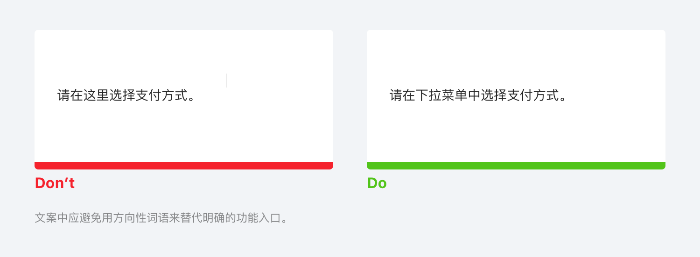
  
（避免不明确的方向性词语，图片来源于网络）

* 控制步骤数：分步引导控制在 3~5 步，移动端每屏每次展示 1 步；根据实际的用户需要，如果内容比较复杂，建议使用视频、帮助文档等其他模式。
* 控制字数：每条引导的字数不宜过多，否则会让产品看起来比实际上更难操作，建议不超出 3 行。

### 操作反馈

操作反馈是指产品对用户的行为作出的即时响应。

阐述角度：对于完成的操作，即时性地告知用户结果；对于有风险的操作，先告知用户风险，再请用户确认。

  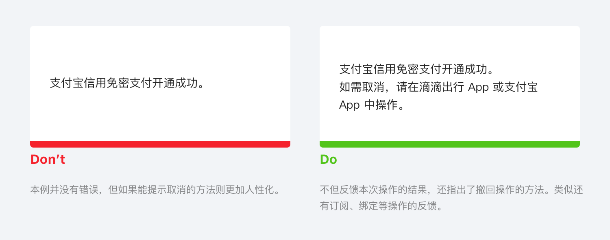
  
（即时告知用户结果，图片来源于网络）

二次确认句式：对于风险较大的操作，需要用户进行二次确认，句式为「操作风险 + 给出建议（可选）+ 是否执行」。

建议对应的按钮使用具体动词或词组，而不是直接使用通用的「确定」、「OK」、「是」。

  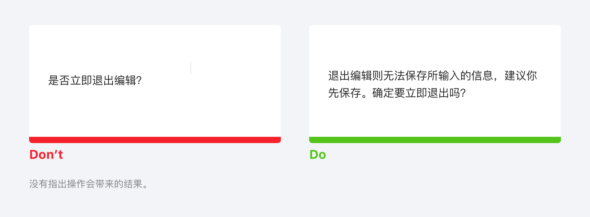
  
（按钮使用具体动词或词组，图片来源于网络）

用词精准：虽然「友好、正面」是原则之一，但用作提醒、警示的反馈中，要将问题直接通知用户，无需刻意隐晦。

  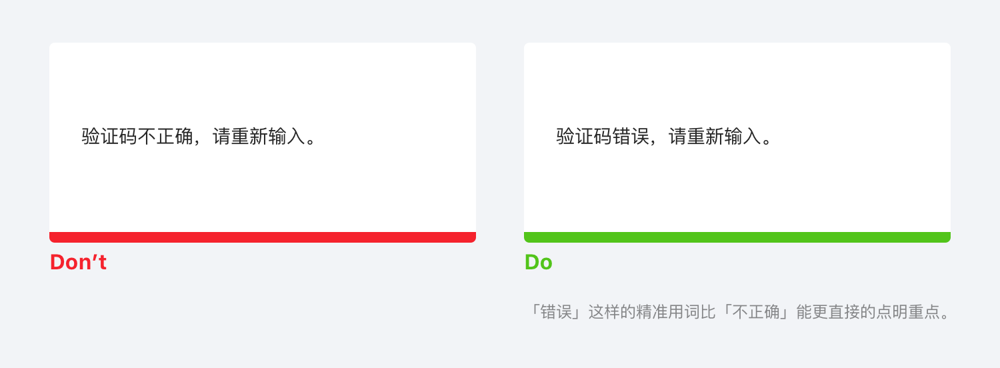
  
（提醒、警示的用词无需刻意隐晦，图片来源于网络）

### 报错信息

报错信息与操作反馈、系统通知有交集，是在用户行为、系统运行、网络问题等因素引发问题后，通知用户并指导如何处理。

阐述角度：引起用户关注，让其快速了解出错情况，并专注于解决问题。

  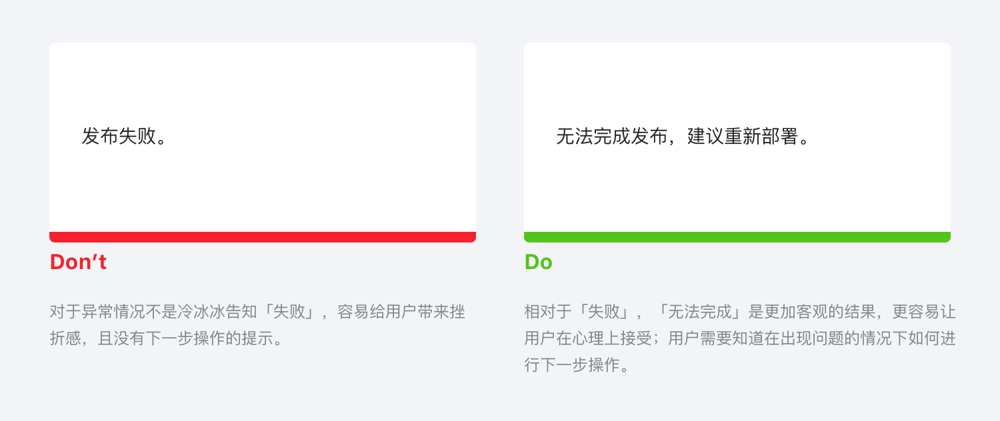
  
（引起用户关注，图片来源于网络）

通用句式：「表达歉意（产品/系统原因时）+ 问题阐述 + 操作指导（推荐提供）」。

如果具体的出错原因对于目标用户容易理解、对接下来的操作有帮助，则明确告知用户，反之则概括性说明出错原因即可。

面向商家的后台产品：

  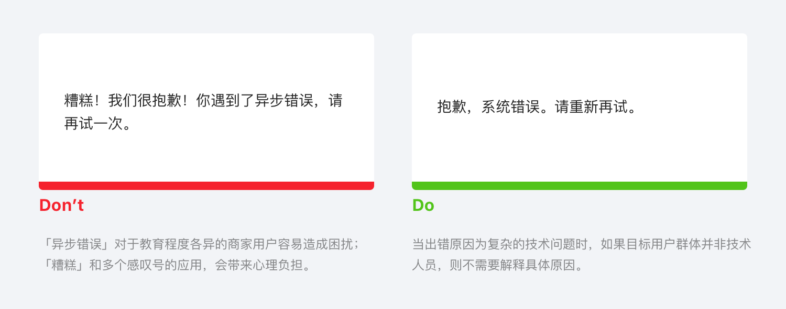
  
（面向商家的后台产品，图片来源于网络）

面向开发者的工具产品：

  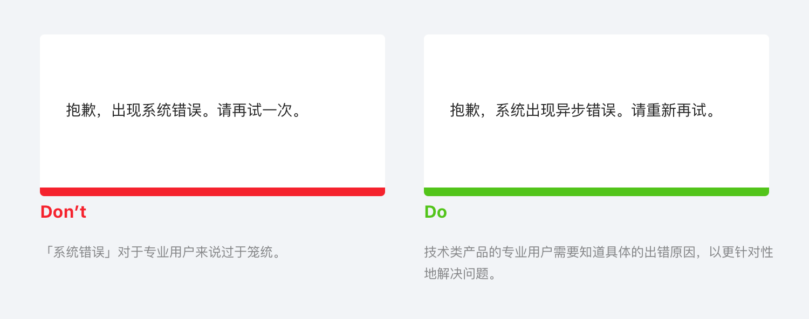
  
（面向开发者的工具产品，图片来源于网络）

态度友好：当出错的时候，尤其需要多给用户支持与鼓励，不要责怪用户。

  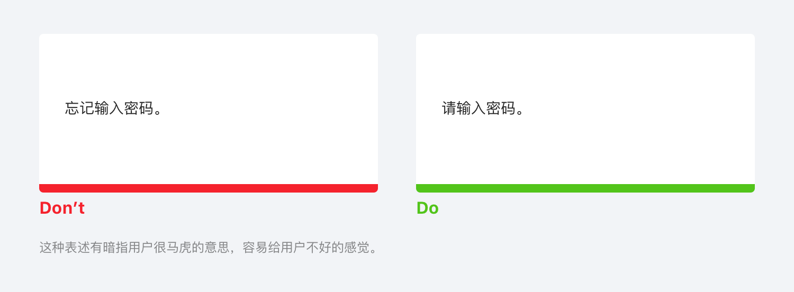
  
（态度友好，图片来源于网络）

## 场景指南

前面介绍的是文案「怎么说」，这里根据 B 类产品中的主要操作场景，来简要介绍「说什么」，即文案较复杂时如何对多种类型进行组合。

  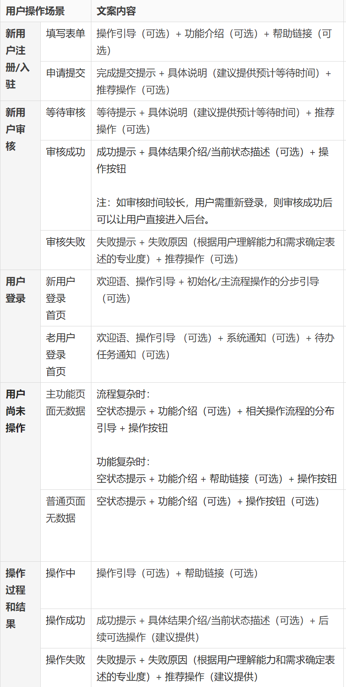
  
（主要操作场景的文案公式，图片来源于网络）

## 参考资料

* [Ant Design 文案](https://ant.design/docs/spec/copywriting-cn)（还有英文版的）
* [Clarity Design 文案](https://design.teambition.com/doc/copywriting)
* [LeanCloud 开放资源](https://open.avoscloud.com/copywriting-style-guide/)
* [Content patterns](https://contentdesign.intuit.com/content-patterns/)（英文文案）
