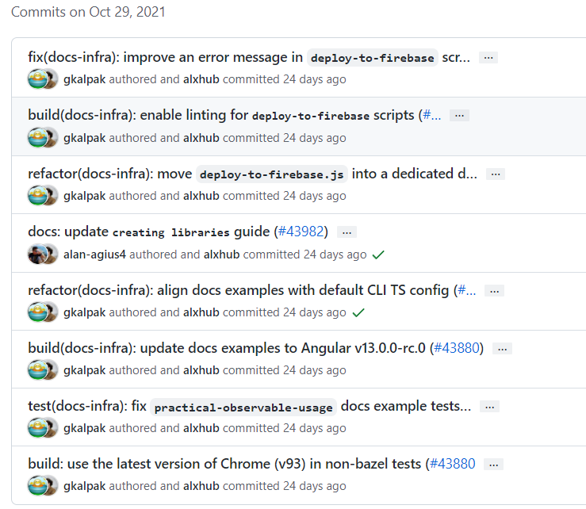
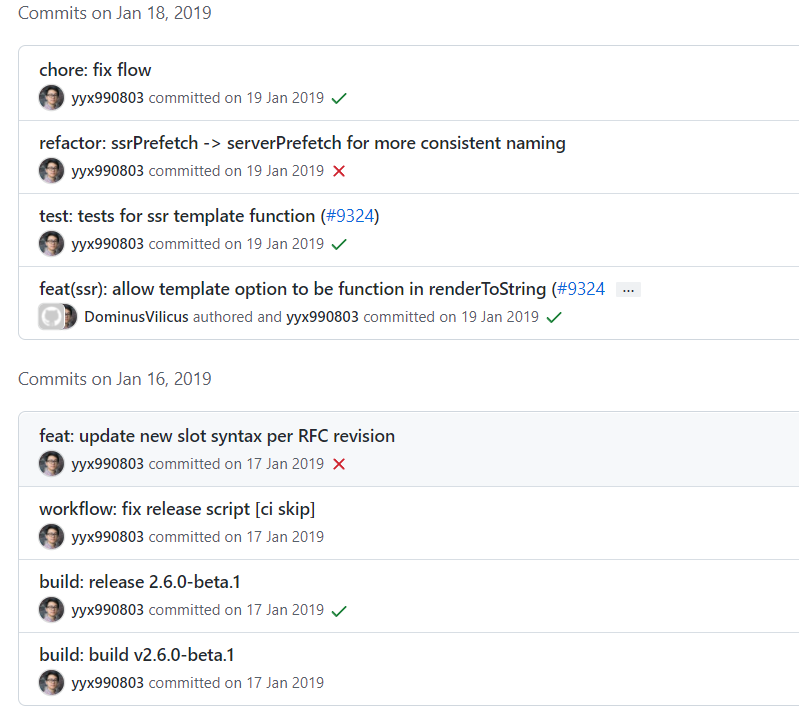
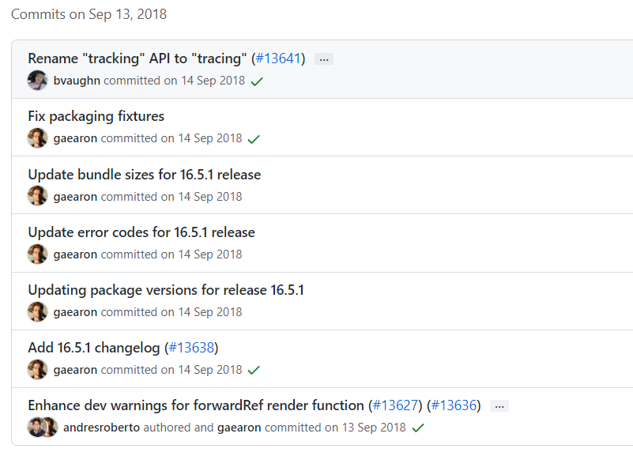

# Git 提交信息规范

> 无论是个人项目还是在团队协作中，commit message 都应该清晰明了，遵守一定规范。
>
> 目前，社区有多种 commit message 的写法规范。本文介绍 [Angular 规范](https://github.com/angular/angular.js/blob/master/DEVELOPERS.md#commits)，这是目前使用最广的写法，比较合理和系统化，并且有配套的工具。

## 规范 commit 的好处

* 提供更明确的历史信息，方便浏览和判断提交目的
* 可以过滤某些不必要的提交，方便快速查找信息
* 自动化生成 Change log

以上的好处，个人认为要有一个大的前提，就是每一个提交，尽量保证其目的单一性。例如几个 bug 仅仅看上去类似，就合并成一次性修改提交，反而会让 commit 的信息变的复杂化，阅读不方便，也容易让人想到一些不必要的关联性。

## 开源项目 commit 示例

找了几个 star 较多的库，看看它们的提交格式。

* [angular-commit](https://github.com/angular/angular/commits/master)

<div style="text-align: center;">
  
  <p style="text-align: center; color: #888;">（Angular 的提交历史）</p>
</div>

* [vuejs-commit](https://github.com/vuejs/vue/commits/dev)

<div style="text-align: center;">
  
  <p style="text-align: center; color: #888;">（Vue.js 的提交历史）</p>
</div>

* [react-commit](https://github.com/facebook/react/commits/main)：跟前两者的风格不一样，似乎就是首字母大写，但最近的提交记录中，看见有参与者在按照 Angular 的 commit 规范进行提交。

<div style="text-align: center;">
  
  <p style="text-align: center; color: #888;">（React 的提交历史）</p>
</div>

## commit 的格式

每次提交，commit message 都包括三个部分：header，body 和 footer。header 有一个特殊的格式包含有 type，scope 和 subject：

```bash
<type>(<scope>): <subject>  # header
<BLANK LINE>                # 空行
<body>                      # body
<BLANK LINE>                # 空行
<footer>                    # footer
```

header、body、footer 之间都要空一行，header 是必填项，scope 是选填项。commit message 的每一行的文字不能超过 100 个字符。这样子在 GitHub 和 Git 工具上更便于阅读。

### type

type 用于说明 commit 的类别，必须为以下类型的一种：

type 用于说明 commit 的类别，一般常用的有下面几种标识：

* `feat`：新功能（feature）
* `fix`：修复 bug
* `docs`：只是文档的更改（documentation）
* `style`：不影响程序逻辑的代码修改（例如格式化、修改空白字符，补全缺失的分号等）
* `refactor`：即不是新增功能，也不是修改 bug 的代码变动（一般指重构代码）
* `perf`：提高性能的代码更改
* `test`：新增测试用例或是更新现有测试
* `revert`：回滚某个更早之前的提交
* `build`：主要目的是修改项目构建系统（例如 glup，webpack，rollup 的配置等）的提交
* `ci`：主要目的是修改项目继续集成流程（例如 Travis，Jenkins，GitLab CI，Circle 等）的提交
* `chore`：不属于以上类型的其他类型（日常事务，例如对构建或者辅助工具的更改、生成文档等）

如果 type 为 feat 和 fix，则该 commit 将肯定出现在 Change log 之中。其他情况由你决定要不要放入 Change log，建议是不要。

### scope

scope 用于说明 commit 影响的范围（比如数据层、控制层、视图层等等），当影响的范围有多个时候，可以使用 `*`。

### subject

subject 用于对本次 commit 的简洁描述，不超过 50 个字符：

* 使用[祈使句](https://baike.baidu.com/item/祈使句/19650285)，一般以动词原形开始，例如使用 change 而不是 changed 或者 changes。
* 第一个字母小写。
* 结尾不加句号（`.`）。

### body

body 用于对 commit 详细描述。

* 使用祈使句，一般以动词原形开始，例如使用 change 而不是 changed 或者 changes。
* 应该说明代码变动的动机，以及与以前行为的对比。
* 可以分成多行。

### footer

footer 部分只用于两种情况。

#### 1）不兼容的变动

如果当前代码与上一个版本不兼容，则 footer 部分以 `BREAKING CHANGE:` 开头，后面是对变动的描述、以及变动理由和迁移方法。

```bash
BREAKING CHANGE: isolate scope bindings definition has changed.

To migrate the code follow the example below:

Before:

scope: {
  myAttr: 'attribute',
}

After:

scope: {
  myAttr: '@',
}

The removed `inject` wasn't generaly useful for directives so there should be no code using it.
```

#### 2）关闭 issue

如果当前 commit 针对某个 issue，那么可以在 footer 部分关闭这个 issue。

```bash
Closes #234
```

也可以一次关闭多个 issue。

```bash
Closes #123, #245, #992
```

### revert（可忽视）

如果当前 commit 用于撤销之前的 commit，则必须以 `revert:` 开头，后面跟着被撤销 commit 的 header。

body 部分的格式是固定的，必须写成 `This reverts commit <hash>.`，其中的 hash 是被撤销 commit 的 SHA 标识符。

```bash
revert: feat(pencil): add 'graphiteWidth' option

This reverts commit 667ecc1654a317a13331b17617d973392f415f02.
```

如果当前 commit 与被撤销的 commit，在同一个发布（release）里面，那么它们都不会出现在 Change log 里面。如果两者在不同的发布，那么当前 commit，会出现在 Change log 的 Reverts 小标题下面。

## 模板参考

```bash
feat($browser): onUrlChange event (popstate/hashchange/polling)

Added new event to $browser:
- forward popstate event if available
- forward hashchange event if popstate not available
- do polling when neither popstate nor hashchange available

Breaks $browser.onHashChange, which was removed (use onUrlChange instead)
```

```bash
fix($compile): couple of unit tests for IE9

Older IEs serialize html uppercased, but IE9 does not...
Would be better to expect case insensitive, unfortunately jasmine does
not allow to user regexps for throw expectations.

Closes #392
Breaks foo.bar api, foo.baz should be used instead
```

```bash
feat(directive): ng:disabled, ng:checked, ng:multiple, ng:readonly, ng:selected

New directives for proper binding these attributes in older browsers (IE).
Added coresponding description, live examples and e2e tests.

Closes #351
```

```bash
style($location): add couple of missing semi colons
```

```bash
docs(guide): updated fixed docs from Google Docs

Couple of typos fixed:
- indentation
- batchLogbatchLog -> batchLog
- start periodic checking
- missing brace
```

```bash
feat($compile): simplify isolate scope bindings

Changed the isolate scope binding options to:
  - @attr - attribute binding (including interpolation)
  - =model - by-directional model binding
  - &expr - expression execution binding

This change simplifies the terminology as well as
number of choices available to the developer. It
also supports local name aliasing from the parent.

BREAKING CHANGE: isolate scope bindings definition has changed and
the inject option for the directive controller injection was removed.

To migrate the code follow the example below:

Before:

scope: {
  myAttr: 'attribute',
  myBind: 'bind',
  myExpression: 'expression',
  myEval: 'evaluate',
  myAccessor: 'accessor'
}

After:

scope: {
  myAttr: '@',
  myBind: '@',
  myExpression: '&',
  // myEval - usually not useful, but in cases where the expression is assignable, you can use '='
  myAccessor: '=' // in directive's template change myAccessor() to myAccessor
}

The removed `inject` wasn't generaly useful for directives so there should be no code using it.
```

## 提交频率

关于什么时候提交一次：

每次你写完一个功能的时候，就应该做一次提交（这个提交是提交到本地的 Git 库中）。

当然，这里的写完表示的是你的这个功能是没有问题的。

## 参考资料

* [Angular 规范](https://github.com/angular/angular.js/blob/master/DEVELOPERS.md#commits)
* [Angular 规范文档](https://docs.google.com/document/d/1QrDFcIiPjSLDn3EL15IJygNPiHORgU1_OOAqWjiDU5Y/edit)
* [约定式提交](https://www.conventionalcommits.org/zh-hans/v1.0.0/)

（完）
