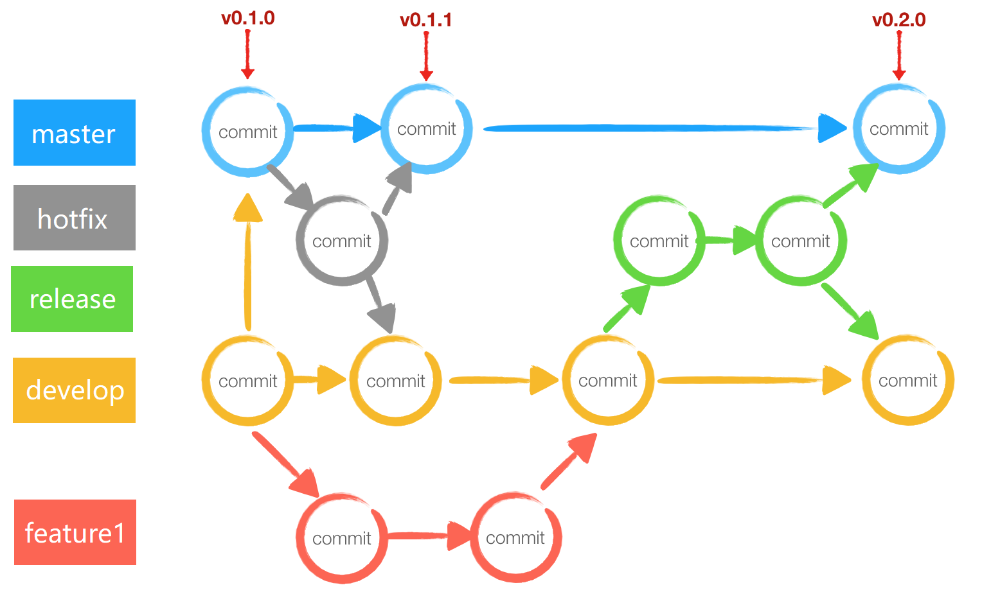
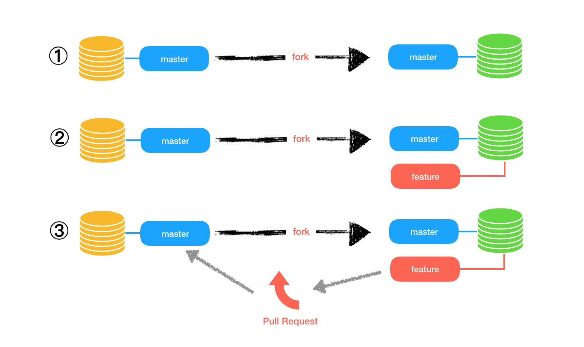
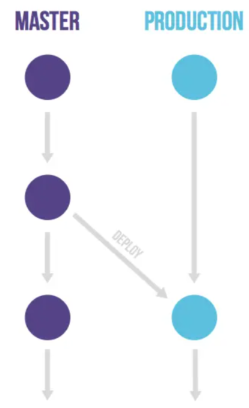
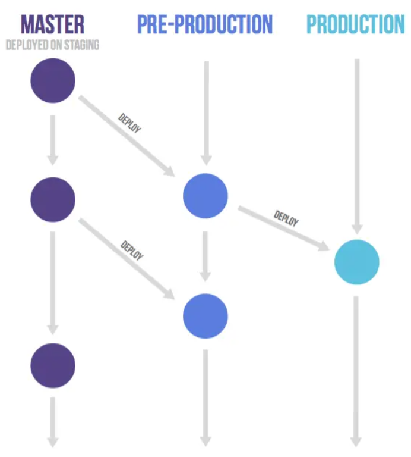
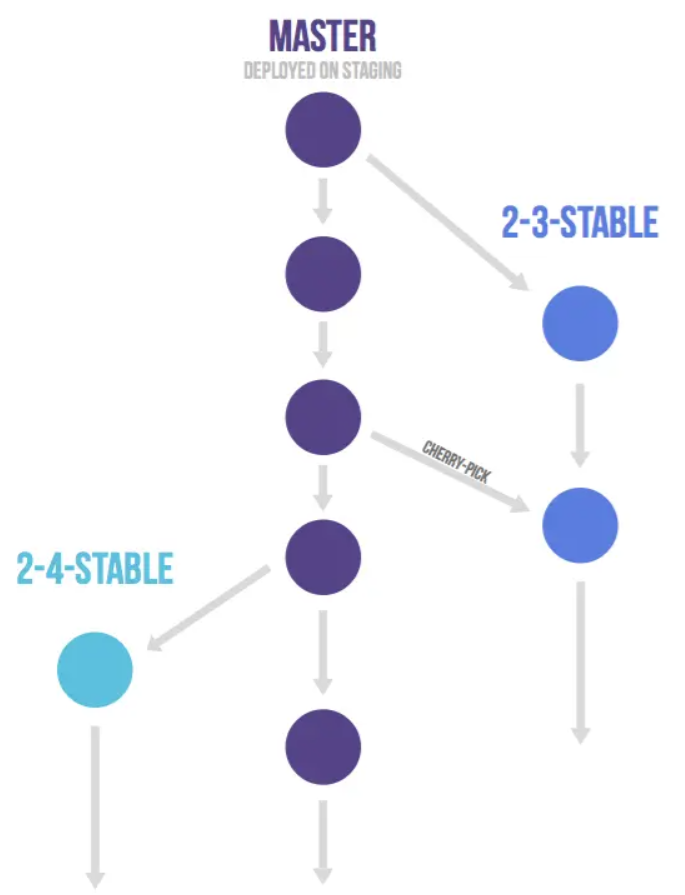

# Git 工作流 — 分支策略

## 前言

设想这样一个场景：某企业的开发团队使用 Git 管理日常开发工作，最初开发团队的代码有一条主干分支（master/main）。后来为了开发新功能，从主干分支拉出一条特性分支，但新功能完成后，该特性分支没有合入主干分支，而是作为下次开发的主干分支，重新拉出一条新的特性分支，导致主干分支一直形同虚设，团队没有一条稳定的代码分支。

这个问题很大程度上源于团队对分支策略的不了解，导致分支策略使用很混乱。因此，本文总结目前主流的几种 Git 工作流 —— 分支策略，方便团队开发时，根据自身情况选择最合适的方案。

## 常见的分支策略

目前业界 Git 工作流主要有：GitFlow、GitHubFlow 以及 GitLabFlow。

### Git Flow

GitFlow 是这三种分支策略中最早出现的。

GitFlow 通常包含五种类型的分支：master 分支、develop 分支、feature 分支、release 分支以及 hotfix 分支。

* **master 分支**：主干分支，也是正式发布版本的分支，其包含可以部署到生产环境中的代码，通常情况下只允许其他分支将代码合入，不允许向 master 分支直接提交代码（对应生产环境）。
* **develop 分支**：开发分支，用来集成测试最新合入的开发成果，包含要发布到下一个 release 的代码（对应开发环境）。
* **feature 分支**：特性分支，通常从 develop 分支拉出，每个新特性的开发对应一个特性分支，用于开发人员提交代码并进行自测。自测完成后，会将 feature 分支的代码合并至 develop 分支，进入下一个 release。
* **release 分支**：发布分支，发布新版本时，基于 develop 分支创建，发布完成后，合并到 master 和 develop 分支（对应集成测试环境）。
* **hot fix 分支**：热修复分支，生产环境发现新 bug 时创建的临时分支，问题验证通过后，合并到 master 和 develop 分支。

通常开发过程中新特性的开发过程如下：

从 develop 分支拉取一条 feature 分支，开发团队在 feature 分支上进行新功能开发；开发完成后，将 feature 分支合入到 develop 分支，并进行开发环境的验证；开发环境验证完成，从 develop 分支拉取一条 release 分支，到测试环境进行 SIT/UAT 测试；测试无问题后，可将 develop 分支合入 master 分支，待发版时，直接将 master 分支代码部署到生产环境。

可参考下图：

  
  
（GitFlow，图来源于网络）

GitFlow 的优点：

* 分支各司其职，覆盖大部分开发场景。
* 预期 master 分支中任何 commit 都是可部署的。
* 严格按照流程执行，出现重大事故的情形会大大降低。

GitFlow 的缺点：

* 过于繁琐，无法要求所有团队成员按照这个流程严格执行。
* 违反 Git 提倡的 short-lived 分支原则。
* 如果特性分支过多的话很容易造成代码冲突，从而提高了合入的成本。
* 由于每次提交都涉及多个分支，所以 GitFlow 也太不适合提交频率较高的项目。
* master 分支历史记录并不干净，只能通过打 Tag 标记哪些是 master 真正要部署的。
* 对持续部署和 [Monorepo](https://zhuanlan.zhihu.com/p/77577415) 仓库不友好。

### GitHubFlow

GitHubFlow 看名字也知道和 GitHub 有关，它来源于 GitHub 团队的工作实践。当代码托管在 GitHub 上时，则需要使用 GitHubFlow。相比 GitFlow 而言，GitHubFlow 没有那么多分支。

GitHubFlow 通常只有一个 master 分支是固定的（[现在被更名为 main 了](https://github.com/github/renaming)），而且 GitHubFlow 中的 master 分支通常是受保护的，只有特定权限的人才可以向 master 分支合入代码。

在 GitHubFlow 中，新功能开发或修复 Bug 需要从 master 分支拉取一个新分支，在这个新分支上进行代码提交；功能开发完成，开发者创建 Pull Request（简称 PR），通知源仓库开发者进行代码修改 Review，确认无误后，将由源仓库开发人员将代码合入 master 分支。

  
  
（GitHubFlow，图来源于网络）

很多人可能会问，提交代码通常是 `commit` 或者 `push`，拉取代码才是 `pull`，为什么 GitHubFlow 中提交代码是「Pull Request」。因为在 GitHubFlow 中，PR 是通知其他人员到你的代码库去拉取代码至本地，然后由他们进行最终的提交，所以用 `pull` 而非 `push`。

GitHubFlow 的优点：

* 相对于 GitFlow 来说比较简单。

GitHubFlow 的缺点：

* 因为只有一条 master 分支，万一代码合入后，由于某些因素 master 分支不能立刻发布，就会导致最终发布的版本和计划不同。

### GitLabFlow

GitLabFlow 出现的最晚，GitLabFlow 是开源工具 GitLab 推荐的做法。

GitLabFlow 支持 GitFlow 的分支策略，也支持 GitHubFlow 的「Pull Request」（在 GitLabFlow 中被称为「Merge Request」）。

相比于 GitHubFlow，GitLabFlow 增加了对预生产环境和生产环境的管理，即 master 分支对应为开发环境的分支，预生产和生产环境由其他分支（如 pre-production、production）进行管理。在这种情况下，master 分支是 pre-production 分支的上游，pre-production 是 production 分支的上游；GitLabFlow 规定代码必须从上游向下游发展，即新功能或修复 Bug 时，特性分支的代码测试无误后，必须先合入 master 分支，然后才能由 master 分支向 pre-production 环境合入，最后由 pre-production 合入到 production。

基于环境：

  
  
（GitLabFlow：master -> production，图来源于网络）

  
  
（GitLabFlow：master -> pre-production -> production，图来源于网络）

基于发布计划：

  
  
（GitLabFlow：master -> stable，图来源于网络）

GitLabFlow 中的 Merge Request 是将一个分支合入到另一个分支的请求，通过 Merge Request 可以对比合入分支和被合入分支的差异，也可以做代码的 Review。

GitLabFlow 并不像 GitFlow、GitHubFlow 一样具有明显的规范，它更多是在 GitHubFlow 基础上，综合考虑环境部署、项目管理等问题而得出的一种实践。

## 总结

Git 提供了丰富的分支策略和工作流方式，通过学习业界 Git 工作流，可以发现每种工作流都设计的非常好，似乎都能运用到团队实践。但在引入 Git 工作流规范开发时要留意：Git 工作流仅仅是整个研发流程中的一环。上游项目管理/缺陷追踪系统虎视眈眈，下游 CD (Continuous Delivery) 嗷嗷待哺，还得考虑团队规模、产品形态、发版方式等等因素。因此，在团队中落地 Git 工作流规范并不是一件能轻松决定的事。

选择的策略不同，研发效率也不同，没有最好的工作流策略，只有最适合团队的工作流策略，Git工作流中常见的三种分支策略及其优缺点在上面已经列出，可以根据团队具体情况，选择合适的分支策略进行开发。

（完）
